# Enemies

<!-- BEGIN GENERATED CATALOGUE -->
<!-- Generated from design/data/enemies.yaml by design/tools/build.py — do not edit by hand. -->

## Glade

The opening biome. It comes in two flavours: the floral **starting glade**, capped by the **fae**, and the rooted **veggie glade**, capped by the **thornmess**.

### sproutling

Rooted in place, watching. It sits in `Idle` until the player is in sight, then spits a
single slow seed at a steady pace. This is the first enemy the player meets. The seed is slow
enough to sidestep on reflex, so it teaches that enemies shoot without much risk.

**Art:** a stem, a leaf, and two eyes. The simplest sprite in the biome, in glade green.

| Stat | |
|---|---|
| HP | low |
| Speed | stationary |
| Detection | med |
| Attack | `SinglePattern` seed, low dmg, slow cadence |
| Casts | Pew |
| Drops | **Pew, Heal** |

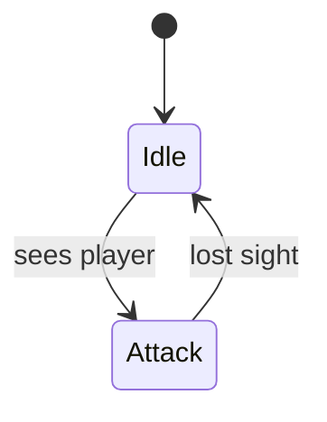

### hopper

A quick closer, and the first enemy that actually comes at you. It `Wander`s until it spots
you, then weaves in and pokes at short range with a fast single shot. Fragile and low-damage
alone; it turns up in pairs with sproutlings, so it teaches you to keep moving while something
crowds your space.

**Art:** a small round critter with two eyes and stubby legs, glade green (8×8): a two-frame idle and a three-frame hop.

| Stat | |
|---|---|
| HP | low |
| Speed | fast (weaving chase) |
| Detection | med |
| Attack | `SinglePattern` poke, low dmg, fast cadence |
| Casts | Pew |
| Drops | **Pew, Heal** |

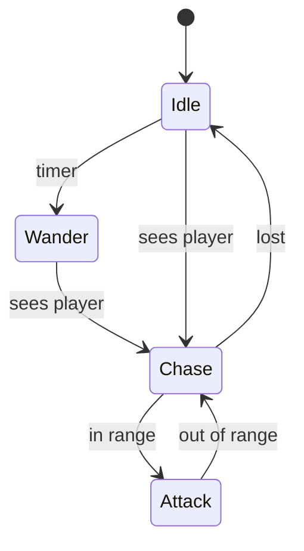

### wasp

A hostile version of the player's Bzzz summon. It flits in on the same flying-minion
behaviour and pesters you with quick stings. Fragile and never a real threat alone. Its job is
to show the summon's logic from the other side, and to drop the spell that turns wasps to your
side. It also appears in the insect deepwood.

**Art:** a small bee in a hostile ochre two-tone (the Bzzz summon recoloured), with eye pixels.

| Stat | |
|---|---|
| HP | very low |
| Speed | fast (flitting) |
| Detection | long |
| Attack | `SinglePattern` sting, low dmg, fast cadence |
| Casts | Pew |
| Drops | **Bzzz, Pew, Zaap** |


### mandrake

Low HP, high tempo, always in a pack. Mandrakes uproot and sprint straight at you, wailing a
slow sound wave as they close. One is trivial. The point is the group: three or four converge
so the waves overlap and force you to move. This is the glade's lesson in what the AoE spells
are *for*, and they spawn in exactly the clumps that reward one.

**Art:** a root-bodied figure with a screaming face; the wave is two expanding arcs.

| Stat | |
|---|---|
| HP | low |
| Speed | fast (straight chase, packs) |
| Detection | med |
| Attack | `SinglePattern` sound wave, low dmg, med cadence |
| Casts | Blam |
| Drops | **Blam** |


### seedling

A sproutling that grew up: the same rooted plant, but instead of one lazy seed it opens into a
slow ring. Where the sproutling teaches that enemies shoot, the seedling teaches you not to
stand next to the thing that shoots. The ring makes its own tile expensive even though it never
chases. It works as area denial, and it stays a speed bump in both glade flavours.

**Art:** the sproutling sprite crowned with a ring of buds.

| Stat | |
|---|---|
| HP | low |
| Speed | stationary |
| Detection | med |
| Attack | `RingPattern` of seeds, low dmg, slow cadence |
| Casts | Ring |
| Drops | **Ring, Heal** |

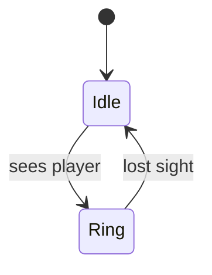

### dirt golem

The golem recipe moved into the glade and softened: just as slow, even tougher, but its rings
barely sting. It works as a low-stakes rehearsal for the real golem at the dungeon doors. You
learn to read an area denier that sits still and then lumbers after you, and here a misread is
cheap. You can always outrun it, so the threat is the space it fills.

**Art:** the golem sprite in packed-earth browns with grass tufts on its shoulders.

| Stat | |
|---|---|
| HP | very high |
| Speed | slow |
| Detection | long |
| Attack | `RingPattern`, low dmg, med cadence |
| Casts | Ring |
| Drops | **Nope, Ring** |

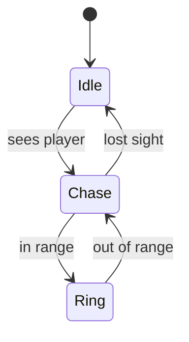

### thornthrower

`Wander` until it spots you, then `Chase` until in range, where it fires a single slow homing
thorn that you have to keep moving to outrun. It is cheap pressure that punishes standing still.

**Art:** an uprooted thorn-plant on root legs, muted glade green with red thorn tips; the missile is a spinning thorn.

| Stat | |
|---|---|
| HP | med |
| Speed | med (chase) |
| Detection | med |
| Attack | single `Homing` thorn, low dmg, slow cadence |
| Casts | Snipe |
| Drops | **Snipe** |

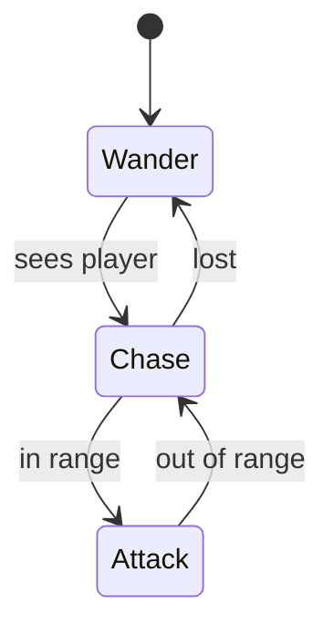

### rosebud

Rooted like a seedling. `Idle` until you get too close or it takes a hit, then it clamps into
a defensive bud. That bud is a brief high-defence windup that punishes spam-hitting. Then it
blooms into a `RingPattern` whose aim rotates slightly each pulse, and idles again. It teaches
you to read the telegraph instead of face-tanking.

**Art:** a closed rose bud on a stem, glade greens with red petals; a petal-spread frame to bloom, a clamped-shut frame for the shell.

| Stat | |
|---|---|
| HP | low |
| Speed | stationary |
| Detection | short |
| Attack | rotating `RingPattern`, low dmg, med cadence |
| Casts | Ring |
| Drops | **Ring, Nope** |

**Notes:** Defensive Shell on the windup: wait out the telegraph, then burn during the bloom.

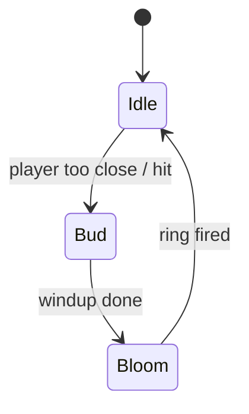

### viper *(rare)*

The one enemy that runs from you. The instant it sees you it picks a random direction and
slithers off, and it turns to fight only when it can't flee: cornered, it unloads a wide
shotgun barrage and bolts again in a fresh direction. It carries tier-2 gear, so it is worth
chasing. Cut the angle, trap it against a tree, and eat the barrage to claim the drop.

**Art:** the snake sprite in a rare venom-green with gold banding.

| Stat | |
|---|---|
| HP | very high |
| Speed | med idling, fast fleeing |
| Detection | long |
| Attack | `ShotgunPattern` barrage, high dmg, on corner |
| Casts | Blam |
| Drops | **Blam** |

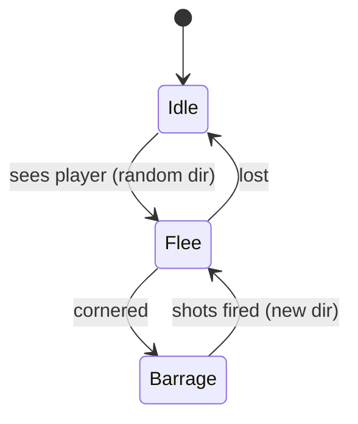

### mandraker *(rare)*

Rare mandrake that casts fireball

**Art:** a root-bodied figure with a screaming face; the wave is two expanding arcs. Palette towards red

| Stat | |
|---|---|
| HP | low |
| Speed | fast (straight chase, packs) |
| Detection | med |
| Attack | `SinglePattern` sound wave, low dmg, med cadence |
| Casts | Blam, fireball |
| Drops | **Fireball, Blam** |

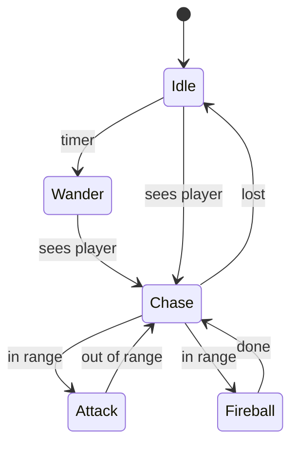

### fae *(boss, starting glade)*

The glade's floral capstone. It is a flitting sprite that hangs at range and rolls a fresh
attack each phase on a `PatternPicker`, so the fight never settles into one rhythm. No single
phase is deadly, but each one runs long, so you win by dealing steady damage while avoiding
chip over many cycles.

- **Rings** (`RingPattern`): pulses full rings for several seconds to weave through.
- **Aimed shotgun** (`Volley` + `ShotgunPattern`): a tight cone fired several times in a row.
  Punishes standing still.
- **Rest** (`FaeRest`): does nothing briefly. Your burn window.
- **Chase**: flits straight at you at half your speed without shooting, just to shove you out of
  position. It breaks off and rolls a new phase once it gets close enough.

**Art:** a small winged figure, one bright fill and a trail of light (16×16 boss sheet).

| Stat | |
|---|---|
| HP | very high (boss) |
| Speed | stationary mid-pattern; med during Chase |
| Detection | long |
| Attack | rings / aimed shotgun / chase, med dmg |
| Casts | Ring, Blam |
| Drops | **Blam, Ring** |

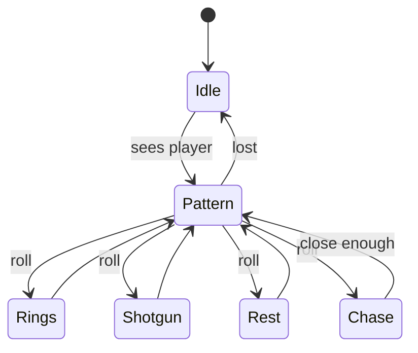

### thornmess *(boss, veggie glade)*

The rooted capstone. It stays on the ground and runs a `PatternPicker`
split into two HP-gated pools. It idles until you are in range, then fires thornthrower
missiles. If you break range it uproots and sprints to close, where it behaves like a rosebud
or fires shotgun volleys. At low health it phase-shifts: it throws spores that fill the screen,
seeds the room with the biome's rooted plants, then returns to the cycle.

**Art:** a massive tangled thorn-mass with a screaming maw and root legs, glade greens with red thorn tips (boss sheet).

| Stat | |
|---|---|
| HP | very high (boss) |
| Speed | stationary rooted; fast when re-closing |
| Detection | med |
| Attack | homing missiles / rosebud bloom / shotgun volleys |
| Casts | Snipe, Ring, Blam, Jimmy (summon) |
| Drops | **Jimmy, Snipe, Ring** |

**Notes:** the low-HP phase swaps in a spore and summon wave rather than layering a summon on top.

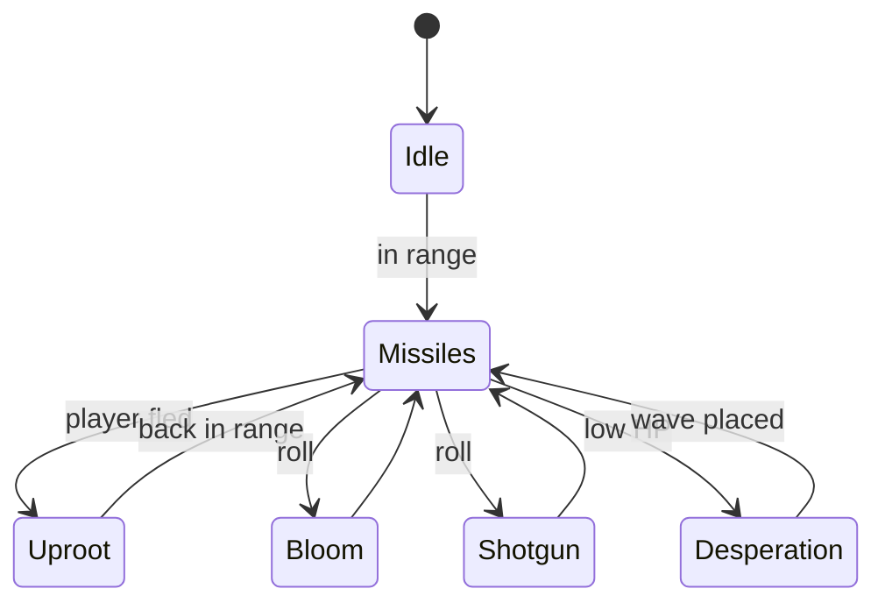

<!-- END GENERATED CATALOGUE -->

---

# ideas

## Deepwood

The forest biome. It comes in three flavours: the **animal deepwood** (beasts, boss
**gnarlking**), the **mimic deepwood** (trees that come alive, boss **mother tree**), and the
**insect deepwood** (swarms and spiders, boss **hive queen**).

### thornback *(animal)*

A charger. It runs a long telegraphed windup (`ChargeWindup`), then a straight high-speed dash
(`ChargeDash`) that sheds bullets off both flanks, then a rooted recovery (`ChargeRecover`) that
is your punish window. It locks heading at launch and can't corner, so sidestep the dash and
burn it during recovery. Trees are your friend.

**Art:** a wide squat body, dark-brown armour over a tan body, a spike array along the back.

| Stat | |
|---|---|
| HP | med |
| Speed | slow wandering, very fast dashing |
| Detection | med |
| Attack | `FlankPattern` bullets shed during the dash, low dmg |
| Casts | Blam |
| Drops | **Blam** (t2) |

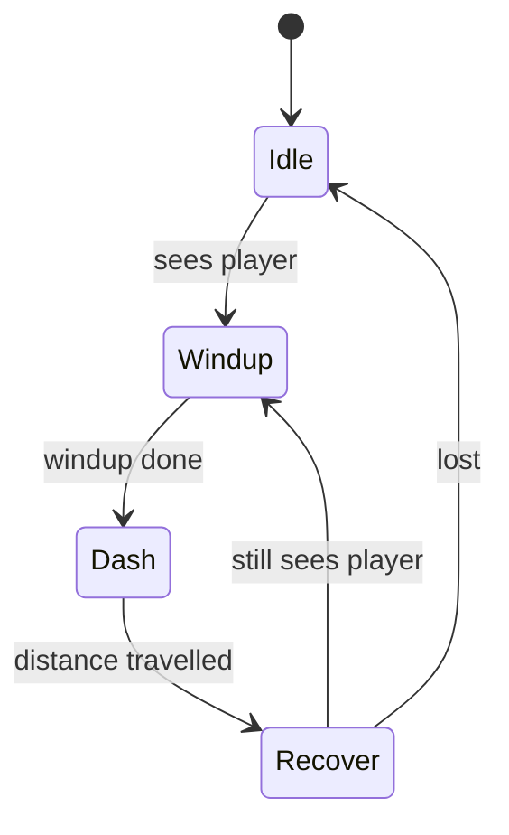

### owl *(animal)*

The perch sniper. It uses `SniperCharge` through the one clean lane between trunks, with a
brief windup as the telegraph. Get too close or too far, or break its line, and it
`Reposition`s a few tiles to a perch that sees you again. If it can't re-perch, it idles. It
outranges rangers, so your move is to close the gap through its fire.

**Art:** a brown oval with an oversized head and two big amber eyes. The eye rule taken to a
whole creature.

| Stat | |
|---|---|
| HP | low |
| Speed | perched; med reposition |
| Detection | long (firing band close to med) |
| Attack | `SinglePattern` charged shot, high dmg, slow cadence |
| Casts | Bwoom |
| Drops | **Bwoom** (t2) |

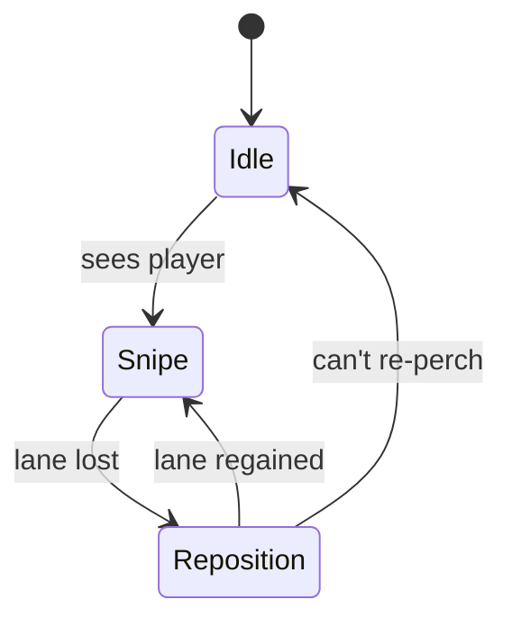

### grimling *(animal)*

Pack hunter. `Idle`→`Wander`→`WeaveChase`→`FireWhenInRange` at short range, with fast
low-damage bolts. Grimlings hunt in threes or more, and hitting one triggers the whole knot. The
weave makes it hard to line up a shot, and the pack punishes you for focusing one down without
a plan for the rest.

**Art:** a small hunched shadow-sprite, gloom-black body with two glowing eyes and needle limbs;
quick flickering run frames.

| Stat | |
|---|---|
| HP | low |
| Speed | fast (weaving chase) |
| Detection | med |
| Attack | `SinglePattern` bolt, low dmg, fast cadence |
| Casts | Pew |
| Drops | **Pew** (t2), **Halp** (t2) |

**Notes:** Berserk on Ally Death: a survivor briefly gains speed and fire rate when a packmate
dies, so kill order matters.

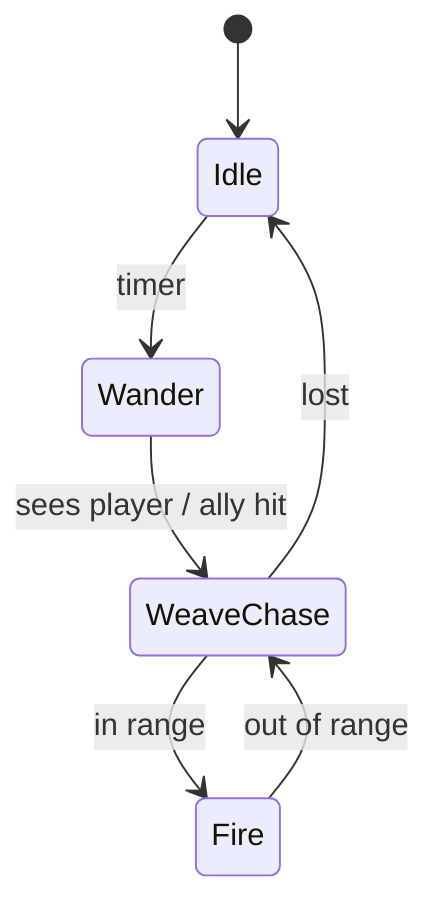

### mosshulk *(animal)*

Heavy tank. `Idle`→`Wander`→`Chase` (slow)→`FireWhenInRange` with a wide spore burst on a slow
cadence. On the attack windup it hardens into a Defensive Shell (brief high defence) that
punishes spam-hitting. Disengage and it lumbers back to its leash, but it lashes one fast
reaching root at your last position first.

**Art:** a hulking golem of moss, root, and stone, deep-green over a grey mass, dim eye-lights
(larger 16×15 sheet); a clenched, hardened frame for the shell.

| Stat | |
|---|---|
| HP | high |
| Speed | slow |
| Detection | med |
| Attack | `ShotgunPattern` spore burst, med dmg/pellet, slow cadence |
| Casts | Blam |
| Drops | **Blam** (t2), **Nope** (t2) |

**Notes:** Defensive Shell (harden) on windup; Leash-Break Rush (root lash) on disengage.

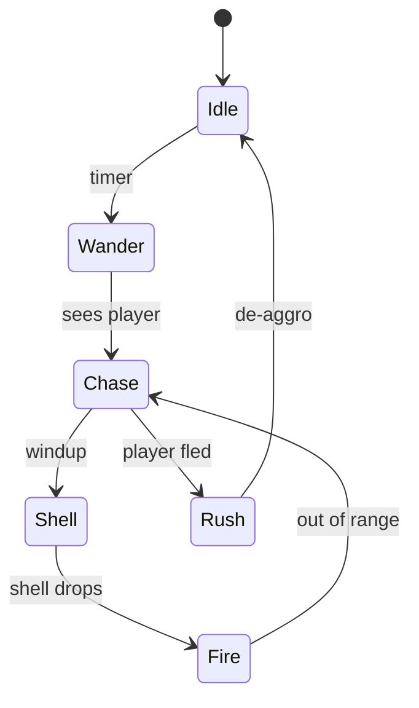

### grimlord *(animal, rare)*

A larger, darker grimling, the knot's alpha. `WeaveChase`→`FireWhenInRange` at medium range with
a wide bolt spray. At critical HP it enrages: fire rate doubles and its exit check drops. On
death it bursts one parting ring. The weave plus the enrage turns the last sliver of its health
into a gauntlet.

**Art:** the grimling silhouette enlarged and near-black, red eye-glow; the enrage frame
brightens the eyes.

| Stat | |
|---|---|
| HP | high |
| Speed | fast (weaving chase) |
| Detection | med |
| Attack | `ShotgunPattern` bolt spray, med dmg, med cadence |
| Casts | Blam |
| Drops | **Blam** (t2), **Ring** (t2) |

**Notes:** Enrage at low HP; `RingPattern` death burst.

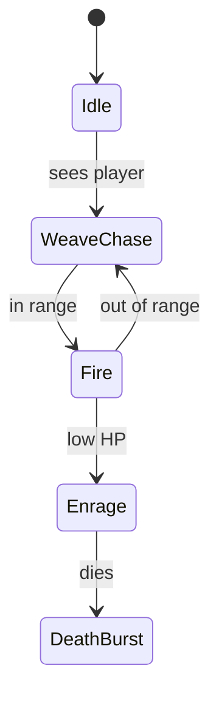

### gnarlking *(boss, animal)*

The apex of the animal deepwood: a towering antlered forest-lord on a `PatternPicker`.

- **Ground Slam**: rears and slams the earth for a radial shockwave (damage falls off with
  distance, and it knocks you back), then calls a ring of grimlings and hangs back until they
  clear or time out. Demonstrates the **Thwomp** spell.
- **Chase** (`TimedChase`): lunges at high speed and drops `FlankPattern` bullets. It can't
  corner, so sidestep it.
- **Shotgun Volley**: plants and fires a burst of spore blasts, tracking your position
  between them.
- **Rest**: heaves briefly. Your burn window.

**Art:** a towering forest-lord of bark, antler, and gloom, glowing pale eyes, oversized frame;
a rear-and-slam pose for the slam (boss sheet).

| Stat | |
|---|---|
| HP | very high (boss) |
| Speed | stationary mid-pattern; very fast during Chase |
| Detection | long |
| Attack | shockwave + summon / lunge / shotgun volley |
| Casts | Thwomp, Blam, Halp (brood) |
| Drops | **Thwomp**, **Halp** |

**Notes:** at critical HP the shockwave radius doubles, it calls grimlords instead of grimlings,
and Rest shrinks to half duration.

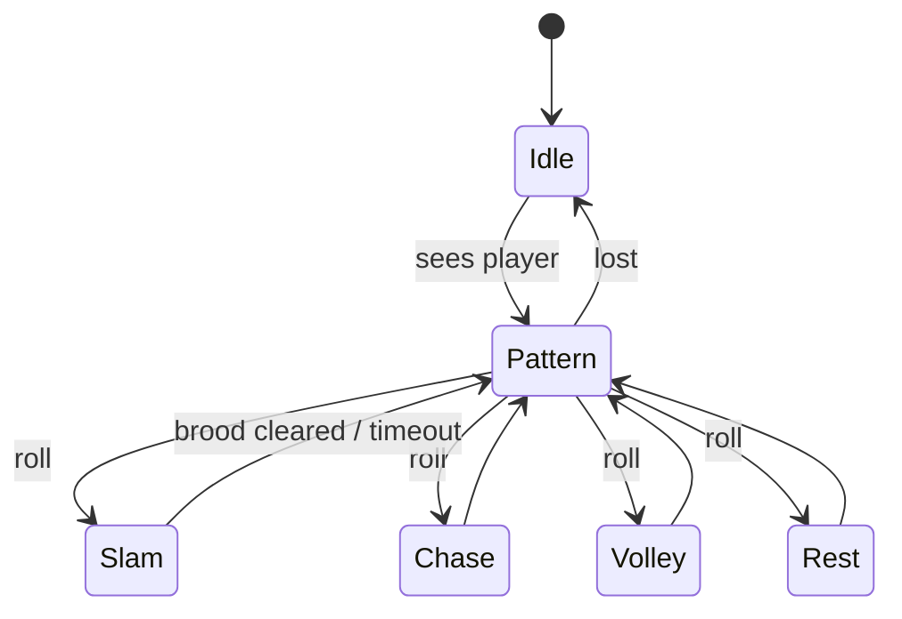

### stalker *(mimic)*

The basic pouncer. It sits in `Idle` disguised as a tree prop, using the deepwood tree
decoration as its idle animation, and watches through a tiny detect probe. Step on it and it
reveals, then `WeaveChase`→`FireWhenInRange` at melee. Lose it and it becomes a tree again.
This is the deepwood's signature jump-scare.

**Art:** a narrow tree form with a pointed canopy, medium/dark green; eyes appear on reveal.

| Stat | |
|---|---|
| HP | low |
| Speed | med (after reveal) |
| Detection | short probe |
| Attack | `SinglePattern`, low dmg, med cadence |
| Casts | Pew |
| Drops | **Ploop** (t2) |

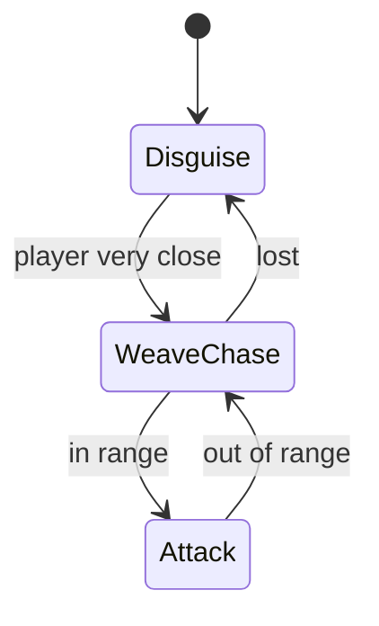

### bramble stalker *(mimic)*

A running thorn-spitter. `Idle` disguised as a bush, then `WeaveChase`→`FireWhenInRange`,
firing full rings of thorns from its body on a slow cadence. It is hard to track on approach,
and the ring punishes you for standing anywhere near it.

**Art:** a rounded thorny bush-mound disguise, deepwood green with bramble-red thorns; eyes on
reveal.

| Stat | |
|---|---|
| HP | low |
| Speed | med (weaving chase) |
| Detection | short probe |
| Attack | `RingPattern` thorns, low dmg/thorn, slow cadence |
| Casts | Ring |
| Drops | **Ring** (t2) |

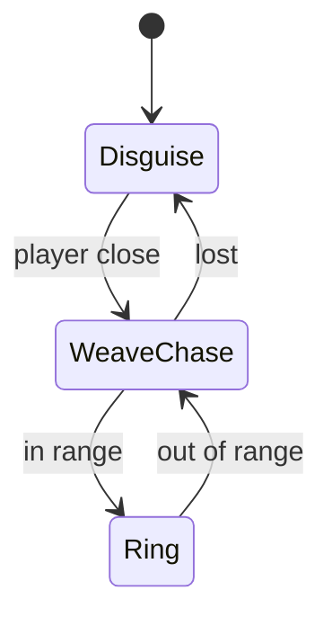

### elder stalker *(mimic, rare)*

An ancient twisted tree on a `PatternPicker`: `SniperCharge` a slow wide-cone homing seed at
long range, then Teleport Blink and, on arrival, a `ShotgunPattern`. The homing seed forces you
to move; the blink resets the engagement.

**Art:** a gnarled dead-tree disguise, bark-grey twisted trunk, hollow amber eye-glow on
reveal; taller than the stalker.

| Stat | |
|---|---|
| HP | med |
| Speed | stationary (blinks) |
| Detection | long |
| Attack | `Homing` seed (med dmg) / `ShotgunPattern` on blink |
| Casts | Fireball, Blam |
| Drops | **Fireball** (t2) |

**Notes:** at critical HP the windup drops to near-instant.

```mermaid
stateDiagram-v2
    [*] --> Idle
    Idle --> Snipe : sees player
    Snipe --> Blink : shot fired
    Blink --> Shotgun : arrived
    Shotgun --> Snipe : cycle
    Snipe --> Idle : lost
```

### shade *(mimic)*

A vanishing harasser. It fires a `Volley` burst, then Teleport Blinks to a random nearby offset
and bursts again. It punishes turret play, since each burst forces you to re-aim.

**Art:** a wispy near-black silhouette with a faint violet edge and two pale eyes; a
barely-there body that blinks out.

| Stat | |
|---|---|
| HP | very low |
| Speed | blinks (short range) |
| Detection | med |
| Attack | `Volley` `SinglePattern`, med dmg, fast within burst |
| Casts | Pew |
| Drops | **Blink** (t2) |

```mermaid
stateDiagram-v2
    [*] --> Idle
    Idle --> Volley : sees player
    Volley --> Blink : burst done
    Blink --> Volley : reappeared
    Volley --> Idle : lost
```

### mirror sprite *(mimic)*

Breaks your movement habits with Mirror/Invert Movement. It mirrors your lateral strafe while
holding a fixed standoff, so strafing left sends it right and standing still makes it hover.
Fires a `SinglePattern` at medium range. Low HP, but you can't circle-strafe it: change
direction or walk straight in.

**Art:** a small floating mirror-shard mote, pale reflective blue-white, a single eye; a
symmetric silhouette selling the mirror theme.

| Stat | |
|---|---|
| HP | very low |
| Speed | med (mirrored strafe) |
| Detection | med |
| Attack | `SinglePattern`, low dmg, med cadence |
| Casts | Pew |
| Drops | **Shing** (t2) |

```mermaid
stateDiagram-v2
    [*] --> Idle
    Idle --> Mirror : sees player
    Mirror --> Fire : in range
    Fire --> Mirror : cadence
    Mirror --> Idle : lost
```

### snake *(mimic)*

A skittish corridor-denier. `Idle`→`Flee` (fast, weaving) when spotted; when its back hits a
wall it stands and fires a `Volley` of twin parallel shots, then bolts again. Trivial in open
rooms; in narrow passages the parallel spread covers the corridor.

**Art:** a low serpentine coil, deepwood two-tone green, a forked head with eye pixels; weave
frames.

| Stat | |
|---|---|
| HP | low |
| Speed | fast (weaving flee) |
| Detection | med |
| Attack | `ParallelPattern` twin shot, low dmg, med cadence |
| Casts | Pew |
| Drops | **Zoing** (t2) |

```mermaid
stateDiagram-v2
    [*] --> Idle
    Idle --> Flee : sees player
    Flee --> Volley : cornered
    Volley --> Flee : burst fired
    Flee --> Idle : lost
```

### mother tree *(boss, mimic)*

The oldest stalker: a massive gnarled tree that uproots and thunders across the room, on a
two-phase cycle.

- **Thorn Rush**: a `TimedChase` lunge at high speed that fires wide high-damage
  `ShotgunPattern` bursts the whole time and scatters **Ploop** seed-mines behind it. The mines
  arm after a delay and erupt into darts if you step near. The room becomes a minefield.
- **Root**: slams down and stops dead. Your burn window. Earlier mines stay live.

**Art:** a massive gnarled bark-brown trunk with a mossy canopy and root legs, amber eyes;
uproots into a charging pose (boss sheet).

| Stat | |
|---|---|
| HP | very high (boss) |
| Speed | very fast during Thorn Rush; stationary in Root |
| Detection | long |
| Attack | shotgun bursts + Ploop mines / none in Root |
| Casts | Blam, Ploop |
| Drops | **Ploop** |

**Notes:** at critical HP Thorn Rush lasts twice as long, the spread tightens, mines double,
and Root drops out.

```mermaid
stateDiagram-v2
    [*] --> Idle
    Idle --> ThornRush : sees player
    ThornRush --> Root : lunge done
    Root --> ThornRush : burn window over
    ThornRush --> ThornRush : low HP (no Root)
```

### wasp *(insect)*

The glade wasp carried into the trees: fragile, fast, and arrives in groups. See the [glade
entry](#wasp); only placement changes. It casts Pew and drops **Bzzz** (t2) at this depth.

### longleg *(insect)*

A wall-crawling spider with two weapons. `Wander`→`SniperCharge` a slow wide-cone homing web at
medium range; when you close, a `RingPattern` then a scuttle away. Wall Crawl keeps it on
wall/blocker tiles. The web is slow enough to sidestep but forces you to keep moving while it
repositions.

**Art:** a small round body on long spidery legs, deepwood browns, clustered eye pixels; a
wall-crawl pose.

| Stat | |
|---|---|
| HP | low |
| Speed | slow (wall-crawling) |
| Detection | med |
| Attack | `Homing` web (med dmg) / close `RingPattern`, low dmg |
| Casts | Fireball, Ring |
| Drops | **Snipe** (t2)  |

```mermaid
stateDiagram-v2
    [*] --> Wander
    Wander --> Snipe : sees player
    Snipe --> Ring : player close
    Ring --> Snipe : reposition
    Snipe --> Wander : lost
```

### beetle *(insect)*

A bouncing brawler. `Chase` (medium speed)→`Volley` burst at short range, then an Impulse Hop
in a random cardinal direction that fires a `RingPattern` mid-hop. It is hard to pin: the hop
resets your aim, and the mid-hop ring makes it dangerous to stand near. Charge in after the hop
lands.

**Art:** a rounded armoured shell, dark carapace over a lighter belly, small eyes; a
squash/stretch hop frame.

| Stat | |
|---|---|
| HP | low |
| Speed | med (chase), hops |
| Detection | med |
| Attack | `Volley` (low dmg, fast) + hop `RingPattern` |
| Casts | Pew, Ring |
| Drops | **Ring** (t2) |

```mermaid
stateDiagram-v2
    [*] --> Idle
    Idle --> Chase : sees player
    Chase --> Volley : in range
    Volley --> Hop : burst done
    Hop --> Chase : landed
    Chase --> Idle : lost
```

### weaver *(insect, rare)*

A large wall-crawling spider. `SniperCharge` a medium-turn high-damage homing web that bounces
off walls several times, so it is dangerous in corridors and can hit you around a corner. If
you close, a `ShotgunPattern` then a scuttle to the nearest wall. Open rooms are your safe zone.

**Art:** a large spider, bulbous abdomen and long legs, deep purple-brown two-tone, an eye
cluster; a wall-cling pose.

| Stat | |
|---|---|
| HP | med |
| Speed | slow (wall-crawling) |
| Detection | long |
| Attack | bouncing `Homing` web (high dmg) / close `ShotgunPattern` |
| Casts | Zoing, Blam |
| Drops | **Zoing** (t2) |

**Notes:** at critical HP the windup drops to near-instant.

```mermaid
stateDiagram-v2
    [*] --> Crawl
    Crawl --> Snipe : sees player
    Snipe --> Shotgun : player close
    Shotgun --> Crawl : scuttle to wall
    Snipe --> Crawl : lost
```

### drone *(insect, rare)*

A flying orbiter with a bullet escort. It tethers at a fixed radius (`Tether`) with bullets
circling it as a deterrent. Every so often the bullets launch outward in a shotgun spread and
the drone flees to recharge, then re-enters the tether at a wider orbit. The fight is a cycle:
dodge the burst, chase it while it is vulnerable, then repeat.

**Art:** a small flying orb ringed by orbiting bullet pixels, metallic two-tone, a single
glowing eye.

| Stat | |
|---|---|
| HP | low |
| Speed | med (orbiting) |
| Detection | med |
| Attack | Circling Bullets → launched `ShotgunPattern`, med dmg |
| Casts | Halo, Blam |
| Drops | **Halo** (t2) |

```mermaid
stateDiagram-v2
    [*] --> Tether
    Tether --> Burst : charged
    Burst --> Flee : bullets launched
    Flee --> Tether : recharged (wider orbit)
```

### hive queen *(boss, insect)*

A massive flying hornet queen on a `PatternPicker`.

- **Acid Spray**: `ShotgunPattern` bursts while she `TimedChase`s toward you. The sweeping
  coverage forces you to rotate around her.
- **Spawn Swarm**: summons fragile fast-shooting wasps and drones and turns invulnerable until
  they clear, and the drones' orbiting bullets fill the room. Demonstrates the **Bzzz** spell.
- **Web Trap**: fires slow bouncing homing webs that explode into AoE on expiry, so you can't
  stand still anywhere.
- **Rest**: hovers chittering. Your burn window.

**Art:** a massive hornet queen, striped ochre/black thorax, big flat translucent wings, a
compound-eye band (boss sheet).

| Stat | |
|---|---|
| HP | very high (boss) |
| Speed | fast during Acid Spray; hovers otherwise |
| Detection | long |
| Attack | acid shotgun / swarm / bouncing web traps |
| Casts | Blam, Bzzz (summon), Snipe (web traps)  |
| Drops | **Bzzz** |

**Notes:** at critical HP Rest drops out and she adds a room-wide exploding `RingPattern`
(Desperation Swarm) behind a long wing-vibration telegraph.

```mermaid
stateDiagram-v2
    [*] --> Idle
    Idle --> Pattern : sees player
    Pattern --> Acid : roll
    Pattern --> Swarm : roll
    Pattern --> WebTrap : roll
    Pattern --> Rest : roll
    Acid --> Pattern
    Swarm --> Pattern : cleared
    WebTrap --> Pattern
    Rest --> Pattern
    Pattern --> Idle : lost
```

### Deepwood drops

Each enemy drops one spell, at tier 2; the bosses drop their signature. Between the roster the
deepwood covers a full tier-2 kit.

| Enemy | Drops |
|---|---|
| thornback | **Blam** (t2) |
| owl | **Bwoom** (t2) |
| grimling | **Pew** (t2), **Halp** (t2) |
| mosshulk | **Blam** (t2), **Nope** (t2) |
| stalker | **Ploop** (t2) |
| bramble stalker | **Ring** (t2) |
| shade | **Blink** (t2) |
| mirror sprite | **Shing** (t2) |
| snake | **Zoing** (t2) |
| wasp | **Bzzz** (t2) |
| longleg | **Snipe** (t2)  |
| beetle | **Ring** (t2) |
| grimlord *(rare)* | **Blam** (t2), **Ring** (t2) |
| elder stalker *(rare)* | **Fireball** (t2) |
| weaver *(rare)* | **Zoing** (t2) |
| drone *(rare)* | **Halo** (t2) |
| gnarlking *(boss)* | **Thwomp**, **Halp** |
| mother tree *(boss)* | **Ploop** |
| hive queen *(boss)* | **Bzzz** |


## other ideas

enemies that scan for the same type in the room and shoot at each other not at the player
