# Enemies

<!-- BEGIN GENERATED CATALOGUE -->
<!-- Generated by design/tools/build.py from design/data/ + the game's .tres — do not edit by hand. -->

## Glade

The opening biome. It comes in two flavours: the floral **starting glade**, capped by the **fae**, and the rooted **veggie glade**, capped by the **thornmess**.

### Dirt Golem

The golem recipe moved into the glade and softened: just as slow, even tougher, but its rings
barely sting. It works as a low-stakes rehearsal for the real golem at the dungeon doors. You
learn to read an area denier that sits still and then lumbers after you, and here a misread is
cheap. You can always outrun it, so the threat is the space it fills.

**Art:** the golem sprite in packed-earth browns with grass tufts on its shoulders.

| Stat |  |
|---|---|
| Difficulty | 3 / 10 |
| HP | 180 |
| Speed | 12 px/s |
| Range | detect 12, ring 3 |
| ring | **16** dmg — 2s cd, Ring x6, 2 @ 0.4s, 6 tiles range |
| Drops | **ring t1** (20%), **nope** (20%) |

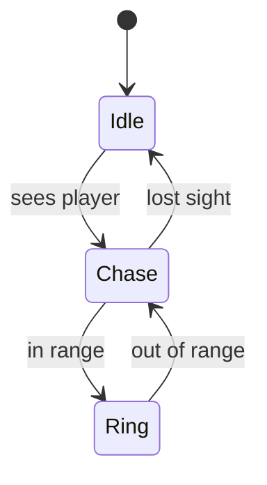
```mermaid
stateDiagram-v2
    [*] --> Idle
    Idle --> Chase : sees player
    Chase --> Ring : in range
    Ring --> Chase : out of range
    Chase --> Idle : lost sight
```

### Hopper

A quick closer, and the first enemy that actually comes at you. It `Wander`s until it spots
you, then weaves in and pokes at short range with a fast single shot. Fragile and low-damage
alone; it turns up in pairs with sproutlings, so it teaches you to keep moving while something
crowds your space.

**Art:** a small round critter with two eyes and stubby legs, glade green (8×8): a two-frame idle and a three-frame hop.

| Stat |  |
|---|---|
| Difficulty | 2 / 10 |
| HP | 38 |
| Speed | 18 px/s |
| Range | detect 7, chase 8, attack 3 |
| attack | **7** dmg — 0.7s cd, Single, 3 @ 0.3s, 5 tiles range |
| Drops | **pew t1** (15%), **heal t1** (10%) |

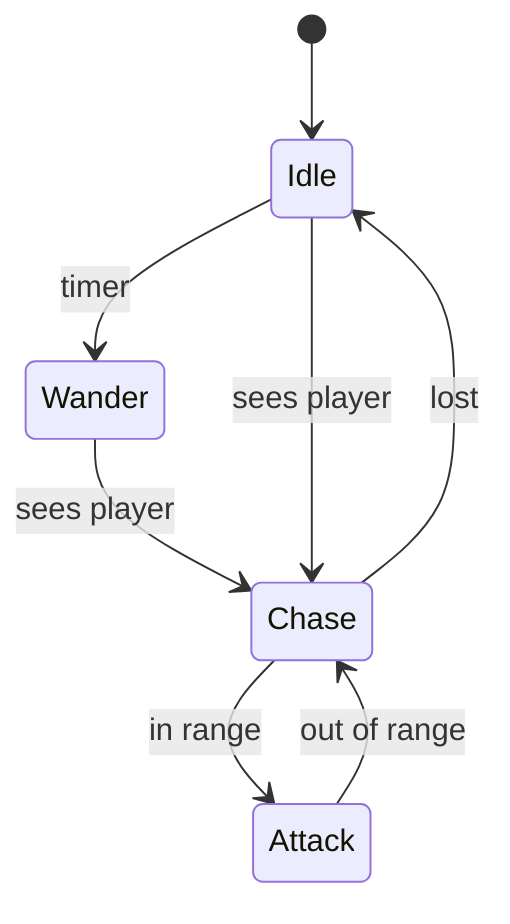
```mermaid
stateDiagram-v2
    [*] --> Idle
    Idle --> Wander : timer
    Wander --> Chase : sees player
    Idle --> Chase : sees player
    Chase --> Attack : in range
    Attack --> Chase : out of range
    Chase --> Idle : lost
```

### Mandrake

Low HP, high tempo, always in a pack. Mandrakes uproot and sprint straight at you, wailing a
slow sound wave as they close. One is trivial. The point is the group: three or four converge
so the waves overlap and force you to move. This is the glade's lesson in what the AoE spells
are *for*, and they spawn in exactly the clumps that reward one.

**Art:** a root-bodied figure with a screaming face; the wave is two expanding arcs.

| Stat |  |
|---|---|
| Difficulty | 2 / 10 |
| HP | 30 |
| Speed | 28 px/s |
| Range | detect 8, chase 12, attack 4 |
| attack | **12** dmg — 1.2s cd, Single, 6 tiles range |
| Drops | **blam t1** (20%) |

```mermaid
stateDiagram-v2
    [*] --> Idle
    Idle --> Wander : timer
    Wander --> Chase : sees player
    Idle --> Chase : sees player
    Chase --> Attack : in range
    Attack --> Chase : out of range
    Chase --> Idle : lost
```

### Seedling

A sproutling that grew up: the same rooted plant, but instead of one lazy seed it opens into a
slow ring. Where the sproutling teaches that enemies shoot, the seedling teaches you not to
stand next to the thing that shoots. The ring makes its own tile expensive even though it never
chases. It works as area denial, and it stays a speed bump in both glade flavours.

**Art:** the sproutling sprite crowned with a ring of buds.

| Stat |  |
|---|---|
| Difficulty | 2 / 10 |
| HP | 45 |
| Range | detect 4 |
| ring | **13** dmg — 3s cd, Ring x6, 6 tiles range |
| Drops | **ring t1** (10%), **heal t1** (10%) |

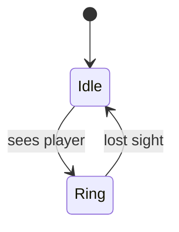
```mermaid
stateDiagram-v2
    [*] --> Idle
    Idle --> Ring : sees player
    Ring --> Idle : lost sight
```

### Sproutling

Rooted in place, watching. It sits in `Idle` until the player is in sight, then spits a
single slow seed at a steady pace. This is the first enemy the player meets. The seed is slow
enough to sidestep on reflex, so it teaches that enemies shoot without much risk.

**Art:** a stem, a leaf, and two eyes. The simplest sprite in the biome, in glade green.

| Stat |  |
|---|---|
| Difficulty | 1 / 10 |
| HP | 25 |
| Range | detect 7 |
| attack | **8** dmg — 2s cd, Single, 9 tiles range |
| Drops | **pew t1** (10%), **heal t1** (10%) |

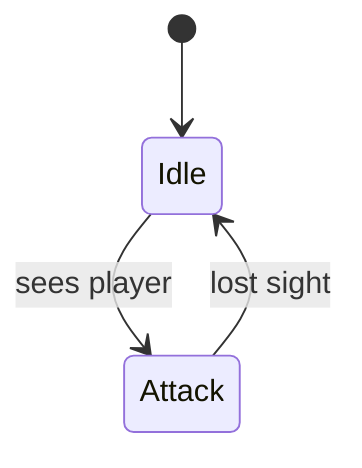
```mermaid
stateDiagram-v2
    [*] --> Idle
    Idle --> Attack : sees player
    Attack --> Idle : lost sight
```

### Wasp

A hostile version of the player's Bzzz summon. It flits in on the same flying-minion
behaviour and pesters you with quick stings. Fragile and never a real threat alone. Its job is
to show the summon's logic from the other side, and to drop the spell that turns wasps to your
side. It also appears in the insect deepwood.

**Art:** a small bee in a hostile ochre two-tone (the Bzzz summon recoloured), with eye pixels.

| Stat |  |
|---|---|
| Difficulty | 1 / 10 |
| HP | 18 |
| Speed | 40 px/s |
| Range | detect 10, chase 14, attack 3 |
| attack | **7** dmg — 0.8s cd, Single, 4 tiles range |
| Drops | **bzzz t1** (10%), **pew t1** (10%), **zaap t1** (10%) |

```mermaid
stateDiagram-v2
    [*] --> Idle
    Idle --> Wander : timer
    Wander --> Chase : sees player
    Idle --> Chase : sees player
    Chase --> Attack : in range
    Attack --> Chase : out of range
    Chase --> Idle : lost
```

### Mandraker *(rare)*

Rare mandrake that casts fireball

**Art:** a root-bodied figure with a screaming face; the wave is two expanding arcs. Palette towards red

| Stat |  |
|---|---|
| Difficulty | 5 / 10 |
| HP | 200 |
| Speed | 28 px/s |
| Range | detect 8, chase 16, attack 4, fireball 9 |
| fireball | **30** dmg — 6s cd, Single, 6 tiles range, blast 3 tiles (splash only) |
| attack | **15** dmg — 2s cd, Single, 7 tiles range |
| Drops | **fireball t2** (50%), **blam t2** (30%) |

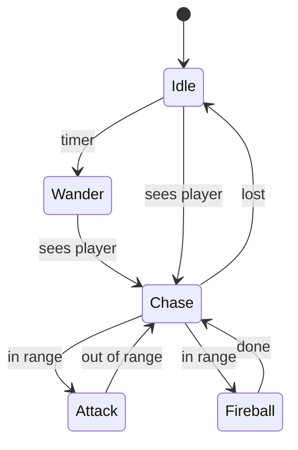
```mermaid
stateDiagram-v2
    [*] --> Idle
    Idle --> Wander : timer
    Wander --> Chase : sees player
    Idle --> Chase : sees player
    Chase --> Attack : in range
    Chase --> Fireball : in range
    Attack --> Chase : out of range
    Fireball --> Chase : done
    Chase --> Idle : lost
```

### Viper *(rare)*

The one enemy that runs from you. The instant it sees you it picks a random direction and
slithers off, and it turns to fight only when it can't flee: cornered, it unloads a wide
shotgun barrage and bolts again in a fresh direction. It carries tier-2 gear, so it is worth
chasing. Cut the angle, trap it against a tree, and eat the barrage to claim the drop.

**Art:** the snake sprite in a rare venom-green with gold banding.

| Stat |  |
|---|---|
| Difficulty | 4 / 10 |
| HP | 180 |
| Speed | 32 px/s |
| Range | detect 12, retreat 1.5 |
| barrage | **22** dmg — 1s cd, Shotgun x5, 7 tiles range |
| Drops | **blam t2** (50%) |

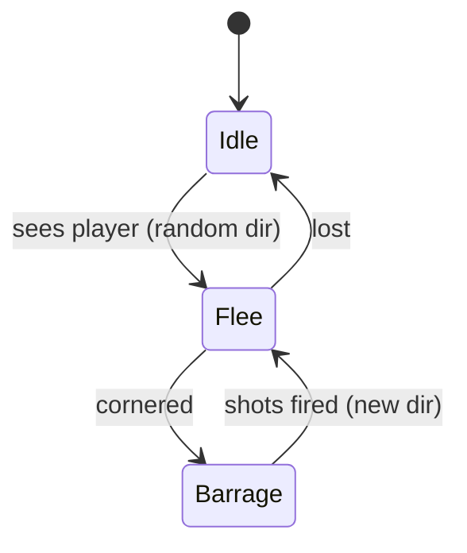
```mermaid
stateDiagram-v2
    [*] --> Idle
    Idle --> Flee : sees player (random dir)
    Flee --> Barrage : cornered
    Barrage --> Flee : shots fired (new dir)
    Flee --> Idle : lost
```

### Fae *(boss)*

The glade's floral capstone. It is a flitting sprite that hangs at range and rolls a fresh
attack each phase on a `PatternPicker`, so the fight never settles into one rhythm. No single
phase is deadly, but each one runs long, so you win by dealing steady damage while avoiding
chip over many cycles.

- **Rings** (`RingPattern`): pulses full rings for several seconds to weave through.
- **Aimed shotgun** (`Volley` + `ShotgunPattern`): a tight cone fired several times in a row.
  Punishes standing still.
- **Rest** (`FaeRest`): does nothing briefly. Your burn window.
- **Chase**: flits straight at you at half your speed without shooting, just to shove you out of
  position. It breaks off and rolls a new phase once it gets close enough.

**Art:** a small winged figure, one bright fill and a trail of light (16×16 boss sheet).

| Stat |  |
|---|---|
| Difficulty | 6 / 10 |
| HP | 1500 |
| Speed | 28 px/s |
| Range | detect 16 |
| rings | **11** dmg — 1s cd, Ring x8, 10 @ 0.8s, 7 tiles range |
| shotgun | **15** dmg — 1s cd, Shotgun x5, 2 @ 0.4s, 8 tiles range |
| Drops | **blam t2** (66%), **ring t2** (66%) |

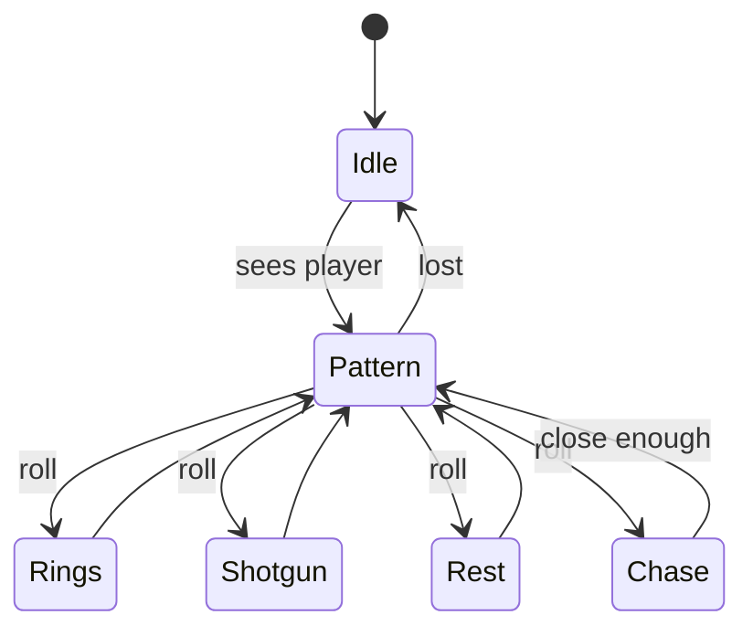
```mermaid
stateDiagram-v2
    [*] --> Idle
    Idle --> Pattern : sees player
    Pattern --> Rings : roll
    Pattern --> Shotgun : roll
    Pattern --> Rest : roll
    Pattern --> Chase : roll
    Rings --> Pattern
    Shotgun --> Pattern
    Rest --> Pattern
    Chase --> Pattern : close enough
    Pattern --> Idle : lost
```

### Rosebud

Rooted like a seedling. `Idle` until you get too close or it takes a hit, then it clamps into
a defensive bud. That bud is a brief high-defence windup that punishes spam-hitting. Then it
blooms into a `RingPattern` whose aim rotates slightly each pulse, and idles again. It teaches
you to read the telegraph instead of face-tanking.

**Art:** a closed rose bud on a stem, glade greens with red petals; a petal-spread frame to bloom, a clamped-shut frame for the shell.

| Stat |  |
|---|---|
| Difficulty | 3 / 10 |
| HP | 30 |
| Range | detect 5 |
| ring | **16** dmg — Ring x8, 4 @ 1s, 8 tiles range |
| Drops | **ring t1** (10%), **nope** (10%) |

**Notes:** Defensive Shell on the windup: wait out the telegraph, then burn during the bloom.

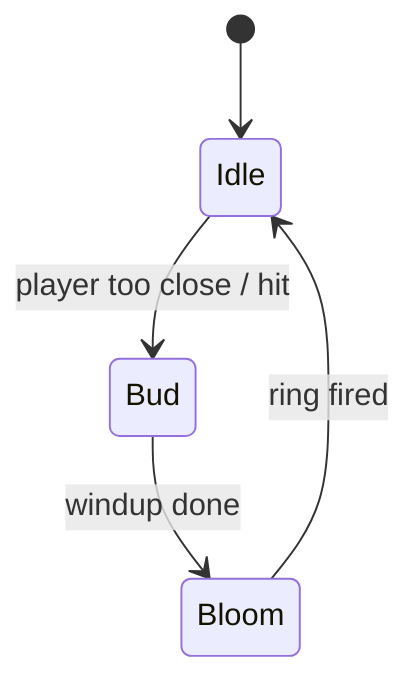
```mermaid
stateDiagram-v2
    [*] --> Idle
    Idle --> Bud : player too close / hit
    Bud --> Bloom : windup done
    Bloom --> Idle : ring fired
```

### Thornthrower

`Wander` until it spots you, then `Chase` until in range, where it fires a single slow homing
thorn that you have to keep moving to outrun. It is cheap pressure that punishes standing still.

**Art:** an uprooted thorn-plant on root legs, muted glade green with red thorn tips; the missile is a spinning thorn.

| Stat |  |
|---|---|
| Difficulty | 3 / 10 |
| HP | 50 |
| Speed | 32 px/s |
| Range | detect 8, chase 12, attack 6 |
| thorn | **16** dmg — 1s cd, Single, 10 tiles range, homing 120° cone |
| Drops | **snipe t1** (20%) |

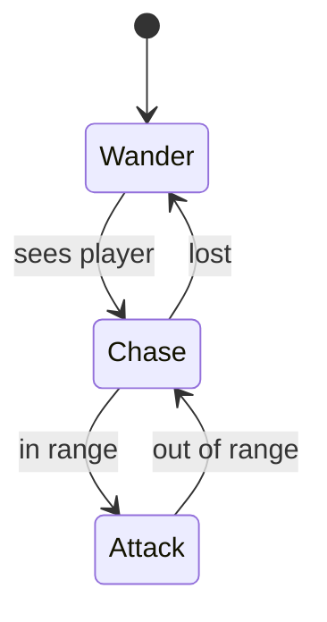
```mermaid
stateDiagram-v2
    [*] --> Wander
    Wander --> Chase : sees player
    Chase --> Attack : in range
    Attack --> Chase : out of range
    Chase --> Wander : lost
```

### Thornmess *(boss)*

The rooted capstone. It stays on the ground and runs a `PatternPicker`
split into two HP-gated pools. It idles until you are in range, then fires thornthrower
missiles. If you break range it uproots and sprints to close, where it behaves like a rosebud
or fires shotgun volleys. At low health it phase-shifts: it throws spores that fill the screen,
seeds the room with the biome's rooted plants, then returns to the cycle.

**Art:** a massive tangled thorn-mass with a screaming maw and root legs, glade greens with red thorn tips (boss sheet).

| Stat |  |
|---|---|
| Difficulty | 7 / 10 |
| HP | 2000 |
| Speed | 32 px/s |
| Range | detect 22, missile 20, close 4 |
| bloom | **18** dmg — 7s cd, Ring x12, 5 @ 0.5s, 14 tiles range |
| missiles | **16** dmg — 3s cd, Single, 4 @ 1s, 12 tiles range, homing 120° cone |
| shotgun | **15** dmg — 1s cd, Shotgun x4, 4 @ 0.6s, 6 tiles range |
| spores | **25** dmg — 6s cd, Ring x16, 10 @ 1.5s, 18 tiles range |
| summon | 6 minions, 8 hp, 0s |
| Drops | **jimmy t1** (100%), **snipe t2** (66%), **ring t2** (66%) |

**Notes:** the low-HP phase swaps in a spore and summon wave rather than layering a summon on top.

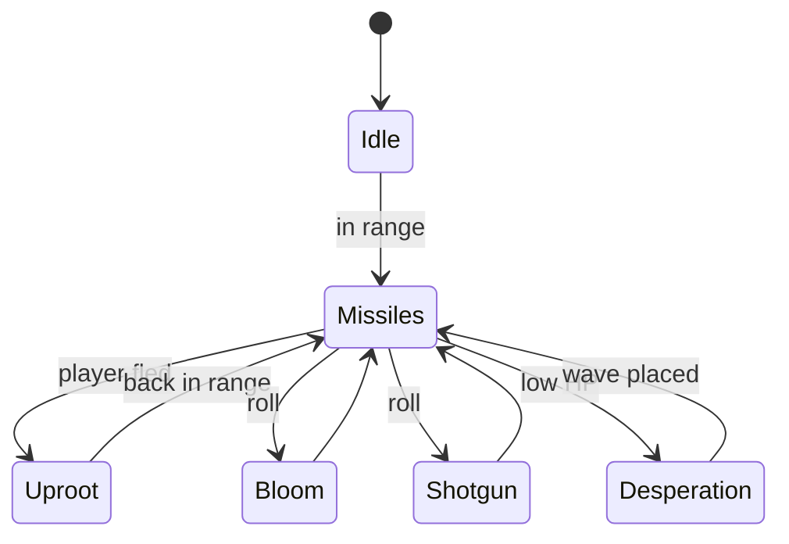
```mermaid
stateDiagram-v2
    [*] --> Idle
    Idle --> Missiles : in range
    Missiles --> Uproot : player fled
    Uproot --> Missiles : back in range
    Missiles --> Bloom : roll
    Missiles --> Shotgun : roll
    Bloom --> Missiles
    Shotgun --> Missiles
    Missiles --> Desperation : low HP
    Desperation --> Missiles : wave placed
```

## Deepwood

The forest, T3. Eleven natives make up the shared pool meant to appear in every deepwood sub-biome; on top of it the **animal deepwood** adds its own beasts and the **gnarlking**, and the **mimic deepwood** its props with eyes. The whole roster spawns, and the rooms are built to introduce it one mechanic at a time.

### Ash Snake

Snake variant, and the one that turns a room into a hazard. It flees furthest and fires the
longest, fastest shots of the three, bouncing five times and losing power on each — a volley
that keeps crossing the room long after the snake has gone. Nothing about it is dangerous
up close; everything about it is dangerous a second later.

**Art:** the snake recoloured ashen — pale grey-lavender scales with cyan eyes.

| Stat |  |
|---|---|
| Difficulty | 4 / 10 |
| HP | 90 |
| Speed | 40 px/s |
| Range | detect 11, retreat 1.375 |
| zoing | **24** dmg — 1.6s cd, Single, 2 @ 0.45s, 13 tiles range, BounceBehaviour |
| Drops | **zoing t2** (5%) |

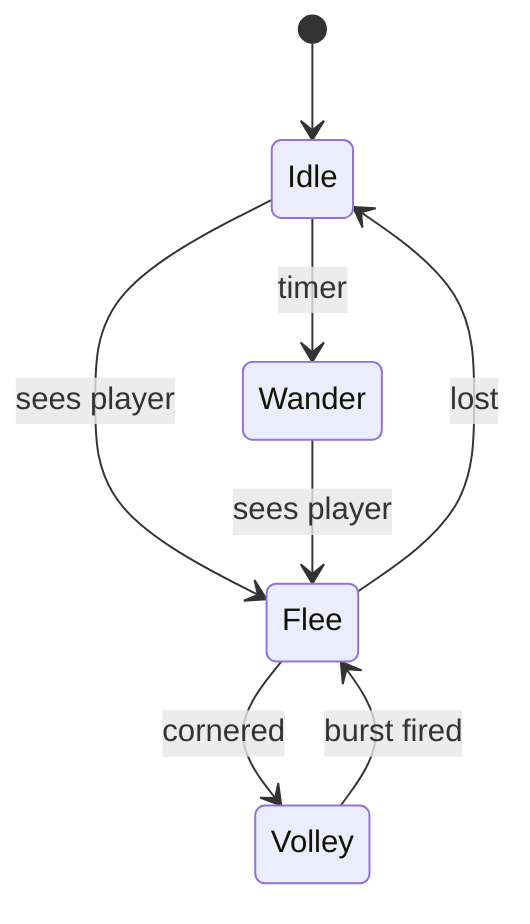
```mermaid
stateDiagram-v2
    [*] --> Idle
    Idle --> Wander : timer
    Idle --> Flee : sees player
    Wander --> Flee : sees player
    Flee --> Volley : cornered
    Volley --> Flee : burst fired
    Flee --> Idle : lost
```

### Coral Snake

Snake variant, and the one that corners early. It sees you late and panics at nearly double
the retreat range, so it hits a wall almost immediately and answers with a short-range
shotgun of twice-bouncing shots instead of a lane-filling pair. The trade is the reverse of
the snake's: harmless at distance, a wall of pellets the moment you crowd it.

**Art:** the snake recoloured hot coral — banded orange over red, white eye pixel.

| Stat |  |
|---|---|
| Difficulty | 3 / 10 |
| HP | 90 |
| Speed | 30 px/s |
| Range | detect 7, retreat 3 |
| zoing | **18** dmg — 1.3s cd, Shotgun x3, 8 tiles range, BounceBehaviour |
| Drops | **zoing t2** (5%) |

```mermaid
stateDiagram-v2
    [*] --> Idle
    Idle --> Wander : timer
    Idle --> Flee : sees player
    Wander --> Flee : sees player
    Flee --> Volley : cornered
    Volley --> Flee : burst fired
    Flee --> Idle : lost
```

### Grimling

Pack hunter. It wanders, then weaves in and fires a three-bolt burst at five tiles, with no
recovery between bursts while you stay in reach. Grimlings share a pack group: one alert —
or one hit — wakes every grimling of any kind in the radius. The weave makes it hard to line
up a shot, and the pack punishes you for focusing one down without a plan for the rest.

**Art:** a small hunched shadow-sprite, gloom-black body with two amber eyes and needle limbs; quick flickering run frames.

| Stat |  |
|---|---|
| Difficulty | 4 / 10 |
| HP | 90 |
| Speed | 40 px/s |
| Range | detect 10, chase 13, attack 3 |
| bolt | **12** dmg — 3s cd, Single, 3 @ 0.3s, 10 tiles range |
| Drops | **pew t2** (50%), **halp t2** (2%) |

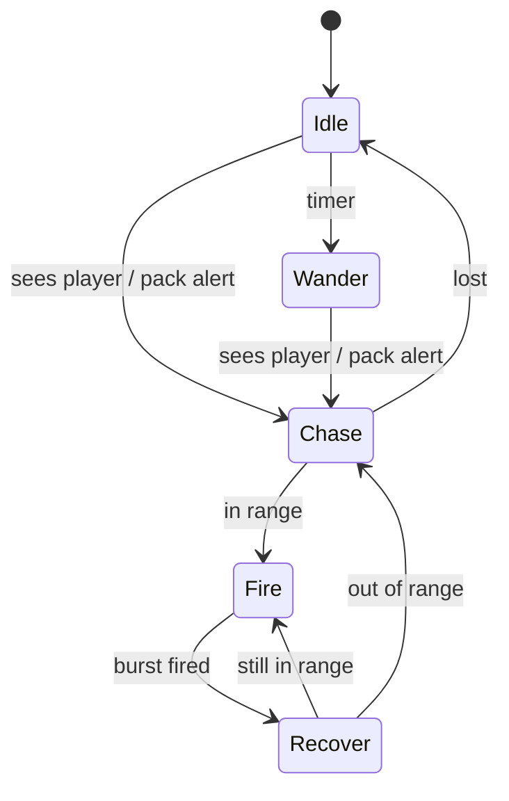
```mermaid
stateDiagram-v2
    [*] --> Idle
    Idle --> Wander : timer
    Idle --> Chase : sees player / pack alert
    Wander --> Chase : sees player / pack alert
    Chase --> Fire : in range
    Fire --> Recover : burst fired
    Recover --> Fire : still in range
    Recover --> Chase : out of range
    Chase --> Idle : lost
```

### Mole

Introduces the **burrow**. It dives underground where it cannot be hit at all, and the only
tell is a dirt plume tracking toward you; inside three tiles it erupts with a pair of
rotating ring bursts, scratches around on the surface for a beat — your punish window —
then dives again. Fighting it is rhythm reading: move off the plume, hit it while it blinks
in the light.

**Art:** a plump maroon-brown mole with oversized pale claws and a pink snout; a travelling dirt-mound sprite while submerged, a burst-of-soil frame on eruption.

| Stat |  |
|---|---|
| Difficulty | 5 / 10 |
| HP | 150 |
| Speed | 30 px/s |
| Range | detect 11, chase 15, erupt 3 |
| erupt | **26** dmg — 1.6s cd, Ring x9, 2 @ 0.35s, 5 tiles range |
| Drops | **ring t2** (10%) |

**Notes:** untouchable for the whole burrow (`damage_scale` 0) — the surface beat is the only window.

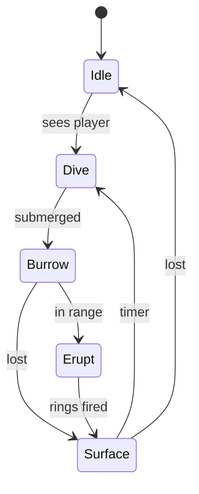
```mermaid
stateDiagram-v2
    [*] --> Idle
    Idle --> Dive : sees player
    Dive --> Burrow : submerged
    Burrow --> Erupt : in range
    Burrow --> Surface : lost
    Erupt --> Surface : rings fired
    Surface --> Dive : timer
    Surface --> Idle : lost
```

### Moon Moth

Moth variant, and the one you fight at arm's length. Same flit-in, poke, bolt loop, but the
poke is a pair of scale rings pulsed off its own body, each rotated off the last, so it has
to be right on top of you to land anything. It commits closer than the moth and leaves
sooner. Standing still to trade with one puts you inside the pulse; step off it, not
through it.

**Art:** the moth recoloured moonlit — pale blue-white wings over a dusk body.

| Stat |  |
|---|---|
| Difficulty | 3 / 10 |
| HP | 55 |
| Speed | 44 px/s |
| Range | detect 12, chase 15, attack 2, retreat 1.5 |
| scales | **18** dmg — 1.1s cd, Ring x6, 2 @ 0.22s, 3 tiles range |
| Drops | **ring t2** (5%) |

**Notes:** the shortest attack probe of the three (2 tiles) and the shortest retreat — its poke only works point-blank, so it re-closes fastest.

```mermaid
stateDiagram-v2
    [*] --> Idle
    Idle --> Wander : timer
    Idle --> Chase : sees player
    Wander --> Chase : sees player
    Chase --> Poke : in range
    Poke --> Retreat : pulse fired
    Retreat --> Chase : retreat over
    Chase --> Idle : lost
```

### Moss Golem

The golem recipe at deepwood weight — the toughest thing in the biome that isn't a boss, and
the slowest. It walks you down, and on arrival it hardens into a shell (a channeled absorb,
the rosebud's trick) that eats whatever you spent punishing the approach; then three rotating
rings pulse out, each turned off the last, dense enough that its own tile is a place you
never stand.

**Art:** the golem sprite overgrown: deep-green moss over grey stone, with dim eye-lights; a clenched, hardened frame for the shell.

| Stat |  |
|---|---|
| Difficulty | 6 / 10 |
| HP | 500 |
| Speed | 14 px/s |
| Range | detect 14, chase 17, attack 3 |
| ring | **36** dmg — 2.6s cd, Ring x8, 3 @ 0.6s, 8 tiles range |
| shell | 5s cd, absorbs 90 |
| Drops | **ring t2** (8%), **nope** (30%) |

**Notes:** the shell is a Nope absorb channelled through the wind-up, so hitting it mid-telegraph is the worst moment to spend a burst.

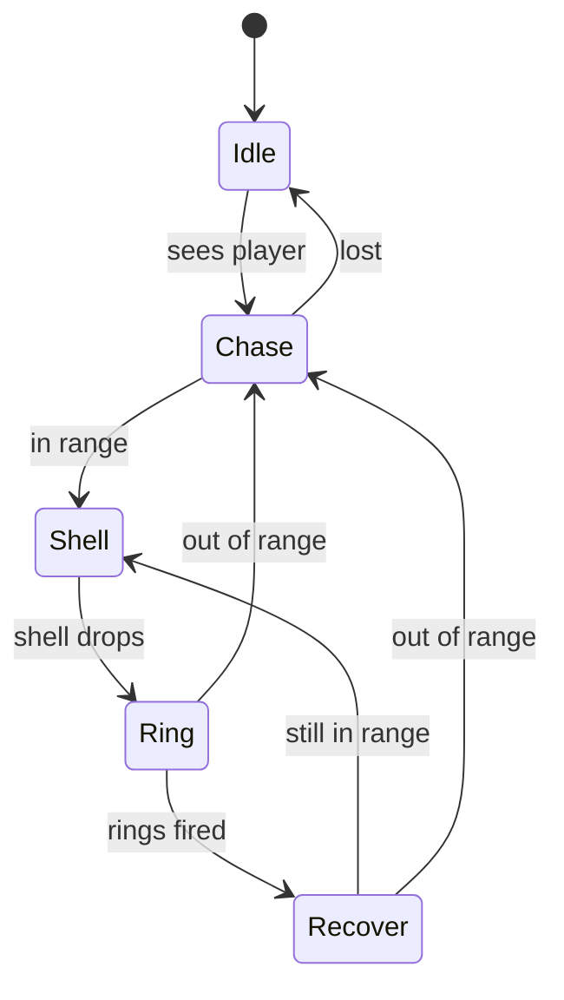
```mermaid
stateDiagram-v2
    [*] --> Idle
    Idle --> Chase : sees player
    Chase --> Shell : in range
    Shell --> Ring : shell drops
    Ring --> Recover : rings fired
    Ring --> Chase : out of range
    Recover --> Shell : still in range
    Recover --> Chase : out of range
    Chase --> Idle : lost
```

### Moth

The deepwood's basic flier and its returning face. It flits in on quick wings, pokes twice
with a dust burst at short range, then bolts for a beat before closing again — it never
stands and trades. Always in twos and threes: fragile chip pressure whose job is to keep
you moving while heavier things line up.

**Art:** a dusty grey-brown moth with big rounded wings and two pale eye pixels; a two-frame flutter.

| Stat |  |
|---|---|
| Difficulty | 3 / 10 |
| HP | 55 |
| Speed | 44 px/s |
| Range | detect 13, chase 16, attack 3, retreat 1.25 |
| dust | **23** dmg — 0.9s cd, Single, 2 @ 0.15s, 5 tiles range |
| Drops | **pew t2** (5%) |

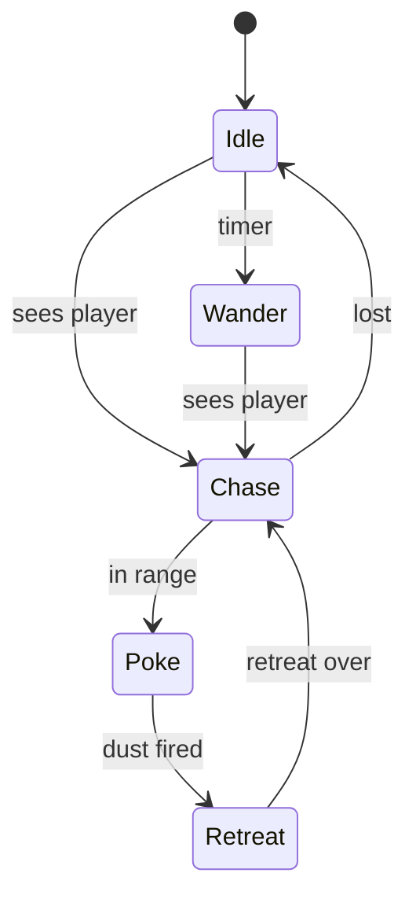
```mermaid
stateDiagram-v2
    [*] --> Idle
    Idle --> Wander : timer
    Idle --> Chase : sees player
    Wander --> Chase : sees player
    Chase --> Poke : in range
    Poke --> Retreat : dust fired
    Retreat --> Chase : retreat over
    Chase --> Idle : lost
```

### Needle Moth

Moth variant, and the one that taxes the dodge. It strikes from five tiles out and leaves
two homing dust-needles behind it, so its retreat is what buys the shot its time: you are
dealing with the moth that just left while the next one comes in. The needles turn hard but
only over a narrow cone — a sidestep won't shake one, breaking the angle will.

**Art:** the moth recoloured rust — tan-orange wings over a dark plum body.

| Stat |  |
|---|---|
| Difficulty | 4 / 10 |
| HP | 55 |
| Speed | 46 px/s |
| Range | detect 14, chase 17, attack 3, retreat 1.75 |
| dart | **19** dmg — 1.2s cd, Single, 2 @ 0.2s, 9 tiles range, homing 70° cone |
| Drops | **snipe t2** (5%) |

**Notes:** the longest attack probe of the three (5 tiles) and the longest retreat — it never comes into the range the other two fight at.

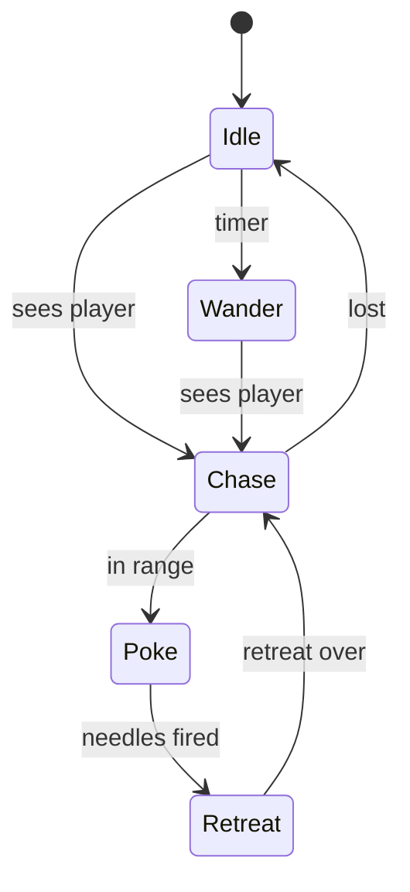
```mermaid
stateDiagram-v2
    [*] --> Idle
    Idle --> Wander : timer
    Idle --> Chase : sees player
    Wander --> Chase : sees player
    Chase --> Poke : in range
    Poke --> Retreat : needles fired
    Retreat --> Chase : retreat over
    Chase --> Idle : lost
```

### Owl

The perch sniper. It sits still and charges a Bwoom shot at anything inside ten tiles, the
wind-up itself being the telegraph. Get too close, or out of its band, and it repositions a
few tiles before charging again; being cornered mid-reposition just makes it fire. It
outranges most of what you carry at this depth, so your move is to close the gap through
its fire.

**Art:** a brown oval with an oversized head and two big amber eyes. The eye rule taken to a whole creature.

| Stat |  |
|---|---|
| Difficulty | 4 / 10 |
| HP | 120 |
| Speed | 46 px/s |
| Range | detect 18, snipe 10, close 5, retreat 2 |
| bwoom | **16** dmg — 5s cd |
| Drops | **bwoom t2** (5%), **pew t2** (7%) |

```mermaid
stateDiagram-v2
    [*] --> Idle
    Idle --> Bwoom : sees player
    Bwoom --> Recover : shot fired
    Bwoom --> Reposition : out of band
    Recover --> Reposition : timer / player closed in
    Reposition --> Bwoom : repositioned / cornered
```

### Shard Grimling

Grimling variant, and the pack's back line. It shares the pack, but it stops at nine tiles
and fans a spread of gloom shards instead of closing. On its own the fan is easy to walk out
of; with two of them behind a pack the cones overlap and the gaps you were stepping into
close. The long wind-up is the tell, so the shard grimling is the one you push or break line
of sight on, never the one you trade with at range.

**Art:** the grimling recoloured dark plum, with a duller eye-glow.

| Stat |  |
|---|---|
| Difficulty | 4 / 10 |
| HP | 110 |
| Speed | 30 px/s |
| Range | detect 12, chase 16, attack 8 |
| shards | **13** dmg — 2.8s cd, Shotgun x3, 12 tiles range |
| Drops | **blam t2** (5%), **halp t2** (2%) |

**Notes:** the longest attack probe of the three (9 tiles) and the longest wind-up — it never closes to the range the others fight at, and it keeps firing while they do.

```mermaid
stateDiagram-v2
    [*] --> Idle
    Idle --> Wander : timer
    Idle --> Chase : sees player / pack alert
    Wander --> Chase : sees player / pack alert
    Chase --> Fire : in range
    Fire --> Recover : fan fired
    Recover --> Fire : still in range
    Recover --> Chase : out of range
    Chase --> Idle : lost
```

### Snake

A skittish corridor-denier. It wanders until it spots you, then bolts in a random direction;
when its back hits a wall it stands and fires twin parallel shots that ricochet, then bolts
again. Trivial in open rooms; in narrow passages the bouncing pair covers the corridor both
ways.

**Art:** a low serpentine coil in deepwood two-tone green, a forked head with a white eye pixel; weave frames.

| Stat |  |
|---|---|
| Difficulty | 4 / 10 |
| HP | 90 |
| Speed | 35 px/s |
| Range | detect 9, retreat 2 |
| zoing | **27** dmg — 1.4s cd, Parallel x2, 2 @ 0.3s, 10 tiles range, BounceBehaviour |
| Drops | **zoing t2** (5%) |

```mermaid
stateDiagram-v2
    [*] --> Idle
    Idle --> Wander : timer
    Idle --> Flee : sees player
    Wander --> Flee : sees player
    Flee --> Volley : cornered
    Volley --> Flee : burst fired
    Flee --> Idle : lost
```

### Stalker

The basic pouncer, and the biome's signature jump-scare. It sits in `Disguise` as a scenery
prop, watching through a probe that only reaches five tiles. Step into that — or hit it —
and it reveals, then weaves in and blasts a point-blank shotgun cone with no recovery
between shots. Lose it and it becomes a prop again. Introduces **prop disguise**.

**Art:** a dark violet-grey cap on a thin stalk with a green leaf flick, indistinguishable from decor until the amber eyes open on reveal.

| Stat |  |
|---|---|
| Difficulty | 5 / 10 |
| HP | 150 |
| Speed | 36 px/s |
| Range | detect 5, chase 16, attack 3 |
| blast | **24** dmg — 1.7s cd, Shotgun x4, 4 tiles range |
| Drops | **blam t2** (5%) |

```mermaid
stateDiagram-v2
    [*] --> Disguise
    Disguise --> Reveal : player very close / hit
    Reveal --> Chase : revealed
    Chase --> Blast : in range
    Blast --> Recover : cone fired
    Recover --> Blast : still in range
    Recover --> Chase : out of range
    Chase --> Disguise : lost
```

### Thornback

A charger, introducing the **charge-dash with flank fire**. It runs a long telegraphed
windup, then a straight high-speed dash that sheds bullets off both flanks, then a rooted
recovery that is your punish window. It locks heading at launch and can't corner, so
sidestep the dash and burn it during recovery. Trees are your friend.

**Art:** a wide squat body, dark-brown armour over a tan body, a spike array along the back.

| Stat |  |
|---|---|
| Difficulty | 5 / 10 |
| HP | 350 |
| Speed | 14 px/s |
| Range | detect 14 |
| charge | **24** dmg — 3s cd, Flank x2, 9 @ 0.1s, 6 tiles range, dash 120 px/s for 1s |
| Drops | **charge_dash t2** (10%) |

```mermaid
stateDiagram-v2
    [*] --> Idle
    Idle --> Wander : timer
    Idle --> Charge : sees player
    Wander --> Charge : sees player
    Charge --> Recover : dash over
    Recover --> Charge : still sees player
    Recover --> Idle : lost
```

### Wisp Grimling

Grimling variant, and the one that finds you. It sees furthest, runs fastest, and calls from
nearly twice the radius its packmates do, so the first wisp to spot you is what turns a room
into a pack. Its poke is a fast triple flicker at four tiles for almost no damage — the
threat is never the bolt, it's who else is now coming. Kill it first or the fight keeps
recruiting.

**Art:** the grimling recoloured pale — washed lavender body, bright eye-glow; the brightest thing in the gloom.

| Stat |  |
|---|---|
| Difficulty | 3 / 10 |
| HP | 60 |
| Speed | 54 px/s |
| Range | detect 18, chase 20, attack 3 |
| flicker | **8** dmg — 1.8s cd, Single, 3 @ 0.18s, 7 tiles range |
| Drops | **pew t2** (5%), **halp t2** (2%) |

**Notes:** pack radius 14 tiles against the grimling's default 8, and the shortest attack probe — it comes all the way in.

```mermaid
stateDiagram-v2
    [*] --> Idle
    Idle --> Wander : timer
    Idle --> Chase : sees player / pack alert
    Wander --> Chase : sees player / pack alert
    Chase --> Fire : in range
    Fire --> Recover : burst fired
    Recover --> Fire : still in range
    Recover --> Chase : out of range
    Chase --> Idle : lost
```

### Great Owl *(rare)*

Owl variant: bigger, and its firing band is most of the map — it charges from twenty-four
tiles, further than anything else in the biome can answer. The wind-up is longer and the
telegraph brighter, so the duel stays honest, but it re-perches further away too and the
whole fight is spent closing.

**Art:** the owl sprite enlarged, pale barn-owl white with amber eyes.

| Stat |  |
|---|---|
| Difficulty | 6 / 10 |
| HP | 300 |
| Speed | 42 px/s |
| Range | detect 28, snipe 24, close 7, retreat 2.5 |
| bwoom | **18** dmg — 4s cd |
| Drops | **bwoom t2** (80%) |

**Notes:** guaranteed Bwoom T3 on death.

```mermaid
stateDiagram-v2
    [*] --> Idle
    Idle --> Bwoom : sees player
    Bwoom --> Recover : shot fired
    Bwoom --> Reposition : out of band
    Recover --> Reposition : timer / player closed in
    Reposition --> Bwoom : repositioned / cornered
    Reposition --> Idle : lost
```

### Grimlord *(rare)*

A larger, darker grimling, the pack's alpha, and the one grimling that rolls its beat: a
`PatternPicker` swaps its move at low health rather than adding one. Above a quarter health
it weaves in and sprays five bolts at four tiles. Below it, the spray is gone and it enrages
— seven bolts, faster, from wherever it stands, with no range check at all. On death it
bursts one parting ring. The weave plus the enrage turns the last sliver of its health into
a gauntlet.

**Art:** the grimling silhouette enlarged and near-black, red eye-glow; the enrage frame brightens the eyes.

| Stat |  |
|---|---|
| Difficulty | 6 / 10 |
| HP | 380 |
| Speed | 38 px/s |
| Range | detect 11, chase 14, attack 3 |
| burst | **13** dmg — Ring x18, 7 tiles range |
| enrage | **13** dmg — 1.4s cd, Single, 7 @ 0.13s, 10 tiles range |
| spray | **13** dmg — 2.4s cd, Single, 5 @ 0.26s, 10 tiles range |
| Drops | **blam t3** (50%), **ring t3** (30%), **halp t2** (20%) |

**Notes:** enrage replaces the spray below 30% HP; `RingPattern` death burst. Shares the grimling pack group, so it wakes with them.

```mermaid
stateDiagram-v2
    [*] --> Idle
    Idle --> Wander : timer
    Idle --> Chase : sees player / pack alert
    Wander --> Chase : sees player / pack alert
    Chase --> Pick : in range
    Pick --> Fire : above 25% HP
    Pick --> Enrage : below 30% HP
    Fire --> Recover
    Enrage --> Recover
    Recover --> Pick : still in range
    Recover --> Chase : out of range
    Chase --> Idle : lost
```

### Razorback *(rare)*

Thornback variant: the recovery is gone. Each dash ends in a snap re-aim and a fresh launch,
chaining charge after charge for as long as you stay inside its very long sight line; only a
head-on wall hit stuns it into a real punish window. Fight it near trees and make the forest
do the work.

**Art:** the thornback silhouette in near-black armour with red spike tips.

| Stat |  |
|---|---|
| Difficulty | 7 / 10 |
| HP | 420 |
| Speed | 18 px/s |
| Range | detect 20 |
| charge | **30** dmg — 0.3s cd, Flank x2, 6 @ 0.1s, 5 tiles range, dash 150 px/s for 0.7s |
| Drops | **charge_dash t2** (50%) |

```mermaid
stateDiagram-v2
    [*] --> Idle
    Idle --> Wander : timer
    Idle --> Charge : sees player
    Wander --> Charge : sees player
    Charge --> Charge : dash over
    Charge --> Stun : head-on wall
    Charge --> Idle : out of range
    Stun --> Charge : recovered
    Stun --> Idle : lost
```

### Gnarlking *(boss)*

The apex of the animal deepwood, and the one boss that doesn't roll: it runs ordered `Gate`
ladders, so what it does next is decided by the arena rather than by dice. The fight
alternates two modes and **the player sets the pace of the swap**.

Everything it owns is a close-quarters weapon, and the whole kit is **range-gated** — it
never swings at air. Out of reach it simply walks you down, and distance is a delay, not an
answer.

- **Call → Hunt** *(armoured)*: it rings in a brood of six grimlings — the plain, shard and
  wisp kinds mixed — then comes for you. While any of them stand it takes about a third
  damage, and it works the ladder by distance: **Ground Slam** inside 6 tiles (radial
  shockwave, damage falling off with distance, big knockback — demonstrates **Thwomp**),
  **Shotgun Volley** inside 8, and outside both it **closes**, at a steady advance you can
  outpace but not shake. Chipping the boss here is a poor trade against clearing the pack,
  but not a wasted one.
- **Charge** *(unarmoured)*: the moment the brood is dead — or its 26s life runs out — the
  charge unlocks and the ranged kit drops entirely. The thornback's charge-dash writ large:
  a locked-heading lunge shedding `FlankPattern` bullets. It can't corner.
- **Stalk → second Charge**: after the lunge it prowls for a beat. Still within reach and it
  immediately charges again; broken away and it goes straight to **Winded**. Your footwork
  sets the length of the burst.
- **Stagger**: sidestep a charge into a tree and the head-on slam staggers it — three and a
  half seconds rooted, taking *extra* damage. The fight's best window, and you have to earn it.
- **Winded**: heaves briefly, then calls the next brood.

The decision the loop poses: clear the adds fast and you reach the burn window sooner but
meet the charge sooner too, with the pack's chip damage still on you; ignore them and you
are ground down while the boss walks into your face anyway.

**Art:** a towering forest-lord of bark, antler, and gloom, pale glowing eyes, oversized frame; a rear-and-slam pose for the slam (boss sheet).

| Stat |  |
|---|---|
| Difficulty | 9 / 10 |
| HP | 5000 |
| Speed | 82 px/s |
| Range | detect 22, close 6, slam 2, volley 4 |
| brood | 6 minions, 8 hp, 26s |
| brood_big | 3 minions, 8 hp, 20s |
| charge | **26** dmg — 5s cd, Flank x2, 16 @ 0.045s, 6 tiles range, dash 300 px/s for 0.7s |
| charge_chain | **26** dmg — Flank x2, 13 @ 0.045s, 6 tiles range, dash 300 px/s for 0.6s |
| slam | **48** dmg — 6s cd |
| volley | **24** dmg — 4s cd, Shotgun x4, 4 @ 0.55s, 6 tiles range |
| Drops | **thwomp t3** (100%), **halp t2** (60%), **blam t3** (100%), **charge_dash t2** (60%) |

**Notes:** one Thwomp only — no bigger low-HP variant. Below a quarter health it calls three grimlords instead of six grimlings (on a shorter 20s leash), and Winded shrinks from 5s to 3s. `clear_group` on the charge is what makes the brood, not a timer, the phase gate.

```mermaid
stateDiagram-v2
    [*] --> Idle
    Idle --> Summon : sees player
    Summon --> CallBig : below 25% HP
    Summon --> Call
    Call --> Hunt
    CallBig --> Hunt
    Hunt --> Charge : brood cleared / expired
    Hunt --> Slam : within 6
    Hunt --> Volley : within 8
    Hunt --> Close : out of reach
    Close --> Volley : arrived
    Close --> Brace : volley cooling
    Close --> Hunt : timer
    Slam --> Hunt
    Volley --> Hunt
    Brace --> Hunt
    Charge --> Stagger : slammed a wall
    Charge --> Stalk : dash over
    Stalk --> Charge2 : still in reach
    Stalk --> Breathe : broke away
    Charge2 --> Breathe
    Breathe --> WindedShort : below 25% HP
    Breathe --> Winded
    Stagger --> Summon
    Winded --> Summon
    WindedShort --> Summon
```

### Bramble Stalker

The mimic sub-biome's opener, and the stalker recipe turned inside out: instead of closing
to point-blank and coning you, it sits as a bush, reveals, weaves in, and fires whole rings
of thorns off its own body. The ring means there is no safe side of it — the answer is
distance, not footwork — and the rings drift a little each wave, so a gap you found in the
first one is somewhere else in the second. Hard to lead on the approach, trivial once you
stop letting it arrive.

**Art:** a leafy deepwood bush, built from the biome's own decor bush — same three greens, same sparse silhouette, same ground shadow, and dead still while it waits. The disguise carries no eye and no thorn at all; the amber eyes open in the leaves on reveal, and the bramble-red thorns push out after them, one per flank as it winds up.

| Stat |  |
|---|---|
| Difficulty | 5 / 10 |
| HP | 110 |
| Speed | 40 px/s |
| Range | detect 3, chase 12, attack 5 |
| ring | **16** dmg — 2.2s cd, Ring x8, 2 @ 0.4s, 5 tiles range |
| Drops | **ring t2** (6%) |

```mermaid
stateDiagram-v2
    [*] --> Disguise
    Disguise --> Reveal : player close / hit
    Reveal --> Chase : revealed
    Chase --> Ring : in range
    Ring --> Recover : rings fired
    Recover --> Ring : still in range
    Recover --> Chase : out of range
    Chase --> Disguise : lost
```

### Bristlestone

The cinderstone's sibling, and the reason you can't read a minefield at a glance. It is the
same rock sitting in the same litter, and it triggers the same way — step close, or clip it
with a shot, and the fuse runs. What comes out is the difference: instead of one big blast
it bursts into a full ring of piercing darts that carry clean across the room and straight
through anything in the way.

Between the two of them a room of rocks stops being scenery you ignore. The blast one
punishes standing next to it, the dart one punishes standing anywhere in line with it,
and until one goes off you don't know which you're walking past. The tell, if you look
for it, is a pair of dry burr spines in the moss on top.

**Art:** the cinderstone's boulder, moss and all, with two pale burr spines standing out of the green. The fuse lights white instead of amber, and it goes off in a pale green seed-burst rather than a fireball.

| Stat |  |
|---|---|
| Difficulty | 4 / 10 |
| HP | 1 |
| Range | trigger 2 |
| ploop | **32** dmg — Ring x6, 3 @ 0.1s, 4 tiles range |
| Drops | **ploop t2** (4%) |

**Notes:** it drops the Ploop it fires, the way the cinderstone drops its Oop. Killing it before the fuse lands does NOT set it off.

```mermaid
stateDiagram-v2
    [*] --> Disguise
    Disguise --> Fuse : player close / hit
    Fuse --> [*] : burst away
```

### Cinderstone

A trap with a health bar. It sits among the real rocks and litter until you step close — or
clip it with a shot — then shivers, glows, and goes up in one big blast, taking itself with
it. Spot the boulder that is slightly too round and spend it from range, or route around it
and leave it armed for whatever chases you. It never moves and never fires twice; the only
question is where you are standing when the fuse ends.

**Art:** a mossy grey boulder, the same stone the deepwood scatters everywhere, with one hairline seam down its face; the seam lights amber through the fuse until the whole rock glows.

| Stat |  |
|---|---|
| Difficulty | 4 / 10 |
| HP | 1 |
| Range | trigger 2 |
| oop | **60** dmg — Single, 0 tiles range, blast 5 tiles (splash only) |
| Drops | **oop t2** (4%) |

**Notes:** its blast is the Oop cast — an ordinary blast-payload bullet whose burst kills the caster when it ends, which is exactly what the player's Oop mine does from the other side. Killing the cinderstone before the fuse lands does NOT set it off. The mother tree seeds these as mines.

```mermaid
stateDiagram-v2
    [*] --> Disguise
    Disguise --> Fuse : player close / hit
    Fuse --> [*] : detonated
```

### Shade

A vanishing harasser, and the enemy that teaches the sub-biome's second trick: it fires a
short burst, then blinks somewhere else nearby and bursts again. Nothing about a single
burst is dangerous; what it costs you is aim. Every exchange starts over, so it punishes
standing still and rewards fighting it while moving to something else. It never walks —
the blink is its whole movement.

**Art:** a wispy near-black silhouette with a faint violet edge and two pale eyes; a barely-there body that blinks out.

| Stat |  |
|---|---|
| Difficulty | 5 / 10 |
| HP | 70 |
| Range | detect 12 |
| blink | 0.6s cd |
| pew | **20** dmg — 1.1s cd, Single, 3 @ 0.16s, 12 tiles range |
| Drops | **blink t2** (8%), **pew t3** (5%) |

**Notes:** the blink is a teleport cast, not a bullet spell — it moves its caster and refuses a landing spot with a wall in the way. The player's own Blink is the same effect with its landing dial on AIM instead of a random bearing.

```mermaid
stateDiagram-v2
    [*] --> Idle
    Idle --> Volley : sees player
    Volley --> Blink : burst done
    Blink --> Recover : reappeared
    Recover --> Volley : burst ready
    Recover --> Idle : lost
```

### Adder *(rare)*

Snake variant, and a lesson about corridors. It flees like the snake, but when its back hits
a wall the twin shot becomes a wide ricocheting spray that fills the passage behind you as
well as ahead. Cornering it in a hallway is the natural move and precisely the mistake;
take it in the open, where the bounces have nothing to come back off.

**Art:** the snake coil in rare charcoal with amber banding.

| Stat |  |
|---|---|
| Difficulty | 7 / 10 |
| HP | 320 |
| Speed | 46 px/s |
| Range | detect 12, retreat 2 |
| zoing | **26** dmg — 1.6s cd, Shotgun x5, 12 tiles range, BounceBehaviour |
| Drops | **zoing t2** (50%) |

```mermaid
stateDiagram-v2
    [*] --> Idle
    Idle --> Wander
    Idle --> Flee : sees player
    Wander --> Flee : sees player
    Flee --> Volley : cornered
    Volley --> Flee : spray fired
```

### Elder Stalker *(rare)*

Stalker variant, and the mimic's long game: an ancient tree that snipes a slow, wide-cone
homing seed from across the room, blinks the moment it has fired, and greets you with a
shotgun cone wherever it lands. The seed forces you to move; the blink means the ground you
moved to is the wrong ground. It never chases — every reposition is a teleport — so the
fight is about closing the gap between its cycle rather than out-running it.

**Art:** a gnarled dead-tree disguise, bark-grey twisted trunk, hollow amber eye-glow on reveal; taller than the stalker.

| Stat |  |
|---|---|
| Difficulty | 7 / 10 |
| HP | 260 |
| Range | detect 22, blast 5 |
| blast | **24** dmg — 1.6s cd, Shotgun x5, 5 tiles range |
| blink | 0.4s cd |
| seed | **32** dmg — 3.2s cd, Single, 20 tiles range, homing 150° cone |
| seed_fast | **32** dmg — 2.4s cd, Single, 20 tiles range, homing 150° cone |
| Drops | **blam t3** (30%), **blink t2** (60%) |

**Notes:** below a quarter health the seed's wind-up drops to near-instant — the same beat with a shorter telegraph, swapped in by health window.

```mermaid
stateDiagram-v2
    [*] --> Disguise
    Disguise --> Aim : sees player
    Aim --> SnipeFast : below 25% HP
    Aim --> Snipe
    Snipe --> Blink : seed away
    SnipeFast --> Blink : seed away
    Blink --> Blast : arrived
    Blast --> Recover
    Recover --> Aim : snipe ready
    Recover --> Disguise : lost
```

### Umbra *(rare)*

Shade variant, and the reason you stop treating the blink as a retreat: every hop lands on
the far side of you. The burst itself is the shade's — a plain Pew, one shot longer — so
what changed is entirely where it fires it from. Turning to face it puts your back to
whatever else is in the room, which is exactly the trade the mimic sub-biome keeps asking
you to make. Clear it first, or fight it with a wall behind you.

**Art:** the shade silhouette in deeper black with a thin red edge.

| Stat |  |
|---|---|
| Difficulty | 7 / 10 |
| HP | 200 |
| Range | detect 12 |
| blink | 0.6s cd |
| pew | **22** dmg — 1.1s cd, Single, 3 @ 0.16s, 12 tiles range |
| Drops | **blink t2** (50%), **pew t3** (30%) |

**Notes:** the same Blink cast as the shade, with the landing spot taken past the target instead of on a random bearing — the dial the player's tiers leave on AIM.

```mermaid
stateDiagram-v2
    [*] --> Idle
    Idle --> Volley : sees player
    Volley --> Blink : burst done
    Blink --> Recover : behind player
    Recover --> Volley : burst ready
    Recover --> Idle : lost
```

<!-- END GENERATED CATALOGUE -->

---

# ideas

## Deepwood

The forest biome, T3: everything has more health and hits harder, tuned to pressure
long-range squishy builds and push the player into close quarters. It comes in four
flavours, in encounter order: the **animal deepwood** (beasts, boss **gnarlking**), the
**mimic deepwood** (props that come alive, boss **mother tree**), the **insect deepwood**
(swarms and crawlers, boss **hive queen**), and the **fungal deepwood** (rot and spores,
boss **rotmaw**).

**The shared pool and the animal and mimic sub-biomes are built** — they moved up into the
catalogue above. What remains below are the two unbuilt sub-biomes: insect and fungal.
Their sprites exist; nothing else does.

Each sub-biome adds three commons, three rares (almost all cheap variants of another enemy —
the mandraker recipe; only the drone is bespoke), and its boss: 16 per sub-biome. Every enemy
carries a generic cast plus a signature and drops both. Commons drop T2, rares guarantee T3,
bosses drop their T3 signatures — the glade's structure one tier up.

The mechanics are budgeted: each sub-biome introduces at most three, and later sub-biomes
reuse and combine earlier ones instead of adding more.

| #   | Mechanic                 | Introduced by       | Reused / combined                           |
| --- | ------------------------ | ------------------- | ------------------------------------------- |
| 1   | prop disguise *(built)*  | stalker *(shared)*  | mimic doubles down; bloatcap                |
| 2   | charge-dash *(built)*    | thornback           | gnarlking; mother tree's thorn rush         |
| 3   | burrow *(built)*         | mole                | rotmaw dives between patterns               |
| 4   | blink teleport *(built)* | shade               | elder stalker; umbra                        |
| 5   | self-detonation *(built)*| cinderstone *(static)* | ticktick *(mobile)*; mycelings *(+ clouds)* |
| 6   | wall crawl               | longleg             | weaver; creeper mold *(+ clouds)*           |
| 7   | bullet escort            | drone               | hive queen's swarm phase                    |
| 8   | lingering spore clouds   | sporespitter        | creeper mold; rot golem; rotmaw             |
| 9   | split on death           | bloatcap            | rotmaw splits at low HP                     |
| 10  | drain leech              | leech               | elder leech's aura; rotmaw's drain phase    |

Spells introduced here: Bwoom, ChargeDash, Thwomp, Halp and Zoing all ship (the animal roster
drops them), and so do Blink and Oop (the shade and umbra carry the two Blink tiers, the
cinderstone its own Oop). Ploop ships as a spell but nothing drops it since the mother tree was
cut. Halo, Slurp and Fwoosh wait on the sub-biomes below. Reserved for future T3 biomes: Kaboom, Krak,
Brrr, Clang, Chomp, Piercing Lights, Vroop, Beep Boop, Nyoom, Shing, Splay.

**Mimic deepwood** — the sub-biome is built except for its boss, which was cut from the
game and is a proposal again.

### mother tree *(boss, mimic)*

The oldest stalker: a massive gnarled tree that uproots and thunders across the room, on
a two-phase cycle.

- **Thorn Rush**: the charge-dash reused at boss scale — a lunge at high speed that fires
  wide high-damage `ShotgunPattern` bursts the whole time and scatters **Ploop**
  seed-mines behind it. The mines arm after a delay and erupt into darts if you step
  near. The room becomes a minefield.
- **Root**: slams down and stops dead. Your burn window. Earlier mines stay live.

**Art:** a massive gnarled bark-brown trunk with a mossy canopy and root legs, amber
eyes; uproots into a charging pose (boss sheet).

| Stat | |
|---|---|
| HP | very high (boss) |
| Speed | very fast during Thorn Rush; stationary in Root |
| Detection | long |
| Attack | shotgun bursts + Ploop mines / none in Root |
| Casts | Blam, Ploop |
| Drops | **Ploop** (t3), **Blam** (t3) |

**Notes:** at critical HP Thorn Rush lasts twice as long, the spread tightens, mines
double, and Root drops out.

```mermaid
stateDiagram-v2
    [*] --> Idle
    Idle --> ThornRush : sees player
    ThornRush --> Root : lunge done
    Root --> ThornRush : burn window over
    ThornRush --> ThornRush : low HP (no Root)
```

**Insect deepwood** — swarms, crawlers, and geometry: the walls stop being safe.
Introduces the wall crawl and the bullet escort; the cinderstone's detonation goes mobile
here.

### longleg *(insect)*

A wall-crawling spider with two weapons, introducing the **wall crawl**.
`Wander`→`SniperCharge` a slow wide-cone homing web at medium range; when you close, a
`RingPattern` then a scuttle away. Wall Crawl keeps it on wall/blocker tiles. The web is
slow enough to sidestep but forces you to keep moving while it repositions.

**Art:** a small round body on long spidery legs, deepwood browns, clustered eye pixels;
a wall-crawl pose.

| Stat | |
|---|---|
| HP | low |
| Speed | slow (wall-crawling) |
| Detection | med |
| Attack | `Homing` web (med dmg) / close `RingPattern`, low dmg |
| Casts | Ring, Snipe |
| Drops | **Snipe** (t2), **Ring** (t2) |

```mermaid
stateDiagram-v2
    [*] --> Wander
    Wander --> Snipe : sees player
    Snipe --> Ring : player close
    Ring --> Snipe : reposition
    Snipe --> Wander : lost
```

### beetle *(insect)*

A bouncing brawler. `Chase` (medium speed)→`Volley` burst at short range, then an Impulse
Hop in a random cardinal direction that fires a `RingPattern` mid-hop. It is hard to pin:
the hop resets your aim, and the mid-hop ring makes it dangerous to stand near. Charge in
after the hop lands.

**Art:** a rounded armoured shell, dark carapace over a lighter belly, small eyes; a
squash/stretch hop frame.

| Stat | |
|---|---|
| HP | low |
| Speed | med (chase), hops |
| Detection | med |
| Attack | `Volley` (low dmg, fast) + hop `RingPattern` |
| Casts | Pew, Ring |
| Drops | **Ring** (t2), **Pew** (t2) |

```mermaid
stateDiagram-v2
    [*] --> Idle
    Idle --> Chase : sees player
    Chase --> Volley : in range
    Volley --> Hop : burst done
    Hop --> Chase : landed
    Chase --> Idle : lost
```

### ticktick *(insect)*

The cinderstone gone mobile. A tiny sprinter that locks on from far off and closes in a dead
straight line, clicking faster the nearer it gets; on contact it detonates, and that
blast is its whole life. Kill it at range or sidestep the final lunge — there is no third
option.

**Art:** a round dark tick on scrabbling legs, with a red pulse-glow that quickens as it
closes.

| Stat | |
|---|---|
| HP | very low |
| Speed | very fast (straight chase) |
| Detection | long |
| Attack | contact blast, high dmg |
| Casts | Oop (on itself) |
| Drops | **Oop** (t2) |

```mermaid
stateDiagram-v2
    [*] --> Idle
    Idle --> Chase : sees player
    Chase --> Detonate : contact
    Chase --> Idle : lost
```

### weaver *(insect, rare)*

Longleg variant: a large wall-crawling spider. `SniperCharge` a medium-turn high-damage
homing web that bounces off walls several times, so it is dangerous in corridors and can
hit you around a corner. If you close, a `ShotgunPattern` then a scuttle to the nearest
wall. Open rooms are your safe zone.

**Art:** a large spider, bulbous abdomen and long legs, deep purple-brown two-tone, an
eye cluster; a wall-cling pose.

| Stat | |
|---|---|
| HP | med |
| Speed | slow (wall-crawling) |
| Detection | long |
| Attack | bouncing `Homing` web (high dmg) / close `ShotgunPattern` |
| Casts | Zoing, Blam |
| Drops | **Zoing** (t3), **Blam** (t3) |

**Notes:** at critical HP the windup drops to near-instant.

```mermaid
stateDiagram-v2
    [*] --> Crawl
    Crawl --> Snipe : sees player
    Snipe --> Shotgun : player close
    Shotgun --> Crawl : scuttle to wall
    Snipe --> Crawl : lost
```

### goliath *(insect, rare)*

Beetle variant: bigger, armoured, and patient. It opens with a Guard windup — an
armoured shell that eats your burst, the rosebud lesson at scale — then answers with a
hop whose mid-air ring covers most of the room. Wait out the shell, burn it on the
landing.

**Art:** the beetle scaled up in gunmetal carapace with a nose horn.

| Stat | |
|---|---|
| HP | high |
| Speed | slow (chase), hops |
| Detection | med |
| Attack | guard → room-wide hop `RingPattern`, med dmg |
| Casts | Ring |
| Drops | **Ring** (t3), **Nope** (t3) |

```mermaid
stateDiagram-v2
    [*] --> Idle
    Idle --> Chase : sees player
    Chase --> Guard : in range
    Guard --> Hop : shell drops
    Hop --> Chase : landed
    Chase --> Idle : lost
```

### drone *(insect, rare)*

A flying orbiter introducing the **bullet escort**. It tethers at a fixed radius
(`Tether`) with bullets circling it as a deterrent. Every so often the bullets launch
outward in a shotgun spread and the drone flees to recharge, then re-enters the tether at
a wider orbit. The fight is a cycle: dodge the burst, chase it while it is vulnerable,
then repeat. The one bespoke rare in the biome.

**Art:** a small flying orb ringed by orbiting bullet pixels, metallic two-tone, a single
glowing eye.

| Stat | |
|---|---|
| HP | low |
| Speed | med (orbiting) |
| Detection | med |
| Attack | Circling Bullets → launched `ShotgunPattern`, med dmg |
| Casts | Halo, Blam |
| Drops | **Halo** (t3) |

```mermaid
stateDiagram-v2
    [*] --> Tether
    Tether --> Burst : charged
    Burst --> Flee : bullets launched
    Flee --> Tether : recharged (wider orbit)
```

### hive queen *(boss, insect)*

A massive flying hornet queen on a `PatternPicker`.

- **Acid Spray**: `ShotgunPattern` bursts while she `TimedChase`s toward you. The
  sweeping coverage forces you to rotate around her.
- **Spawn Swarm**: summons her own larvae — fragile fast-shooting brood — plus drones,
  and turns invulnerable until they clear; the drones' orbiting escorts fill the room.
  Demonstrates the **Bzzz** spell.
- **Web Trap**: fires slow bouncing homing webs that explode into AoE on expiry, so you
  can't stand still anywhere.
- **Rest**: hovers chittering. Your burn window.

**Art:** a massive hornet queen, striped ochre/black thorax, big flat translucent wings,
a compound-eye band (boss sheet).

| Stat | |
|---|---|
| HP | very high (boss) |
| Speed | fast during Acid Spray; hovers otherwise |
| Detection | long |
| Attack | acid shotgun / swarm / bouncing web traps |
| Casts | Blam, Bzzz (brood), Snipe (web traps) |
| Drops | **Bzzz** (t3) |

**Notes:** at critical HP Rest drops out and she adds a room-wide exploding `RingPattern`
(Desperation Swarm) behind a long wing-vibration telegraph.

```mermaid
stateDiagram-v2
    [*] --> Idle
    Idle --> Pattern : sees player
    Pattern --> Acid : roll
    Pattern --> Swarm : roll
    Pattern --> WebTrap : roll
    Pattern --> Rest : roll
    Acid --> Pattern
    Swarm --> Pattern : cleared
    WebTrap --> Pattern
    Rest --> Pattern
    Pattern --> Idle : lost
```

**Fungal deepwood** — the wood, rotting: a turf war where they paint the floor and you
contest it. The finale sub-biome: three new mechanics (spore clouds, split on death, the
drain leech), everything else recombined from the other three.

### sporespitter *(fungal)*

Rooted lobber, introducing **lingering spore clouds**. It arcs spore blobs at you on a
slow cadence, and every burst leaves a cloud that hangs there ticking damage — a miss
still costs you floor. One sporespitter is a zoning puzzle; two facing each other own the
room between them.

**Art:** a bent mushroom with a spout-shaped cap, pale stalk and sickly green gills; a
cheek-puff frame on the spit.

| Stat | |
|---|---|
| HP | med |
| Speed | stationary |
| Detection | med |
| Attack | lobbed blob → lingering DoT cloud, low tick dmg, slow cadence |
| Casts | Pew, Fwoosh (the cloud) |
| Drops | **Fwoosh** (t2), **Pew** (t2) |

```mermaid
stateDiagram-v2
    [*] --> Idle
    Idle --> Spit : sees player
    Spit --> Idle : lost sight
```

### leech *(fungal)*

Introduces the **drain leech**. A slow slug that creeps in and latches a drain beam:
while it holds, you bleed and it heals the same amount. The beam breaks on range or line
of sight, so the fight is about geometry — put a trunk between you, or kill it faster
than it drinks. In a mixed room it quietly undoes all your damage if ignored.

**Art:** a glossy umber slug that pulses brighter while latched; the beam is a dotted
line of drips flowing the wrong way.

| Stat | |
|---|---|
| HP | med |
| Speed | slow |
| Detection | med |
| Attack | latch drain beam, low dps, self-heals for the same |
| Casts | Slurp |
| Drops | **Slurp** (t2) |

```mermaid
stateDiagram-v2
    [*] --> Idle
    Idle --> Chase : sees player
    Chase --> Latch : in range
    Latch --> Chase : beam broken
    Chase --> Idle : lost
```

### bloatcap *(fungal)*

Introduces **split on death**, and reuses half the biome doing it. It hides among the
real mushroom scenery (the stalker's trick), waddles at you when you get close, and pops
when it dies (the cinderstone's trick): one spore cloud plus two or three mycelings —
fist-sized copies that sprint and pop in turn into smaller clouds. Killing it point-blank
is a mistake; killing it at range is three more kills.

**Art:** a fat button mushroom, off-white cap with rot spots and stubby feet; mycelings
are the same sprite at half size.

| Stat | |
|---|---|
| HP | med |
| Speed | slow (waddling chase) |
| Detection | short probe |
| Attack | death-pop cloud + myceling brood |
| Casts | Oop (the pop) |
| Drops | **Oop** (t2) |

**Notes:** mycelings are its spawn, not a roster entry; they carry no drops.

```mermaid
stateDiagram-v2
    [*] --> Disguise
    Disguise --> Chase : player close
    Chase --> Disguise : lost
    Chase --> Pop : dies
```

### elder leech *(fungal, rare)*

Leech variant: the beam is gone, replaced by a drain aura with nothing to break.
Everything near it — you, your minions — feeds it. It creeps forward tanking through its
own healing, and the only answers are range or overwhelming burst.

**Art:** the leech sprite grown long and pale, ringed by a faint spore shimmer.

| Stat | |
|---|---|
| HP | high |
| Speed | slow |
| Detection | med |
| Attack | drain aura, low dps in a radius, self-heals per target |
| Casts | Slurp |
| Drops | **Slurp** (t3) |

```mermaid
stateDiagram-v2
    [*] --> Idle
    Idle --> Creep : sees player
    Creep --> Idle : lost
```

### rot golem *(fungal, rare)*

Moss golem variant, mold-eaten: everywhere it lumbers it leaves a trail of spore cloud,
so its slow chase quietly redraws the room. Kite it in circles and you fence yourself in;
fight it where you can afford to give up ground.

**Art:** the moss golem recoloured to rot: pale fungal white over sagging green, gills
sprouting from the shoulders.

| Stat | |
|---|---|
| HP | very high |
| Speed | slow |
| Detection | long |
| Attack | `RingPattern`, med dmg + a lingering cloud trail |
| Casts | Ring, Fwoosh (the trail) |
| Drops | **Nope** (t3), **Fwoosh** (t3) |

```mermaid
stateDiagram-v2
    [*] --> Idle
    Idle --> Chase : sees player
    Chase --> Shell : in range
    Shell --> Ring : shell drops
    Ring --> Chase : out of range
    Chase --> Idle : lost sight
```

### creeper mold *(fungal, rare)*

Longleg variant gone moldy: the wall crawl and the spore trail combined. It circles the
room's edges painting them with rot, squeezing the fight toward the middle, and puffs
short-range spores at you if you press it. The safe zone shrinks the longer it lives.

**Art:** the longleg sprite half-swallowed by pale mold, trailing spore flecks.

| Stat | |
|---|---|
| HP | med |
| Speed | slow (wall-crawling) |
| Detection | med |
| Attack | short `ShotgunPattern` spore puff, low dmg + the wall cloud trail |
| Casts | Blam, Fwoosh (the trail) |
| Drops | **Fwoosh** (t3) |

```mermaid
stateDiagram-v2
    [*] --> Crawl
    Crawl --> Circle : sees player
    Circle --> Puff : player close
    Puff --> Circle : repelled
    Circle --> Crawl : lost
```

### rotmaw *(boss, fungal)*

The fungal capstone: a vast split-capped maw on a `PatternPicker`, and the biome's
recombination exam.

- **Spore Carpet**: sweeps lanes of lingering cloud across the arena, shrinking the clean
  floor each pass.
- **Brood**: burps up a wave of mycelings that sprint and pop.
- **Drain**: latches the leech beam wide and heals off everything it holds — break line
  of sight or lose the damage race. Demonstrates **Slurp**.
- **Burrow**: dives underground (the mole's trick) and resurfaces across the room,
  cutting your positioning out from under you between patterns.

At low HP it **splits into two half-HP maws**, each running a reduced pool (carpet +
brood only) — the desperation swaps the drain out rather than layering more on top.

**Art:** a huge split-capped fungus with a toothy maw between the halves, pale flesh and
rot-green gills (boss sheet).

| Stat | |
|---|---|
| HP | very high (boss) |
| Speed | stationary mid-pattern; submerged dashes between |
| Detection | long |
| Attack | spore lanes / myceling waves / drain beam |
| Casts | Slurp, Fwoosh, brood |
| Drops | **Slurp** (t3), **Fwoosh** (t3) |

```mermaid
stateDiagram-v2
    [*] --> Idle
    Idle --> Pattern : sees player
    Pattern --> Carpet : roll
    Pattern --> Brood : roll
    Pattern --> Drain : roll
    Pattern --> Burrow : roll
    Carpet --> Pattern
    Brood --> Pattern : cleared
    Drain --> Pattern : beam broken
    Burrow --> Pattern : resurfaced
    Pattern --> Split : low HP
    Split --> Pattern : as two maws
    Pattern --> Idle : lost
```

### Deepwood drops

Commons drop T2 — generic and signature both — rares guarantee T3, bosses drop their T3
signatures. Between them the four sub-biomes **cover** a full tier-2 kit and seed the tier-3
one; the built rosters' drops are in the catalogue above, these two are what's left.

| Enemy | Drops |
|---|---|
| longleg | **Snipe** (t2), **Ring** (t2) |
| beetle | **Ring** (t2), **Pew** (t2) |
| ticktick | **Oop** (t2) |
| weaver *(rare)* | **Zoing** (t3), **Blam** (t3) |
| goliath *(rare)* | **Ring** (t3), **Nope** (t3) |
| drone *(rare)* | **Halo** (t3) |
| hive queen *(boss)* | **Bzzz** (t3) |
| sporespitter | **Fwoosh** (t2), **Pew** (t2) |
| leech | **Slurp** (t2) |
| bloatcap | **Oop** (t2) |
| elder leech *(rare)* | **Slurp** (t3) |
| rot golem *(rare)* | **Nope** (t3), **Fwoosh** (t3) |
| creeper mold *(rare)* | **Fwoosh** (t3) |
| rotmaw *(boss)* | **Slurp** (t3), **Fwoosh** (t3) |

## other ideas

enemies that scan for the same type in the room and shoot at each other not at the player
bids that make wind
