# Enemies

<!-- BEGIN GENERATED CATALOGUE -->
<!-- Generated from design/data/enemies.yaml by design/tools/build.py — do not edit by hand. -->

## Glade

The opening biome. It comes in two flavours: the floral **starting glade**, capped by the **fae**, and the rooted **veggie glade**, capped by the **thornmess**.

### sproutling

Rooted in place, watching. It sits in `Idle` until the player is in sight, then spits a
single slow seed at a steady pace. This is the first enemy the player meets. The seed is slow
enough to sidestep on reflex, so it teaches that enemies shoot without much risk.

**Art:** a stem, a leaf, and two eyes. The simplest sprite in the biome, in glade green.

| Stat | |
|---|---|
| HP | low |
| Speed | stationary |
| Detection | med |
| Attack | `SinglePattern` seed, low dmg, slow cadence |
| Casts | Pew |
| Drops | **Pew, Heal** |

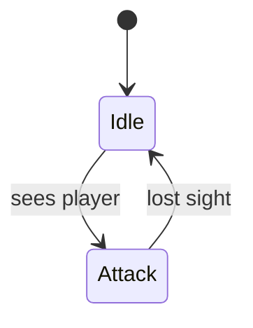
```mermaid
stateDiagram-v2
    [*] --> Idle
    Idle --> Attack : sees player
    Attack --> Idle : lost sight
```

### hopper

A quick closer, and the first enemy that actually comes at you. It `Wander`s until it spots
you, then weaves in and pokes at short range with a fast single shot. Fragile and low-damage
alone; it turns up in pairs with sproutlings, so it teaches you to keep moving while something
crowds your space.

**Art:** a small round critter with two eyes and stubby legs, glade green (8×8): a two-frame idle and a three-frame hop.

| Stat | |
|---|---|
| HP | low |
| Speed | fast (weaving chase) |
| Detection | med |
| Attack | `SinglePattern` poke, low dmg, fast cadence |
| Casts | Pew |
| Drops | **Pew, Heal** |

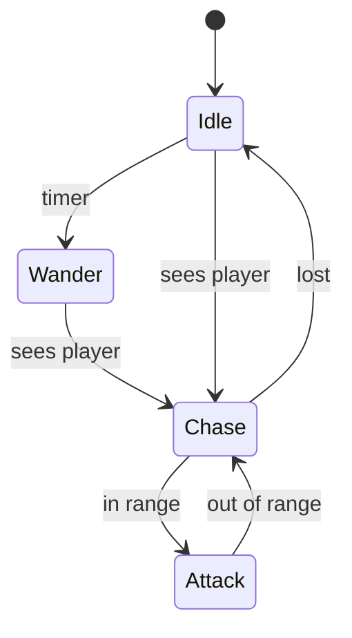
```mermaid
stateDiagram-v2
    [*] --> Idle
    Idle --> Wander : timer
    Wander --> Chase : sees player
    Idle --> Chase : sees player
    Chase --> Attack : in range
    Attack --> Chase : out of range
    Chase --> Idle : lost
```

### wasp

A hostile version of the player's Bzzz summon. It flits in on the same flying-minion
behaviour and pesters you with quick stings. Fragile and never a real threat alone. Its job is
to show the summon's logic from the other side, and to drop the spell that turns wasps to your
side. It also appears in the insect deepwood.

**Art:** a small bee in a hostile ochre two-tone (the Bzzz summon recoloured), with eye pixels.

| Stat | |
|---|---|
| HP | very low |
| Speed | fast (flitting) |
| Detection | long |
| Attack | `SinglePattern` sting, low dmg, fast cadence |
| Casts | Pew |
| Drops | **Bzzz, Pew, Zaap** |

```mermaid
stateDiagram-v2
    [*] --> Idle
    Idle --> Wander : timer
    Wander --> Chase : sees player
    Idle --> Chase : sees player
    Chase --> Attack : in range
    Attack --> Chase : out of range
    Chase --> Idle : lost
```

### mandrake

Low HP, high tempo, always in a pack. Mandrakes uproot and sprint straight at you, wailing a
slow sound wave as they close. One is trivial. The point is the group: three or four converge
so the waves overlap and force you to move. This is the glade's lesson in what the AoE spells
are *for*, and they spawn in exactly the clumps that reward one.

**Art:** a root-bodied figure with a screaming face; the wave is two expanding arcs.

| Stat | |
|---|---|
| HP | low |
| Speed | fast (straight chase, packs) |
| Detection | med |
| Attack | `SinglePattern` sound wave, low dmg, med cadence |
| Casts | Blam |
| Drops | **Blam** |

```mermaid
stateDiagram-v2
    [*] --> Idle
    Idle --> Wander : timer
    Wander --> Chase : sees player
    Idle --> Chase : sees player
    Chase --> Attack : in range
    Attack --> Chase : out of range
    Chase --> Idle : lost
```

### seedling

A sproutling that grew up: the same rooted plant, but instead of one lazy seed it opens into a
slow ring. Where the sproutling teaches that enemies shoot, the seedling teaches you not to
stand next to the thing that shoots. The ring makes its own tile expensive even though it never
chases. It works as area denial, and it stays a speed bump in both glade flavours.

**Art:** the sproutling sprite crowned with a ring of buds.

| Stat | |
|---|---|
| HP | low |
| Speed | stationary |
| Detection | med |
| Attack | `RingPattern` of seeds, low dmg, slow cadence |
| Casts | Ring |
| Drops | **Ring, Heal** |

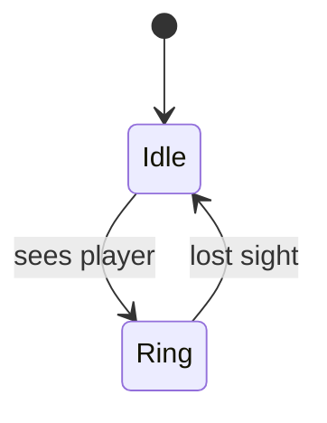
```mermaid
stateDiagram-v2
    [*] --> Idle
    Idle --> Ring : sees player
    Ring --> Idle : lost sight
```

### dirt golem

The golem recipe moved into the glade and softened: just as slow, even tougher, but its rings
barely sting. It works as a low-stakes rehearsal for the real golem at the dungeon doors. You
learn to read an area denier that sits still and then lumbers after you, and here a misread is
cheap. You can always outrun it, so the threat is the space it fills.

**Art:** the golem sprite in packed-earth browns with grass tufts on its shoulders.

| Stat | |
|---|---|
| HP | very high |
| Speed | slow |
| Detection | long |
| Attack | `RingPattern`, low dmg, med cadence |
| Casts | Ring |
| Drops | **Nope, Ring** |

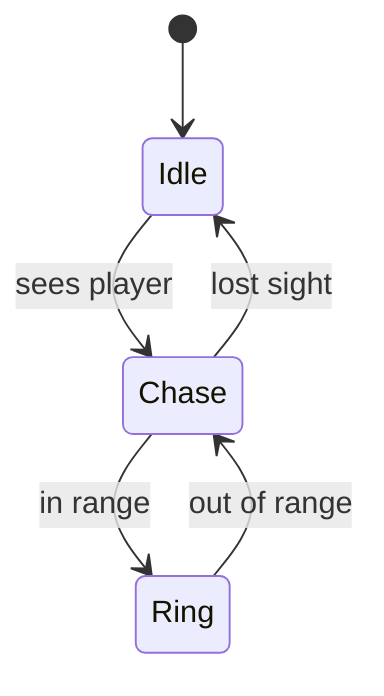
```mermaid
stateDiagram-v2
    [*] --> Idle
    Idle --> Chase : sees player
    Chase --> Ring : in range
    Ring --> Chase : out of range
    Chase --> Idle : lost sight
```

### thornthrower

`Wander` until it spots you, then `Chase` until in range, where it fires a single slow homing
thorn that you have to keep moving to outrun. It is cheap pressure that punishes standing still.

**Art:** an uprooted thorn-plant on root legs, muted glade green with red thorn tips; the missile is a spinning thorn.

| Stat | |
|---|---|
| HP | med |
| Speed | med (chase) |
| Detection | med |
| Attack | single `Homing` thorn, low dmg, slow cadence |
| Casts | Snipe |
| Drops | **Snipe** |

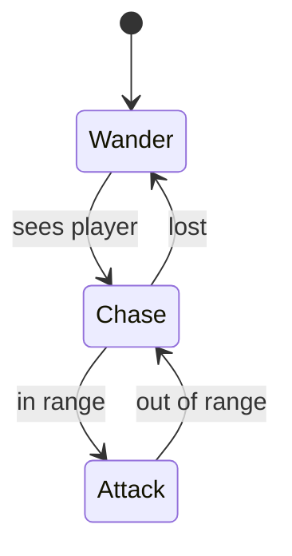
```mermaid
stateDiagram-v2
    [*] --> Wander
    Wander --> Chase : sees player
    Chase --> Attack : in range
    Attack --> Chase : out of range
    Chase --> Wander : lost
```

### rosebud

Rooted like a seedling. `Idle` until you get too close or it takes a hit, then it clamps into
a defensive bud. That bud is a brief high-defence windup that punishes spam-hitting. Then it
blooms into a `RingPattern` whose aim rotates slightly each pulse, and idles again. It teaches
you to read the telegraph instead of face-tanking.

**Art:** a closed rose bud on a stem, glade greens with red petals; a petal-spread frame to bloom, a clamped-shut frame for the shell.

| Stat | |
|---|---|
| HP | low |
| Speed | stationary |
| Detection | short |
| Attack | rotating `RingPattern`, low dmg, med cadence |
| Casts | Ring |
| Drops | **Ring, Nope** |

**Notes:** Defensive Shell on the windup: wait out the telegraph, then burn during the bloom.

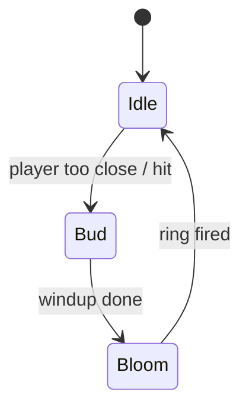
```mermaid
stateDiagram-v2
    [*] --> Idle
    Idle --> Bud : player too close / hit
    Bud --> Bloom : windup done
    Bloom --> Idle : ring fired
```

### viper *(rare)*

The one enemy that runs from you. The instant it sees you it picks a random direction and
slithers off, and it turns to fight only when it can't flee: cornered, it unloads a wide
shotgun barrage and bolts again in a fresh direction. It carries tier-2 gear, so it is worth
chasing. Cut the angle, trap it against a tree, and eat the barrage to claim the drop.

**Art:** the snake sprite in a rare venom-green with gold banding.

| Stat | |
|---|---|
| HP | very high |
| Speed | med idling, fast fleeing |
| Detection | long |
| Attack | `ShotgunPattern` barrage, high dmg, on corner |
| Casts | Blam |
| Drops | **Blam** |

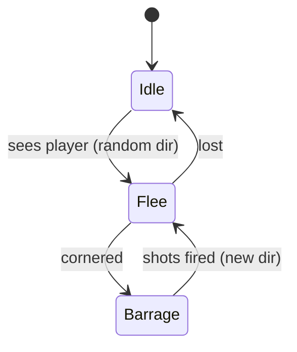
```mermaid
stateDiagram-v2
    [*] --> Idle
    Idle --> Flee : sees player (random dir)
    Flee --> Barrage : cornered
    Barrage --> Flee : shots fired (new dir)
    Flee --> Idle : lost
```

### mandraker *(rare)*

Rare mandrake that casts fireball

**Art:** a root-bodied figure with a screaming face; the wave is two expanding arcs. Palette towards red

| Stat | |
|---|---|
| HP | low |
| Speed | fast (straight chase, packs) |
| Detection | med |
| Attack | `SinglePattern` sound wave, low dmg, med cadence |
| Casts | Blam, fireball |
| Drops | **Fireball, Blam** |

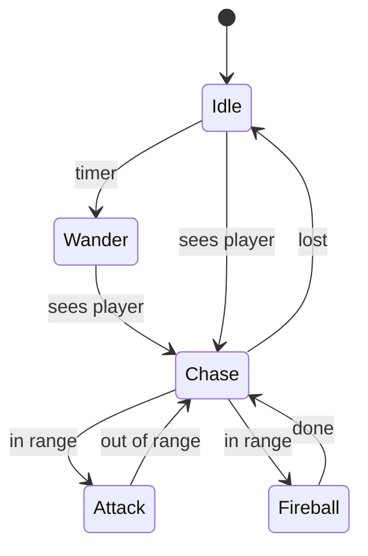
```mermaid
stateDiagram-v2
    [*] --> Idle
    Idle --> Wander : timer
    Wander --> Chase : sees player
    Idle --> Chase : sees player
    Chase --> Attack : in range
    Chase --> Fireball : in range
    Attack --> Chase : out of range
    Fireball --> Chase : done
    Chase --> Idle : lost
```

### fae *(boss, starting glade)*

The glade's floral capstone. It is a flitting sprite that hangs at range and rolls a fresh
attack each phase on a `PatternPicker`, so the fight never settles into one rhythm. No single
phase is deadly, but each one runs long, so you win by dealing steady damage while avoiding
chip over many cycles.

- **Rings** (`RingPattern`): pulses full rings for several seconds to weave through.
- **Aimed shotgun** (`Volley` + `ShotgunPattern`): a tight cone fired several times in a row.
  Punishes standing still.
- **Rest** (`FaeRest`): does nothing briefly. Your burn window.
- **Chase**: flits straight at you at half your speed without shooting, just to shove you out of
  position. It breaks off and rolls a new phase once it gets close enough.

**Art:** a small winged figure, one bright fill and a trail of light (16×16 boss sheet).

| Stat | |
|---|---|
| HP | very high (boss) |
| Speed | stationary mid-pattern; med during Chase |
| Detection | long |
| Attack | rings / aimed shotgun / chase, med dmg |
| Casts | Ring, Blam |
| Drops | **Blam, Ring** |

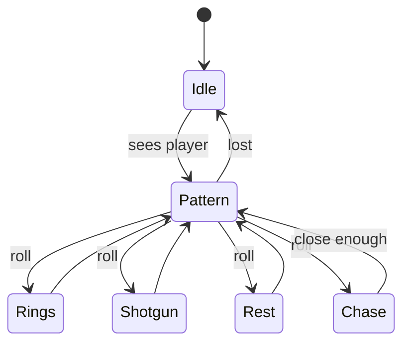
```mermaid
stateDiagram-v2
    [*] --> Idle
    Idle --> Pattern : sees player
    Pattern --> Rings : roll
    Pattern --> Shotgun : roll
    Pattern --> Rest : roll
    Pattern --> Chase : roll
    Rings --> Pattern
    Shotgun --> Pattern
    Rest --> Pattern
    Chase --> Pattern : close enough
    Pattern --> Idle : lost
```

### thornmess *(boss, veggie glade)*

The rooted capstone. It stays on the ground and runs a `PatternPicker`
split into two HP-gated pools. It idles until you are in range, then fires thornthrower
missiles. If you break range it uproots and sprints to close, where it behaves like a rosebud
or fires shotgun volleys. At low health it phase-shifts: it throws spores that fill the screen,
seeds the room with the biome's rooted plants, then returns to the cycle.

**Art:** a massive tangled thorn-mass with a screaming maw and root legs, glade greens with red thorn tips (boss sheet).

| Stat | |
|---|---|
| HP | very high (boss) |
| Speed | stationary rooted; fast when re-closing |
| Detection | med |
| Attack | homing missiles / rosebud bloom / shotgun volleys |
| Casts | Snipe, Ring, Blam, Jimmy (summon) |
| Drops | **Jimmy, Snipe, Ring** |

**Notes:** the low-HP phase swaps in a spore and summon wave rather than layering a summon on top.

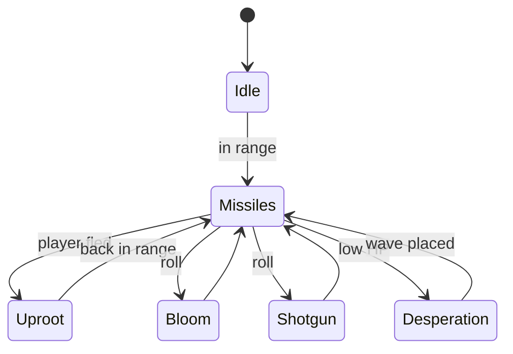
```mermaid
stateDiagram-v2
    [*] --> Idle
    Idle --> Missiles : in range
    Missiles --> Uproot : player fled
    Uproot --> Missiles : back in range
    Missiles --> Bloom : roll
    Missiles --> Shotgun : roll
    Bloom --> Missiles
    Shotgun --> Missiles
    Missiles --> Desperation : low HP
    Desperation --> Missiles : wave placed
```

<!-- END GENERATED CATALOGUE -->

---

# ideas

## Deepwood

The forest biome, T3: everything has more health and hits harder, tuned to pressure
long-range squishy builds and push the player into close quarters. It comes in four
flavours, in encounter order: the **animal deepwood** (beasts, boss **gnarlking**), the
**mimic deepwood** (props that come alive, boss **mother tree**), the **insect deepwood**
(swarms and crawlers, boss **hive queen**), and the **fungal deepwood** (rot and spores,
boss **rotmaw**).

A shared pool of five deepwood natives appears in all four sub-biomes; each sub-biome adds
three commons, three rares (almost all cheap variants of another enemy — the mandraker
recipe; only the drone is bespoke), and its boss: 12 per sub-biome. Every enemy carries a
generic cast plus a signature and drops both. Commons drop T2, rares guarantee T3, bosses
drop their T3 signatures — the glade's structure one tier up.

The mechanics are budgeted: each sub-biome introduces at most three, and later sub-biomes
reuse and combine earlier ones instead of adding more.

| #   | Mechanic                 | Introduced by       | Reused / combined                           |
| --- | ------------------------ | ------------------- | ------------------------------------------- |
| 1   | prop disguise            | stalker *(shared)*  | mimic doubles down; bloatcap                |
| 2   | charge-dash + flank fire | thornback           | gnarlking; mother tree's thorn rush         |
| 3   | burrow                   | mole                | rotmaw dives between patterns               |
| 4   | blink teleport           | shade               | elder stalker; umbra                        |
| 5   | self-detonation          | deadwood *(static)* | ticktick *(mobile)*; mycelings *(+ clouds)* |
| 6   | wall crawl               | longleg             | weaver; creeper mold *(+ clouds)*           |
| 7   | bullet escort            | drone               | hive queen's swarm phase                    |
| 8   | lingering spore clouds   | sporespitter        | creeper mold; rot golem; rotmaw             |
| 9   | split on death           | bloatcap            | rotmaw splits at low HP                     |
| 10  | drain leech              | leech               | elder leech's aura; rotmaw's drain phase    |

Spells introduced here: Bwoom, ChargeDash, Thwomp, Halp, Blink, Oop, Ploop, Zoing, Halo,
Slurp, Fwoosh. Reserved for future T3 biomes: Kaboom, Krak, Brrr, Clang, Chomp, Piercing
Lights, Vroop, Beep Boop, Nyoom, Shing, Splay.

**Shared pool** — these five appear in every sub-biome and define "deepwood" as a place;
the exclusives define the flavour.

### moth *(shared)*

THIS ONE CHASES, ATTACKS AND THEN FLEES.
NOT PEW, RING

The deepwood's basic flier and its returning face. It flits in on quick wings and pesters
you with dust-pokes at short range, always in twos and threes. Fragile chip pressure whose
job is to keep you moving while heavier things line up.

**Art:** a dusty grey-brown moth with big rounded wings and two eye pixels; a two-frame
flutter.

| Stat | |
|---|---|
| HP | very low |
| Speed | fast (flitting) |
| Detection | long |
| Attack | `SinglePattern` dust-poke, low dmg, fast cadence |
| Casts | Pew |
| Drops | **Pew** (t2), **Heal** (t2) |

```mermaid
stateDiagram-v2
    [*] --> Idle
    Idle --> Wander : timer
    Wander --> Chase : sees player
    Idle --> Chase : sees player
    Chase --> Attack : in range
    Attack --> Chase : out of range
    Chase --> Idle : lost
```

### stalker *(shared)*

REDO THE ART
NO PLOOP

The basic pouncer, and the biome's signature jump-scare. It sits in `Idle` disguised as a
scenery prop — a tree in the animal wood, a log in the mimic wood, a husk in the insect
wood, a mushroom in the fungal wood — watching through a tiny detect probe. Step on it and
it reveals, then `WeaveChase`→`FireWhenInRange` at melee. Lose it and it becomes a prop
again. Introduces **prop disguise**.

**Art:** a narrow tree form with a pointed canopy, medium/dark green, plus one disguise
recolour per sub-biome; eyes appear on reveal.

| Stat | |
|---|---|
| HP | low |
| Speed | med (after reveal) |
| Detection | short probe |
| Attack | `SinglePattern`, low dmg, med cadence |
| Casts | Pew |
| Drops | **Pew** (t2), **Ploop** (t2) |

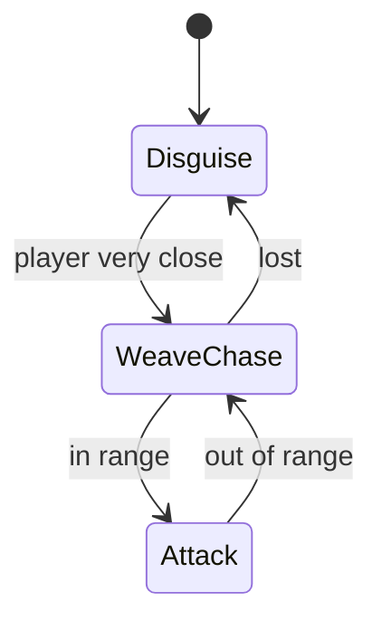
```mermaid
stateDiagram-v2
    [*] --> Disguise
    Disguise --> WeaveChase : player very close
    WeaveChase --> Attack : in range
    Attack --> WeaveChase : out of range
    WeaveChase --> Disguise : lost
```

### grimling *(shared)*

CAST BLAM

Pack hunter. `Idle`→`Wander`→`WeaveChase`→`FireWhenInRange` at short range, with fast
low-damage bolts. Grimlings hunt in threes or more, and hitting one triggers the whole
knot. The weave makes it hard to line up a shot, and the pack punishes you for focusing
one down without a plan for the rest.

**Art:** a small hunched shadow-sprite, gloom-black body with two glowing eyes and needle
limbs; quick flickering run frames.

| Stat      |                                             |
| --------- | ------------------------------------------- |
| HP        | low                                         |
| Speed     | fast (weaving chase)                        |
| Detection | med                                         |
| Attack    | `SinglePattern` bolt, low dmg, fast cadence |
| Casts     | Pew                                         |
| Drops     | **Pew** (t2), **Halp** (t2)                 |

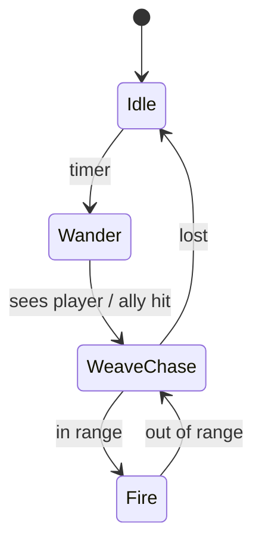
```mermaid
stateDiagram-v2
    [*] --> Idle
    Idle --> Wander : timer
    Wander --> WeaveChase : sees player / ally hit
    WeaveChase --> Fire : in range
    Fire --> WeaveChase : out of range
    WeaveChase --> Idle : lost
```

### moss golem *(shared)*

NO NOPE T2. OR MAYBE CASTS NOPE

The golem recipe at deepwood weight. As slow as its glade cousin and far tougher, but its
rings now actually hurt. On the attack windup it hardens into a Defensive Shell (brief
high defence, the rosebud's trick) that punishes spam-hitting; then the ring pulses out
dense enough that its own tile is a place you never stand.

**Art:** the golem sprite overgrown: deep-green moss over grey stone, dim eye-lights; a
clenched, hardened frame for the shell.

| Stat      |                                     |
| --------- | ----------------------------------- |
| HP        | very high                           |
| Speed     | slow                                |
| Detection | long                                |
| Attack    | `RingPattern`, med dmg, med cadence |
| Casts     | Ring                                |
| Drops     | **Ring** (t2), **Nope** (t2)        |

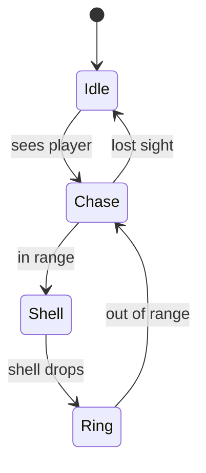
```mermaid
stateDiagram-v2
    [*] --> Idle
    Idle --> Chase : sees player
    Chase --> Shell : in range
    Shell --> Ring : shell drops
    Ring --> Chase : out of range
    Chase --> Idle : lost sight
```

### snake *(shared)*

NEW SPELL WITH PARALLEL PATTERN?

A skittish corridor-denier. `Idle`→`Flee` (fast, weaving) when spotted; when its back
hits a wall it stands and fires a `Volley` of twin shots that ricochet off the walls,
then bolts again. Trivial in open rooms; in narrow passages the bouncing spread covers
the corridor both ways.

**Art:** a low serpentine coil, deepwood two-tone green, a forked head with eye pixels;
weave frames.

| Stat      |                                                            |
| --------- | ---------------------------------------------------------- |
| HP        | low                                                        |
| Speed     | fast (weaving flee)                                        |
| Detection | med                                                        |
| Attack    | `ParallelPattern` twin ricochet shot, low dmg, med cadence |
| Casts     | Pew, Zoing                                                 |
| Drops     | **Zoing** (t2)                                             |

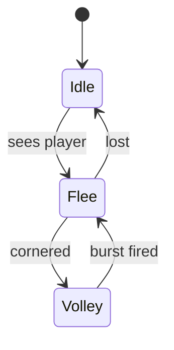
```mermaid
stateDiagram-v2
    [*] --> Idle
    Idle --> Flee : sees player
    Flee --> Volley : cornered
    Volley --> Flee : burst fired
    Flee --> Idle : lost
```

**Animal deepwood** — beasts that punish standing still. Introduces the charge-dash and
the burrow.

### thornback *(animal)*

REDO ART (GRAVEYARD?)

A charger, introducing the **charge-dash with flank fire**. It runs a long telegraphed
windup (`ChargeWindup`), then a straight high-speed dash (`ChargeDash`) that sheds
bullets off both flanks, then a rooted recovery (`ChargeRecover`) that is your punish
window. It locks heading at launch and can't corner, so sidestep the dash and burn it
during recovery. Trees are your friend.

**Art:** a wide squat body, dark-brown armour over a tan body, a spike array along the
back.

| Stat | |
|---|---|
| HP | med |
| Speed | slow wandering, very fast dashing |
| Detection | med |
| Attack | `FlankPattern` bullets shed during the dash, low dmg |
| Casts | Blam, ChargeDash |
| Drops | **ChargeDash** (t2), **Blam** (t2) |

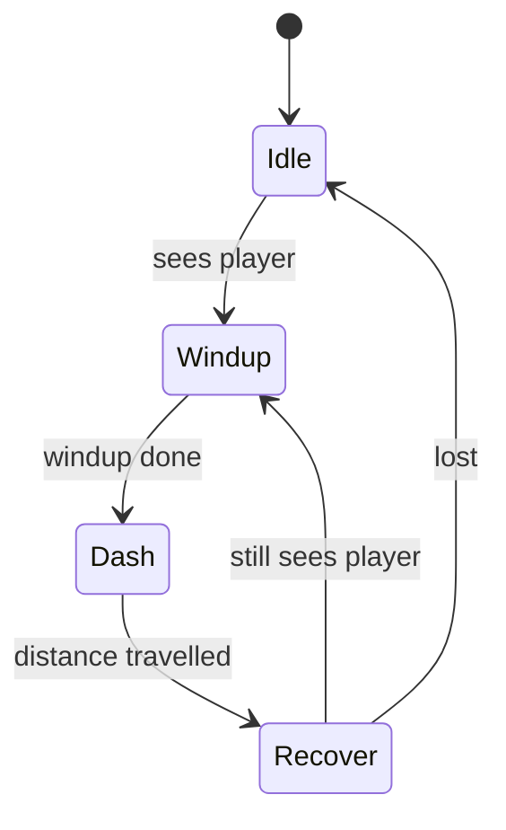
```mermaid
stateDiagram-v2
    [*] --> Idle
    Idle --> Windup : sees player
    Windup --> Dash : windup done
    Dash --> Recover : distance travelled
    Recover --> Windup : still sees player
    Recover --> Idle : lost
```

### owl *(animal)*

WHAT DOES REPOSITION DO? LOOK FOR A FREE SPOT OPPOSITE FROM THE PLAYER AND GO THERE?
The perch sniper. It uses `SniperCharge` through the one clean lane between trunks, with
a brief windup as the telegraph, and pokes quick low bolts between charged shots. Get too
close or too far, or break its line, and it `Reposition`s a few tiles to a perch that
sees you again. If it can't re-perch, it idles. It outranges rangers, so your move is to
close the gap through its fire.

**Art:** a brown oval with an oversized head and two big amber eyes. The eye rule taken
to a whole creature.

| Stat | |
|---|---|
| HP | low |
| Speed | perched; med reposition |
| Detection | long (firing band close to med) |
| Attack | `SinglePattern` charged shot, high dmg, slow cadence |
| Casts | Pew, Bwoom |
| Drops | **Bwoom** (t2), **Pew** (t2) |

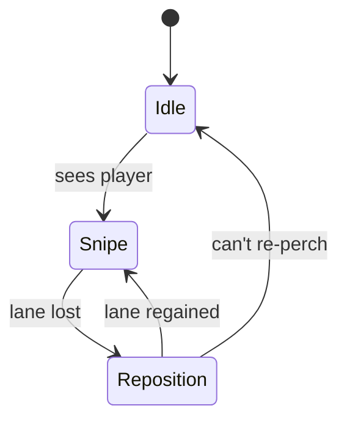
```mermaid
stateDiagram-v2
    [*] --> Idle
    Idle --> Snipe : sees player
    Snipe --> Reposition : lane lost
    Reposition --> Snipe : lane regained
    Reposition --> Idle : can't re-perch
```

### mole *(animal)*

Introduces the **burrow**. It dives underground where it can't be hit, and the only tell
is a dirt plume tracking toward you; it erupts beneath your feet with a ring burst,
scratches around on the surface for a beat — your punish window — then dives again.
Fighting it is rhythm reading: move off the plume, hit it while it blinks in the light.

**Art:** a plump velvet-black mole with oversized digging claws and pinprick eyes; a
travelling dirt-mound sprite while submerged, a burst-of-soil frame on eruption.

| Stat | |
|---|---|
| HP | med |
| Speed | slow surfaced, med submerged |
| Detection | med |
| Attack | `RingPattern` on eruption, med dmg |
| Casts | Ring |
| Drops | **Ring** (t2) |

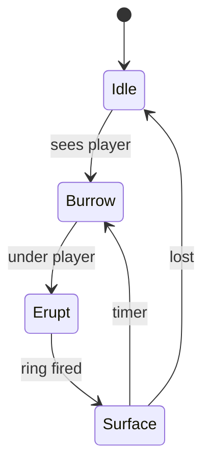
```mermaid
stateDiagram-v2
    [*] --> Idle
    Idle --> Burrow : sees player
    Burrow --> Erupt : under player
    Erupt --> Surface : ring fired
    Surface --> Burrow : timer
    Surface --> Idle : lost
```

### grimlord *(animal, rare)*

A larger, darker grimling, the knot's alpha. `WeaveChase`→`FireWhenInRange` at medium
range with a wide bolt spray. At critical HP it enrages: fire rate doubles and its exit
check drops. On death it bursts one parting ring. The weave plus the enrage turns the
last sliver of its health into a gauntlet.

**Art:** the grimling silhouette enlarged and near-black, red eye-glow; the enrage frame
brightens the eyes.

| Stat | |
|---|---|
| HP | high |
| Speed | fast (weaving chase) |
| Detection | med |
| Attack | `ShotgunPattern` bolt spray, med dmg, med cadence |
| Casts | Blam, Ring |
| Drops | **Blam** (t3), **Ring** (t3) |

**Notes:** Enrage at low HP; `RingPattern` death burst.

```mermaid
stateDiagram-v2
    [*] --> Idle
    Idle --> WeaveChase : sees player
    WeaveChase --> Fire : in range
    Fire --> WeaveChase : out of range
    Fire --> Enrage : low HP
    Enrage --> DeathBurst : dies
```

### razorback *(animal, rare)*

Thornback variant: the recovery is gone. Each dash ends in a snap re-aim and a fresh
launch, chaining charge after charge; only a head-on wall hit stuns it into a real punish
window. Fight it near trees and make the forest do the work.

**Art:** the thornback silhouette in near-black armour with red spike tips.

| Stat | |
|---|---|
| HP | high |
| Speed | very fast dashing |
| Detection | med |
| Attack | `FlankPattern` bullets shed during every dash, med dmg |
| Casts | Blam, ChargeDash |
| Drops | **ChargeDash** (t3) |

```mermaid
stateDiagram-v2
    [*] --> Idle
    Idle --> Windup : sees player
    Windup --> Dash : windup done
    Dash --> Windup : dash ended
    Dash --> Stun : head-on wall
    Stun --> Windup : recovered
    Stun --> Idle : lost
```

### great owl *(animal, rare)*

Owl variant: bigger, and the charged shot pierces, crossing the whole room and everything
in it. The windup is longer and the telegraph brighter, so the duel stays honest — but it
re-perches further away, and its firing lane is most of the map.

**Art:** the owl sprite enlarged, pale barn-owl white with amber eyes.

| Stat | |
|---|---|
| HP | med |
| Speed | perched; med reposition |
| Detection | very long |
| Attack | `SinglePattern` piercing charged shot, very high dmg, slow cadence |
| Casts | Pew, Bwoom |
| Drops | **Bwoom** (t3) |

```mermaid
stateDiagram-v2
    [*] --> Idle
    Idle --> Snipe : sees player
    Snipe --> Reposition : lane lost
    Reposition --> Snipe : lane regained
    Reposition --> Idle : can't re-perch
```

### gnarlking *(boss, animal)*

The apex of the animal deepwood: a towering antlered forest-lord on a `PatternPicker`.

- **Ground Slam**: rears and slams the earth for a radial shockwave (damage falls off
  with distance, and it knocks you back), then calls a ring of grimlings and hangs back
  until they clear or time out. Demonstrates the **Thwomp** spell.
- **Charge**: the thornback's charge-dash writ large — a locked-heading lunge shedding
  `FlankPattern` bullets. It can't corner, so sidestep it.
- **Shotgun Volley**: plants and fires a burst of blasts, tracking your position between
  them.
- **Rest**: heaves briefly. Your burn window.

**Art:** a towering forest-lord of bark, antler, and gloom, glowing pale eyes, oversized
frame; a rear-and-slam pose for the slam (boss sheet).

| Stat | |
|---|---|
| HP | very high (boss) |
| Speed | stationary mid-pattern; very fast during Charge |
| Detection | long |
| Attack | shockwave + summon / charge-dash / shotgun volley |
| Casts | Thwomp, Blam, Halp (brood) |
| Drops | **Thwomp** (t3), **Halp** (t3) |

**Notes:** at critical HP the shockwave radius doubles, it calls grimlords instead of
grimlings, and Rest shrinks to half duration.

```mermaid
stateDiagram-v2
    [*] --> Idle
    Idle --> Pattern : sees player
    Pattern --> Slam : roll
    Pattern --> Charge : roll
    Pattern --> Volley : roll
    Pattern --> Rest : roll
    Slam --> Pattern : brood cleared / timeout
    Charge --> Pattern
    Volley --> Pattern
    Rest --> Pattern
    Pattern --> Idle : lost
```

**Mimic deepwood** — nothing is what it looks like: most of a room might be props with
eyes. Introduces the blink and self-detonation.

### bramble stalker *(mimic)*

A running thorn-spitter. `Idle` disguised as a bush, then `WeaveChase`→`FireWhenInRange`,
firing full rings of thorns from its body on a slow cadence. It is hard to track on
approach, and the ring punishes you for standing anywhere near it.

**Art:** a rounded thorny bush-mound disguise, deepwood green with bramble-red thorns;
eyes on reveal.

| Stat | |
|---|---|
| HP | low |
| Speed | med (weaving chase) |
| Detection | short probe |
| Attack | `RingPattern` thorns, low dmg/thorn, slow cadence |
| Casts | Ring |
| Drops | **Ring** (t2) |

```mermaid
stateDiagram-v2
    [*] --> Disguise
    Disguise --> WeaveChase : player close
    WeaveChase --> Ring : in range
    Ring --> WeaveChase : out of range
    WeaveChase --> Disguise : lost
```

### shade *(mimic)*

A vanishing harasser, introducing the **blink teleport**. It fires a `Volley` burst, then
blinks to a random nearby offset and bursts again. It punishes turret play, since each
burst forces you to re-aim.

**Art:** a wispy near-black silhouette with a faint violet edge and two pale eyes; a
barely-there body that blinks out.

| Stat | |
|---|---|
| HP | very low |
| Speed | blinks (short range) |
| Detection | med |
| Attack | `Volley` `SinglePattern`, med dmg, fast within burst |
| Casts | Pew, Blink |
| Drops | **Blink** (t2), **Pew** (t2) |

```mermaid
stateDiagram-v2
    [*] --> Idle
    Idle --> Volley : sees player
    Volley --> Blink : burst done
    Blink --> Volley : reappeared
    Volley --> Idle : lost
```

### deadwood *(mimic)*

A trap with a health bar, introducing **self-detonation**. It lies among the real log
props until you step close or clip it with a shot, then shivers, glows, and blows: one
big blast and it is gone. Spot the log that is slightly too neat and spend it from range,
or route around it and leave it armed for the enemies that chase you.

**Art:** a mossy fallen log with one knothole; the knothole opens into an eye on trigger,
and the whole log glows through the fuse.

| Stat | |
|---|---|
| HP | low |
| Speed | stationary |
| Detection | short probe |
| Attack | `Oop`-style proximity blast, high dmg |
| Casts | Oop |
| Drops | **Oop** (t2) |

```mermaid
stateDiagram-v2
    [*] --> Disguise
    Disguise --> Fuse : player close / hit
    Fuse --> Detonate : fuse done
```

### elder stalker *(mimic, rare)*

Stalker variant: an ancient twisted tree on a `PatternPicker`. `SniperCharge` a slow
wide-cone homing seed at long range, then a blink and, on arrival, a `ShotgunPattern`.
The homing seed forces you to move; the blink resets the engagement.

**Art:** a gnarled dead-tree disguise, bark-grey twisted trunk, hollow amber eye-glow on
reveal; taller than the stalker.

| Stat | |
|---|---|
| HP | med |
| Speed | stationary (blinks) |
| Detection | long |
| Attack | `Homing` seed (med dmg) / `ShotgunPattern` on blink |
| Casts | Fireball, Blam |
| Drops | **Fireball** (t3), **Blam** (t3) |

**Notes:** at critical HP the windup drops to near-instant.

```mermaid
stateDiagram-v2
    [*] --> Idle
    Idle --> Snipe : sees player
    Snipe --> Blink : shot fired
    Blink --> Shotgun : arrived
    Shotgun --> Snipe : cycle
    Snipe --> Idle : lost
```

### umbra *(mimic, rare)*

Shade variant: every blink lands behind you, and the volley comes twinned. It punishes
tunnel vision — clear it first, or fight with your back to a wall.

**Art:** the shade silhouette in deeper black with a thin red edge.

| Stat | |
|---|---|
| HP | low |
| Speed | blinks (short range) |
| Detection | med |
| Attack | twinned `Volley`, med dmg |
| Casts | Pew, Blink |
| Drops | **Blink** (t3) |

```mermaid
stateDiagram-v2
    [*] --> Idle
    Idle --> Volley : sees player
    Volley --> Blink : burst done
    Blink --> Volley : behind player
    Volley --> Idle : lost
```

### adder *(mimic, rare)*

Snake variant: the cornered burst becomes a wide ricochet spray that fills the corridor
behind you as well as ahead. Catching it in a passage is the natural move — and exactly
the mistake.

**Art:** the snake coil in rare charcoal with amber banding.

| Stat | |
|---|---|
| HP | high |
| Speed | fast (weaving flee) |
| Detection | med |
| Attack | bouncing `ShotgunPattern` spray, med dmg, on corner |
| Casts | Pew, Zoing |
| Drops | **Zoing** (t3) |

```mermaid
stateDiagram-v2
    [*] --> Idle
    Idle --> Flee : sees player
    Flee --> Volley : cornered
    Volley --> Flee : burst fired
    Flee --> Idle : lost
```

### mother tree *(boss, mimic)*

The oldest stalker: a massive gnarled tree that uproots and thunders across the room, on
a two-phase cycle.

- **Thorn Rush**: the charge-dash reused at boss scale — a lunge at high speed that fires
  wide high-damage `ShotgunPattern` bursts the whole time and scatters **Ploop**
  seed-mines behind it. The mines arm after a delay and erupt into darts if you step
  near. The room becomes a minefield.
- **Root**: slams down and stops dead. Your burn window. Earlier mines stay live.

**Art:** a massive gnarled bark-brown trunk with a mossy canopy and root legs, amber
eyes; uproots into a charging pose (boss sheet).

| Stat | |
|---|---|
| HP | very high (boss) |
| Speed | very fast during Thorn Rush; stationary in Root |
| Detection | long |
| Attack | shotgun bursts + Ploop mines / none in Root |
| Casts | Blam, Ploop |
| Drops | **Ploop** (t3), **Blam** (t3) |

**Notes:** at critical HP Thorn Rush lasts twice as long, the spread tightens, mines
double, and Root drops out.

```mermaid
stateDiagram-v2
    [*] --> Idle
    Idle --> ThornRush : sees player
    ThornRush --> Root : lunge done
    Root --> ThornRush : burn window over
    ThornRush --> ThornRush : low HP (no Root)
```

**Insect deepwood** — swarms, crawlers, and geometry: the walls stop being safe.
Introduces the wall crawl and the bullet escort; the deadwood's detonation goes mobile
here.

### longleg *(insect)*

A wall-crawling spider with two weapons, introducing the **wall crawl**.
`Wander`→`SniperCharge` a slow wide-cone homing web at medium range; when you close, a
`RingPattern` then a scuttle away. Wall Crawl keeps it on wall/blocker tiles. The web is
slow enough to sidestep but forces you to keep moving while it repositions.

**Art:** a small round body on long spidery legs, deepwood browns, clustered eye pixels;
a wall-crawl pose.

| Stat | |
|---|---|
| HP | low |
| Speed | slow (wall-crawling) |
| Detection | med |
| Attack | `Homing` web (med dmg) / close `RingPattern`, low dmg |
| Casts | Ring, Snipe |
| Drops | **Snipe** (t2), **Ring** (t2) |

```mermaid
stateDiagram-v2
    [*] --> Wander
    Wander --> Snipe : sees player
    Snipe --> Ring : player close
    Ring --> Snipe : reposition
    Snipe --> Wander : lost
```

### beetle *(insect)*

A bouncing brawler. `Chase` (medium speed)→`Volley` burst at short range, then an Impulse
Hop in a random cardinal direction that fires a `RingPattern` mid-hop. It is hard to pin:
the hop resets your aim, and the mid-hop ring makes it dangerous to stand near. Charge in
after the hop lands.

**Art:** a rounded armoured shell, dark carapace over a lighter belly, small eyes; a
squash/stretch hop frame.

| Stat | |
|---|---|
| HP | low |
| Speed | med (chase), hops |
| Detection | med |
| Attack | `Volley` (low dmg, fast) + hop `RingPattern` |
| Casts | Pew, Ring |
| Drops | **Ring** (t2), **Pew** (t2) |

```mermaid
stateDiagram-v2
    [*] --> Idle
    Idle --> Chase : sees player
    Chase --> Volley : in range
    Volley --> Hop : burst done
    Hop --> Chase : landed
    Chase --> Idle : lost
```

### ticktick *(insect)*

The deadwood gone mobile. A tiny sprinter that locks on from far off and closes in a dead
straight line, clicking faster the nearer it gets; on contact it detonates, and that
blast is its whole life. Kill it at range or sidestep the final lunge — there is no third
option.

**Art:** a round dark tick on scrabbling legs, with a red pulse-glow that quickens as it
closes.

| Stat | |
|---|---|
| HP | very low |
| Speed | very fast (straight chase) |
| Detection | long |
| Attack | contact blast, high dmg |
| Casts | Oop (on itself) |
| Drops | **Oop** (t2) |

```mermaid
stateDiagram-v2
    [*] --> Idle
    Idle --> Chase : sees player
    Chase --> Detonate : contact
    Chase --> Idle : lost
```

### weaver *(insect, rare)*

Longleg variant: a large wall-crawling spider. `SniperCharge` a medium-turn high-damage
homing web that bounces off walls several times, so it is dangerous in corridors and can
hit you around a corner. If you close, a `ShotgunPattern` then a scuttle to the nearest
wall. Open rooms are your safe zone.

**Art:** a large spider, bulbous abdomen and long legs, deep purple-brown two-tone, an
eye cluster; a wall-cling pose.

| Stat | |
|---|---|
| HP | med |
| Speed | slow (wall-crawling) |
| Detection | long |
| Attack | bouncing `Homing` web (high dmg) / close `ShotgunPattern` |
| Casts | Zoing, Blam |
| Drops | **Zoing** (t3), **Blam** (t3) |

**Notes:** at critical HP the windup drops to near-instant.

```mermaid
stateDiagram-v2
    [*] --> Crawl
    Crawl --> Snipe : sees player
    Snipe --> Shotgun : player close
    Shotgun --> Crawl : scuttle to wall
    Snipe --> Crawl : lost
```

### goliath *(insect, rare)*

Beetle variant: bigger, armoured, and patient. It opens with a Guard windup — an
armoured shell that eats your burst, the rosebud lesson at scale — then answers with a
hop whose mid-air ring covers most of the room. Wait out the shell, burn it on the
landing.

**Art:** the beetle scaled up in gunmetal carapace with a nose horn.

| Stat | |
|---|---|
| HP | high |
| Speed | slow (chase), hops |
| Detection | med |
| Attack | guard → room-wide hop `RingPattern`, med dmg |
| Casts | Ring |
| Drops | **Ring** (t3), **Nope** (t3) |

```mermaid
stateDiagram-v2
    [*] --> Idle
    Idle --> Chase : sees player
    Chase --> Guard : in range
    Guard --> Hop : shell drops
    Hop --> Chase : landed
    Chase --> Idle : lost
```

### drone *(insect, rare)*

A flying orbiter introducing the **bullet escort**. It tethers at a fixed radius
(`Tether`) with bullets circling it as a deterrent. Every so often the bullets launch
outward in a shotgun spread and the drone flees to recharge, then re-enters the tether at
a wider orbit. The fight is a cycle: dodge the burst, chase it while it is vulnerable,
then repeat. The one bespoke rare in the biome.

**Art:** a small flying orb ringed by orbiting bullet pixels, metallic two-tone, a single
glowing eye.

| Stat | |
|---|---|
| HP | low |
| Speed | med (orbiting) |
| Detection | med |
| Attack | Circling Bullets → launched `ShotgunPattern`, med dmg |
| Casts | Halo, Blam |
| Drops | **Halo** (t3) |

```mermaid
stateDiagram-v2
    [*] --> Tether
    Tether --> Burst : charged
    Burst --> Flee : bullets launched
    Flee --> Tether : recharged (wider orbit)
```

### hive queen *(boss, insect)*

A massive flying hornet queen on a `PatternPicker`.

- **Acid Spray**: `ShotgunPattern` bursts while she `TimedChase`s toward you. The
  sweeping coverage forces you to rotate around her.
- **Spawn Swarm**: summons her own larvae — fragile fast-shooting brood — plus drones,
  and turns invulnerable until they clear; the drones' orbiting escorts fill the room.
  Demonstrates the **Bzzz** spell.
- **Web Trap**: fires slow bouncing homing webs that explode into AoE on expiry, so you
  can't stand still anywhere.
- **Rest**: hovers chittering. Your burn window.

**Art:** a massive hornet queen, striped ochre/black thorax, big flat translucent wings,
a compound-eye band (boss sheet).

| Stat | |
|---|---|
| HP | very high (boss) |
| Speed | fast during Acid Spray; hovers otherwise |
| Detection | long |
| Attack | acid shotgun / swarm / bouncing web traps |
| Casts | Blam, Bzzz (brood), Snipe (web traps) |
| Drops | **Bzzz** (t3) |

**Notes:** at critical HP Rest drops out and she adds a room-wide exploding `RingPattern`
(Desperation Swarm) behind a long wing-vibration telegraph.

```mermaid
stateDiagram-v2
    [*] --> Idle
    Idle --> Pattern : sees player
    Pattern --> Acid : roll
    Pattern --> Swarm : roll
    Pattern --> WebTrap : roll
    Pattern --> Rest : roll
    Acid --> Pattern
    Swarm --> Pattern : cleared
    WebTrap --> Pattern
    Rest --> Pattern
    Pattern --> Idle : lost
```

**Fungal deepwood** — the wood, rotting: a turf war where they paint the floor and you
contest it. The finale sub-biome: three new mechanics (spore clouds, split on death, the
drain leech), everything else recombined from the other three.

### sporespitter *(fungal)*

Rooted lobber, introducing **lingering spore clouds**. It arcs spore blobs at you on a
slow cadence, and every burst leaves a cloud that hangs there ticking damage — a miss
still costs you floor. One sporespitter is a zoning puzzle; two facing each other own the
room between them.

**Art:** a bent mushroom with a spout-shaped cap, pale stalk and sickly green gills; a
cheek-puff frame on the spit.

| Stat | |
|---|---|
| HP | med |
| Speed | stationary |
| Detection | med |
| Attack | lobbed blob → lingering DoT cloud, low tick dmg, slow cadence |
| Casts | Pew, Fwoosh (the cloud) |
| Drops | **Fwoosh** (t2), **Pew** (t2) |

```mermaid
stateDiagram-v2
    [*] --> Idle
    Idle --> Spit : sees player
    Spit --> Idle : lost sight
```

### leech *(fungal)*

Introduces the **drain leech**. A slow slug that creeps in and latches a drain beam:
while it holds, you bleed and it heals the same amount. The beam breaks on range or line
of sight, so the fight is about geometry — put a trunk between you, or kill it faster
than it drinks. In a mixed room it quietly undoes all your damage if ignored.

**Art:** a glossy umber slug that pulses brighter while latched; the beam is a dotted
line of drips flowing the wrong way.

| Stat | |
|---|---|
| HP | med |
| Speed | slow |
| Detection | med |
| Attack | latch drain beam, low dps, self-heals for the same |
| Casts | Slurp |
| Drops | **Slurp** (t2) |

```mermaid
stateDiagram-v2
    [*] --> Idle
    Idle --> Chase : sees player
    Chase --> Latch : in range
    Latch --> Chase : beam broken
    Chase --> Idle : lost
```

### bloatcap *(fungal)*

Introduces **split on death**, and reuses half the biome doing it. It hides among the
real mushroom scenery (the stalker's trick), waddles at you when you get close, and pops
when it dies (the deadwood's trick): one spore cloud plus two or three mycelings —
fist-sized copies that sprint and pop in turn into smaller clouds. Killing it point-blank
is a mistake; killing it at range is three more kills.

**Art:** a fat button mushroom, off-white cap with rot spots and stubby feet; mycelings
are the same sprite at half size.

| Stat | |
|---|---|
| HP | med |
| Speed | slow (waddling chase) |
| Detection | short probe |
| Attack | death-pop cloud + myceling brood |
| Casts | Oop (the pop) |
| Drops | **Oop** (t2), **Heal** (t2) |

**Notes:** mycelings are its spawn, not a roster entry; they carry no drops.

```mermaid
stateDiagram-v2
    [*] --> Disguise
    Disguise --> Chase : player close
    Chase --> Disguise : lost
    Chase --> Pop : dies
```

### elder leech *(fungal, rare)*

Leech variant: the beam is gone, replaced by a drain aura with nothing to break.
Everything near it — you, your minions — feeds it. It creeps forward tanking through its
own healing, and the only answers are range or overwhelming burst.

**Art:** the leech sprite grown long and pale, ringed by a faint spore shimmer.

| Stat | |
|---|---|
| HP | high |
| Speed | slow |
| Detection | med |
| Attack | drain aura, low dps in a radius, self-heals per target |
| Casts | Slurp |
| Drops | **Slurp** (t3) |

```mermaid
stateDiagram-v2
    [*] --> Idle
    Idle --> Creep : sees player
    Creep --> Idle : lost
```

### rot golem *(fungal, rare)*

Moss golem variant, mold-eaten: everywhere it lumbers it leaves a trail of spore cloud,
so its slow chase quietly redraws the room. Kite it in circles and you fence yourself in;
fight it where you can afford to give up ground.

**Art:** the moss golem recoloured to rot: pale fungal white over sagging green, gills
sprouting from the shoulders.

| Stat | |
|---|---|
| HP | very high |
| Speed | slow |
| Detection | long |
| Attack | `RingPattern`, med dmg + a lingering cloud trail |
| Casts | Ring, Fwoosh (the trail) |
| Drops | **Nope** (t3), **Fwoosh** (t3) |

```mermaid
stateDiagram-v2
    [*] --> Idle
    Idle --> Chase : sees player
    Chase --> Shell : in range
    Shell --> Ring : shell drops
    Ring --> Chase : out of range
    Chase --> Idle : lost sight
```

### creeper mold *(fungal, rare)*

Longleg variant gone moldy: the wall crawl and the spore trail combined. It circles the
room's edges painting them with rot, squeezing the fight toward the middle, and puffs
short-range spores at you if you press it. The safe zone shrinks the longer it lives.

**Art:** the longleg sprite half-swallowed by pale mold, trailing spore flecks.

| Stat | |
|---|---|
| HP | med |
| Speed | slow (wall-crawling) |
| Detection | med |
| Attack | short `ShotgunPattern` spore puff, low dmg + the wall cloud trail |
| Casts | Blam, Fwoosh (the trail) |
| Drops | **Fwoosh** (t3) |

```mermaid
stateDiagram-v2
    [*] --> Crawl
    Crawl --> Circle : sees player
    Circle --> Puff : player close
    Puff --> Circle : repelled
    Circle --> Crawl : lost
```

### rotmaw *(boss, fungal)*

The fungal capstone: a vast split-capped maw on a `PatternPicker`, and the biome's
recombination exam.

- **Spore Carpet**: sweeps lanes of lingering cloud across the arena, shrinking the clean
  floor each pass.
- **Brood**: burps up a wave of mycelings that sprint and pop.
- **Drain**: latches the leech beam wide and heals off everything it holds — break line
  of sight or lose the damage race. Demonstrates **Slurp**.
- **Burrow**: dives underground (the mole's trick) and resurfaces across the room,
  cutting your positioning out from under you between patterns.

At low HP it **splits into two half-HP maws**, each running a reduced pool (carpet +
brood only) — the desperation swaps the drain out rather than layering more on top.

**Art:** a huge split-capped fungus with a toothy maw between the halves, pale flesh and
rot-green gills (boss sheet).

| Stat | |
|---|---|
| HP | very high (boss) |
| Speed | stationary mid-pattern; submerged dashes between |
| Detection | long |
| Attack | spore lanes / myceling waves / drain beam |
| Casts | Slurp, Fwoosh, brood |
| Drops | **Slurp** (t3), **Fwoosh** (t3) |

```mermaid
stateDiagram-v2
    [*] --> Idle
    Idle --> Pattern : sees player
    Pattern --> Carpet : roll
    Pattern --> Brood : roll
    Pattern --> Drain : roll
    Pattern --> Burrow : roll
    Carpet --> Pattern
    Brood --> Pattern : cleared
    Drain --> Pattern : beam broken
    Burrow --> Pattern : resurfaced
    Pattern --> Split : low HP
    Split --> Pattern : as two maws
    Pattern --> Idle : lost
```

### Deepwood drops

Commons drop T2 — generic and signature both — rares guarantee T3, bosses drop their T3
signatures. Between the roster the deepwood covers a full tier-2 kit and seeds the
tier-3 one.

| Enemy | Drops |
|---|---|
| moth *(shared)* | **Pew** (t2), **Heal** (t2) |
| stalker *(shared)* | **Pew** (t2), **Ploop** (t2) |
| grimling *(shared)* | **Pew** (t2), **Halp** (t2) |
| moss golem *(shared)* | **Ring** (t2), **Nope** (t2) |
| snake *(shared)* | **Zoing** (t2) |
| thornback | **ChargeDash** (t2), **Blam** (t2) |
| owl | **Bwoom** (t2), **Pew** (t2) |
| mole | **Ring** (t2) |
| grimlord *(rare)* | **Blam** (t3), **Ring** (t3) |
| razorback *(rare)* | **ChargeDash** (t3) |
| great owl *(rare)* | **Bwoom** (t3) |
| gnarlking *(boss)* | **Thwomp** (t3), **Halp** (t3) |
| bramble stalker | **Ring** (t2) |
| shade | **Blink** (t2), **Pew** (t2) |
| deadwood | **Oop** (t2) |
| elder stalker *(rare)* | **Fireball** (t3), **Blam** (t3) |
| umbra *(rare)* | **Blink** (t3) |
| adder *(rare)* | **Zoing** (t3) |
| mother tree *(boss)* | **Ploop** (t3), **Blam** (t3) |
| longleg | **Snipe** (t2), **Ring** (t2) |
| beetle | **Ring** (t2), **Pew** (t2) |
| ticktick | **Oop** (t2) |
| weaver *(rare)* | **Zoing** (t3), **Blam** (t3) |
| goliath *(rare)* | **Ring** (t3), **Nope** (t3) |
| drone *(rare)* | **Halo** (t3) |
| hive queen *(boss)* | **Bzzz** (t3) |
| sporespitter | **Fwoosh** (t2), **Pew** (t2) |
| leech | **Slurp** (t2) |
| bloatcap | **Oop** (t2), **Heal** (t2) |
| elder leech *(rare)* | **Slurp** (t3) |
| rot golem *(rare)* | **Nope** (t3), **Fwoosh** (t3) |
| creeper mold *(rare)* | **Fwoosh** (t3) |
| rotmaw *(boss)* | **Slurp** (t3), **Fwoosh** (t3) |

## other ideas

enemies that scan for the same type in the room and shoot at each other not at the player
bids that make wind
