# Enemies

<!-- BEGIN GENERATED CATALOGUE -->
<!-- Generated by design/tools/build.py from design/data/ + the game's .tres — do not edit by hand. -->

## Glade

The opening biome. It comes in two flavours: the floral **starting glade**, capped by the **fae**, and the rooted **veggie glade**, capped by the **thornmess**.

### Dirt Golem

The golem recipe moved into the glade and softened: just as slow, even tougher, but its rings
barely sting. It works as a low-stakes rehearsal for the real golem at the dungeon doors. You
learn to read an area denier that sits still and then lumbers after you, and here a misread is
cheap. You can always outrun it, so the threat is the space it fills.

**Art:** the golem sprite in packed-earth browns with grass tufts on its shoulders.

| Stat |  |
|---|---|
| HP | 180 |
| Speed | 12 px/s |
| Range | detect 12, ring 3 |
| ring | **16** dmg — 2s cd, Ring x6, 2 @ 0.4s, 6 tiles range |
| Drops | **ring t1** (20%), **nope** (20%) |

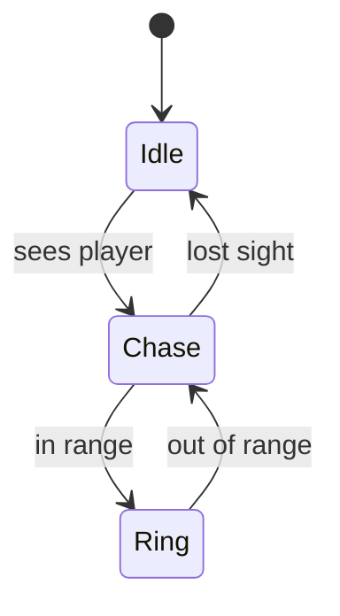
```mermaid
stateDiagram-v2
    [*] --> Idle
    Idle --> Chase : sees player
    Chase --> Ring : in range
    Ring --> Chase : out of range
    Chase --> Idle : lost sight
```

### Hopper

A quick closer, and the first enemy that actually comes at you. It `Wander`s until it spots
you, then weaves in and pokes at short range with a fast single shot. Fragile and low-damage
alone; it turns up in pairs with sproutlings, so it teaches you to keep moving while something
crowds your space.

**Art:** a small round critter with two eyes and stubby legs, glade green (8×8): a two-frame idle and a three-frame hop.

| Stat |  |
|---|---|
| HP | 38 |
| Speed | 18 px/s |
| Range | detect 7, chase 8, attack 3 |
| attack | **7** dmg — 0.7s cd, Single, 3 @ 0.3s, 5 tiles range |
| Drops | **pew t1** (15%), **heal t1** (10%) |

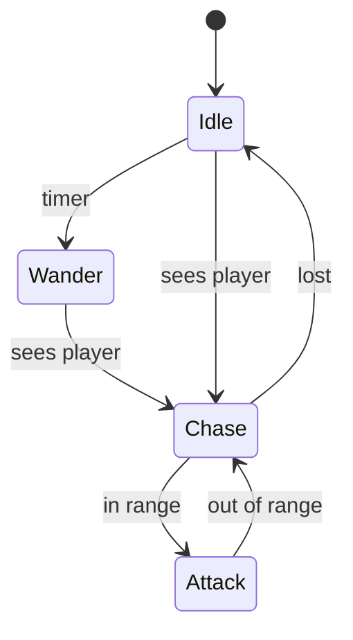
```mermaid
stateDiagram-v2
    [*] --> Idle
    Idle --> Wander : timer
    Wander --> Chase : sees player
    Idle --> Chase : sees player
    Chase --> Attack : in range
    Attack --> Chase : out of range
    Chase --> Idle : lost
```

### Mandrake

Low HP, high tempo, always in a pack. Mandrakes uproot and sprint straight at you, wailing a
slow sound wave as they close. One is trivial. The point is the group: three or four converge
so the waves overlap and force you to move. This is the glade's lesson in what the AoE spells
are *for*, and they spawn in exactly the clumps that reward one.

**Art:** a root-bodied figure with a screaming face; the wave is two expanding arcs.

| Stat |  |
|---|---|
| HP | 30 |
| Speed | 28 px/s |
| Range | detect 8, chase 12, attack 4 |
| attack | **12** dmg — 1.2s cd, Single, 6 tiles range |
| Drops | **blam t1** (20%) |

```mermaid
stateDiagram-v2
    [*] --> Idle
    Idle --> Wander : timer
    Wander --> Chase : sees player
    Idle --> Chase : sees player
    Chase --> Attack : in range
    Attack --> Chase : out of range
    Chase --> Idle : lost
```

### Seedling

A sproutling that grew up: the same rooted plant, but instead of one lazy seed it opens into a
slow ring. Where the sproutling teaches that enemies shoot, the seedling teaches you not to
stand next to the thing that shoots. The ring makes its own tile expensive even though it never
chases. It works as area denial, and it stays a speed bump in both glade flavours.

**Art:** the sproutling sprite crowned with a ring of buds.

| Stat |  |
|---|---|
| HP | 45 |
| Range | detect 4 |
| ring | **13** dmg — 3s cd, Ring x6, 6 tiles range |
| Drops | **ring t1** (10%), **heal t1** (10%) |

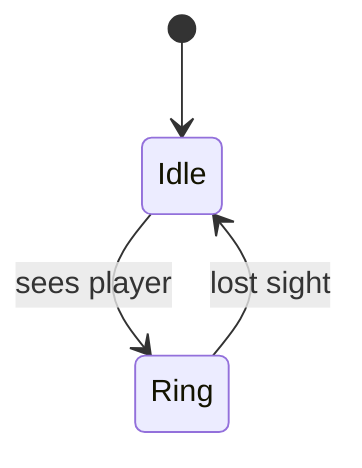
```mermaid
stateDiagram-v2
    [*] --> Idle
    Idle --> Ring : sees player
    Ring --> Idle : lost sight
```

### Sproutling

Rooted in place, watching. It sits in `Idle` until the player is in sight, then spits a
single slow seed at a steady pace. This is the first enemy the player meets. The seed is slow
enough to sidestep on reflex, so it teaches that enemies shoot without much risk.

**Art:** a stem, a leaf, and two eyes. The simplest sprite in the biome, in glade green.

| Stat |  |
|---|---|
| HP | 25 |
| Range | detect 7 |
| attack | **8** dmg — 2s cd, Single, 9 tiles range |
| Drops | **pew t1** (10%), **heal t1** (10%) |

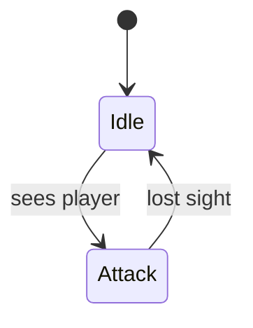
```mermaid
stateDiagram-v2
    [*] --> Idle
    Idle --> Attack : sees player
    Attack --> Idle : lost sight
```

### Wasp

A hostile version of the player's Bzzz summon. It flits in on the same flying-minion
behaviour and pesters you with quick stings. Fragile and never a real threat alone. Its job is
to show the summon's logic from the other side, and to drop the spell that turns wasps to your
side. It also appears in the insect deepwood.

**Art:** a small bee in a hostile ochre two-tone (the Bzzz summon recoloured), with eye pixels.

| Stat |  |
|---|---|
| Kinds | insect |
| HP | 18 |
| Speed | 40 px/s |
| Range | detect 10, chase 14, attack 3 |
| attack | **7** dmg — 0.8s cd, Single, 4 tiles range |
| Drops | **bzzz t1** (10%), **pew t1** (10%), **zaap t1** (10%) |

```mermaid
stateDiagram-v2
    [*] --> Idle
    Idle --> Wander : timer
    Wander --> Chase : sees player
    Idle --> Chase : sees player
    Chase --> Attack : in range
    Attack --> Chase : out of range
    Chase --> Idle : lost
```

### Mandraker *(rare)*

Rare mandrake that casts fireball

**Art:** a root-bodied figure with a screaming face; the wave is two expanding arcs. Palette towards red

| Stat |  |
|---|---|
| HP | 200 |
| Speed | 28 px/s |
| Range | detect 8, chase 16, attack 4, fireball 9 |
| fireball | **30** dmg — 6s cd, Single, 6 tiles range, blast 3 tiles (splash only) |
| attack | **15** dmg — 2s cd, Single, 7 tiles range |
| Drops | **fireball t2** (50%), **blam t2** (30%) |

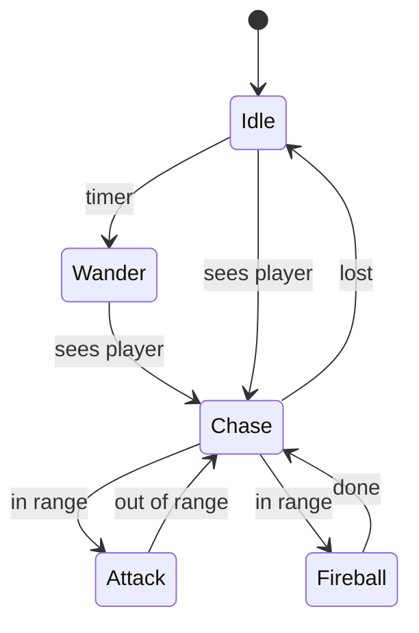
```mermaid
stateDiagram-v2
    [*] --> Idle
    Idle --> Wander : timer
    Wander --> Chase : sees player
    Idle --> Chase : sees player
    Chase --> Attack : in range
    Chase --> Fireball : in range
    Attack --> Chase : out of range
    Fireball --> Chase : done
    Chase --> Idle : lost
```

### Viper *(rare)*

The one enemy that runs from you. The instant it sees you it picks a random direction and
slithers off, and it turns to fight only when it can't flee: cornered, it unloads a wide
shotgun barrage and bolts again in a fresh direction. It carries tier-2 gear, so it is worth
chasing. Cut the angle, trap it against a tree, and eat the barrage to claim the drop.

**Art:** the snake sprite in a rare venom-green with gold banding.

| Stat |  |
|---|---|
| HP | 180 |
| Speed | 32 px/s |
| Range | detect 12, retreat 1.5 |
| barrage | **22** dmg — 1s cd, Shotgun x5, 7 tiles range |
| Drops | **blam t2** (50%) |

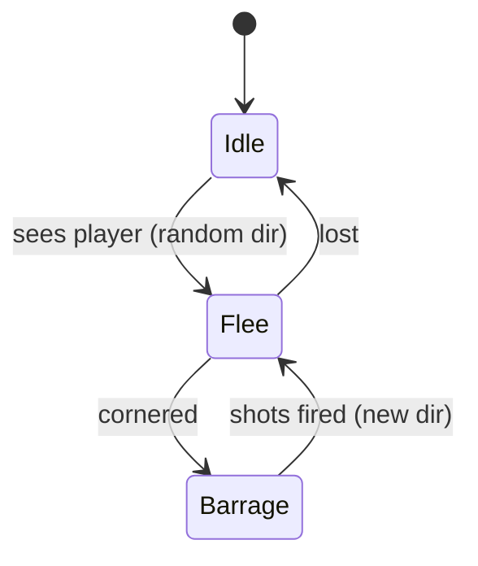
```mermaid
stateDiagram-v2
    [*] --> Idle
    Idle --> Flee : sees player (random dir)
    Flee --> Barrage : cornered
    Barrage --> Flee : shots fired (new dir)
    Flee --> Idle : lost
```

### Fae *(boss)*

The glade's floral capstone. It is a flitting sprite that hangs at range and rolls a fresh
attack each phase on a `PatternPicker`, so the fight never settles into one rhythm. No single
phase is deadly, but each one runs long, so you win by dealing steady damage while avoiding
chip over many cycles.

- **Rings** (`RingPattern`): pulses full rings for several seconds to weave through.
- **Aimed shotgun** (`Volley` + `ShotgunPattern`): a tight cone fired several times in a row.
  Punishes standing still.
- **Rest** (`FaeRest`): does nothing briefly. Your burn window.
- **Chase**: flits straight at you at half your speed without shooting, just to shove you out of
  position. It breaks off and rolls a new phase once it gets close enough.

**Art:** a small winged figure, one bright fill and a trail of light (16×16 boss sheet).

| Stat |  |
|---|---|
| HP | 1500 |
| Speed | 28 px/s |
| Range | detect 16 |
| rings | **11** dmg — 1s cd, Ring x8, 10 @ 0.8s, 7 tiles range |
| shotgun | **15** dmg — 1s cd, Shotgun x5, 2 @ 0.4s, 8 tiles range |
| Drops | **blam t2** (66%), **ring t2** (66%) |

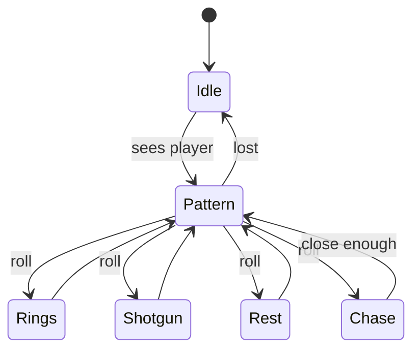
```mermaid
stateDiagram-v2
    [*] --> Idle
    Idle --> Pattern : sees player
    Pattern --> Rings : roll
    Pattern --> Shotgun : roll
    Pattern --> Rest : roll
    Pattern --> Chase : roll
    Rings --> Pattern
    Shotgun --> Pattern
    Rest --> Pattern
    Chase --> Pattern : close enough
    Pattern --> Idle : lost
```

### Rosebud

Rooted like a seedling. `Idle` until you get too close or it takes a hit, then it clamps into
a defensive bud. That bud is a brief high-defence windup that punishes spam-hitting. Then it
blooms into a `RingPattern` whose aim rotates slightly each pulse, and idles again. It teaches
you to read the telegraph instead of face-tanking.

**Art:** a closed rose bud on a stem, glade greens with red petals; a petal-spread frame to bloom, a clamped-shut frame for the shell.

| Stat |  |
|---|---|
| HP | 30 |
| Range | detect 5 |
| ring | **16** dmg — Ring x8, 4 @ 1s, 8 tiles range |
| Drops | **ring t1** (10%), **nope** (10%) |

**Notes:** Defensive Shell on the windup: wait out the telegraph, then burn during the bloom.

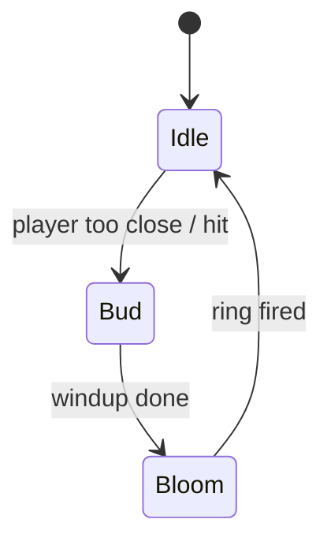
```mermaid
stateDiagram-v2
    [*] --> Idle
    Idle --> Bud : player too close / hit
    Bud --> Bloom : windup done
    Bloom --> Idle : ring fired
```

### Thornthrower

`Wander` until it spots you, then `Chase` until in range, where it fires a single slow homing
thorn that you have to keep moving to outrun. It is cheap pressure that punishes standing still.

**Art:** an uprooted thorn-plant on root legs, muted glade green with red thorn tips; the missile is a spinning thorn.

| Stat |  |
|---|---|
| HP | 50 |
| Speed | 32 px/s |
| Range | detect 8, chase 12, attack 6 |
| thorn | **16** dmg — 1s cd, Single, 10 tiles range, homing 120° cone |
| Drops | **snipe t1** (20%) |

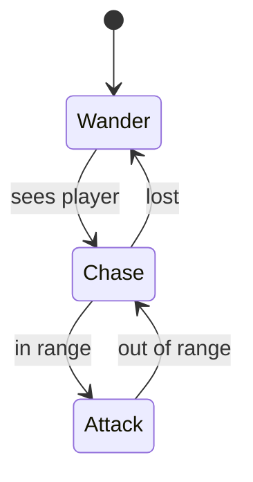
```mermaid
stateDiagram-v2
    [*] --> Wander
    Wander --> Chase : sees player
    Chase --> Attack : in range
    Attack --> Chase : out of range
    Chase --> Wander : lost
```

### Thornmess *(boss)*

The rooted capstone. It stays on the ground and runs a `PatternPicker`
split into two HP-gated pools. It idles until you are in range, then fires thornthrower
missiles. If you break range it uproots and sprints to close, where it behaves like a rosebud
or fires shotgun volleys. At low health it phase-shifts: it throws spores that fill the screen,
seeds the room with the biome's rooted plants, then returns to the cycle.

**Art:** a massive tangled thorn-mass with a screaming maw and root legs, glade greens with red thorn tips (boss sheet).

| Stat |  |
|---|---|
| HP | 2000 |
| Speed | 32 px/s |
| Range | detect 22, missile 20, close 4 |
| bloom | **18** dmg — 7s cd, Ring x12, 5 @ 0.5s, 14 tiles range |
| missiles | **16** dmg — 3s cd, Single, 4 @ 1s, 12 tiles range, homing 120° cone |
| shotgun | **15** dmg — 1s cd, Shotgun x4, 4 @ 0.6s, 6 tiles range |
| spores | **25** dmg — 6s cd, Ring x16, 10 @ 1.5s, 18 tiles range |
| summon | 6 minions, 8 hp, 0s |
| Drops | **jimmy t1** (100%), **snipe t2** (66%), **ring t2** (66%) |

**Notes:** the low-HP phase swaps in a spore and summon wave rather than layering a summon on top.

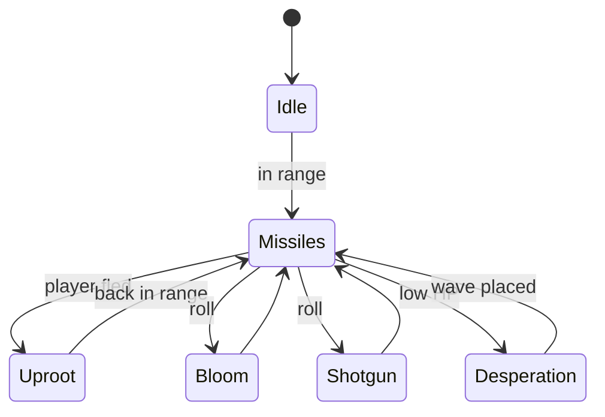
```mermaid
stateDiagram-v2
    [*] --> Idle
    Idle --> Missiles : in range
    Missiles --> Uproot : player fled
    Uproot --> Missiles : back in range
    Missiles --> Bloom : roll
    Missiles --> Shotgun : roll
    Bloom --> Missiles
    Shotgun --> Missiles
    Missiles --> Desperation : low HP
    Desperation --> Missiles : wave placed
```

## Deepwood

The forest, T3. Eleven natives make up the shared pool meant to appear in every deepwood sub-biome; on top of it the **animal deepwood** adds its own beasts and the **gnarlking**, and the **mimic deepwood** its props with eyes. The whole roster spawns, and the rooms are built to introduce it one mechanic at a time.

### Ash Snake

Snake variant, and the one that turns a room into a hazard. It flees furthest and fires the
longest, fastest shots of the three, bouncing five times and losing power on each — a volley
that keeps crossing the room long after the snake has gone. Nothing about it is dangerous
up close; everything about it is dangerous a second later.

**Art:** the snake recoloured ashen — pale grey-lavender scales with cyan eyes.

| Stat |  |
|---|---|
| HP | 90 |
| Speed | 40 px/s |
| Range | detect 11, retreat 1.375 |
| zoing | **24** dmg — 1.6s cd, Single, 2 @ 0.45s, 13 tiles range, BounceBehaviour |
| Drops | **zoing t2** (5%) |

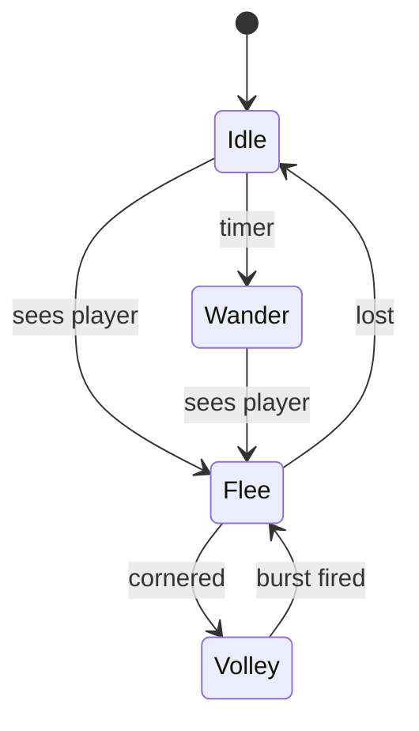
```mermaid
stateDiagram-v2
    [*] --> Idle
    Idle --> Wander : timer
    Idle --> Flee : sees player
    Wander --> Flee : sees player
    Flee --> Volley : cornered
    Volley --> Flee : burst fired
    Flee --> Idle : lost
```

### Coral Snake

Snake variant, and the one that corners early. It sees you late and panics at nearly double
the retreat range, so it hits a wall almost immediately and answers with a short-range
shotgun of twice-bouncing shots instead of a lane-filling pair. The trade is the reverse of
the snake's: harmless at distance, a wall of pellets the moment you crowd it.

**Art:** the snake recoloured hot coral — banded orange over red, white eye pixel.

| Stat |  |
|---|---|
| HP | 90 |
| Speed | 30 px/s |
| Range | detect 7, retreat 3 |
| zoing | **18** dmg — 1.3s cd, Shotgun x3, 8 tiles range, BounceBehaviour |
| Drops | **zoing t2** (5%) |

```mermaid
stateDiagram-v2
    [*] --> Idle
    Idle --> Wander : timer
    Idle --> Flee : sees player
    Wander --> Flee : sees player
    Flee --> Volley : cornered
    Volley --> Flee : burst fired
    Flee --> Idle : lost
```

### Grimling

Pack hunter. It wanders, then weaves in and fires a three-bolt burst at five tiles, with no
recovery between bursts while you stay in reach. Grimlings share a pack group: one alert —
or one hit — wakes every grimling of any kind in the radius. The weave makes it hard to line
up a shot, and the pack punishes you for focusing one down without a plan for the rest.

**Art:** a small hunched shadow-sprite, gloom-black body with two amber eyes and needle limbs; quick flickering run frames.

| Stat |  |
|---|---|
| HP | 90 |
| Speed | 40 px/s |
| Range | detect 10, chase 13, attack 3 |
| bolt | **12** dmg — 3s cd, Single, 3 @ 0.3s, 10 tiles range |
| Drops | **pew t2** (50%), **halp t2** (2%) |

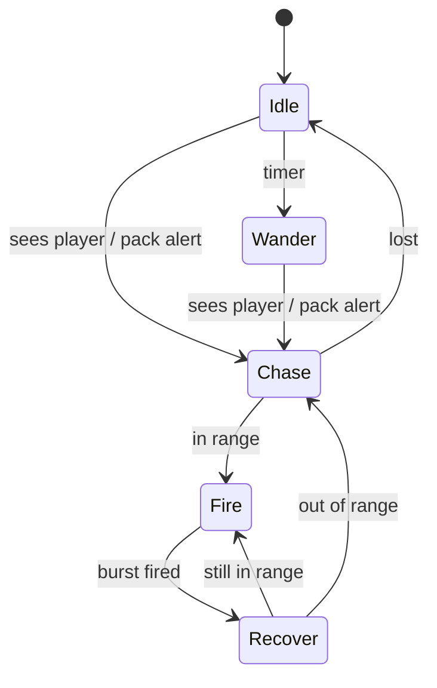
```mermaid
stateDiagram-v2
    [*] --> Idle
    Idle --> Wander : timer
    Idle --> Chase : sees player / pack alert
    Wander --> Chase : sees player / pack alert
    Chase --> Fire : in range
    Fire --> Recover : burst fired
    Recover --> Fire : still in range
    Recover --> Chase : out of range
    Chase --> Idle : lost
```

### Mole

Introduces the **burrow**. It dives underground where it cannot be hit at all, and the only
tell is a dirt plume tracking toward you; inside three tiles it erupts with a pair of
rotating ring bursts, scratches around on the surface for a beat — your punish window —
then dives again. Fighting it is rhythm reading: move off the plume, hit it while it blinks
in the light.

**Art:** a plump maroon-brown mole with oversized pale claws and a pink snout; a travelling dirt-mound sprite while submerged, a burst-of-soil frame on eruption.

| Stat |  |
|---|---|
| HP | 150 |
| Speed | 30 px/s |
| Range | detect 11, chase 15, erupt 3 |
| erupt | **26** dmg — 1.6s cd, Ring x9, 2 @ 0.35s, 5 tiles range |
| Drops | **ring t2** (10%) |

**Notes:** untouchable for the whole burrow (`damage_scale` 0) — the surface beat is the only window.

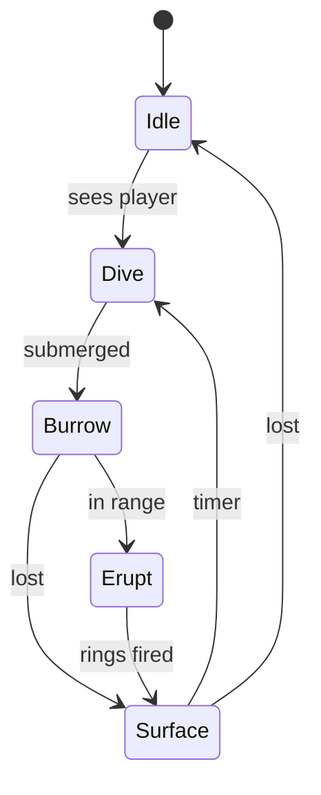
```mermaid
stateDiagram-v2
    [*] --> Idle
    Idle --> Dive : sees player
    Dive --> Burrow : submerged
    Burrow --> Erupt : in range
    Burrow --> Surface : lost
    Erupt --> Surface : rings fired
    Surface --> Dive : timer
    Surface --> Idle : lost
```

### Moon Moth

Moth variant, and the one you fight at arm's length. Same flit-in, poke, bolt loop, but the
poke is a pair of scale rings pulsed off its own body, each rotated off the last, so it has
to be right on top of you to land anything. It commits closer than the moth and leaves
sooner. Standing still to trade with one puts you inside the pulse; step off it, not
through it.

**Art:** the moth recoloured moonlit — pale blue-white wings over a dusk body.

| Stat |  |
|---|---|
| HP | 55 |
| Speed | 44 px/s |
| Range | detect 12, chase 15, attack 2, retreat 1.5 |
| scales | **18** dmg — 1.1s cd, Ring x6, 2 @ 0.22s, 3 tiles range |
| Drops | **ring t2** (5%) |

**Notes:** the shortest attack probe of the three (2 tiles) and the shortest retreat — its poke only works point-blank, so it re-closes fastest.

```mermaid
stateDiagram-v2
    [*] --> Idle
    Idle --> Wander : timer
    Idle --> Chase : sees player
    Wander --> Chase : sees player
    Chase --> Poke : in range
    Poke --> Retreat : pulse fired
    Retreat --> Chase : retreat over
    Chase --> Idle : lost
```

### Moss Golem

The golem recipe at deepwood weight — the toughest thing in the biome that isn't a boss, and
the slowest. It walks you down, and on arrival it hardens into a shell (a channeled absorb,
the rosebud's trick) that eats whatever you spent punishing the approach; then three rotating
rings pulse out, each turned off the last, dense enough that its own tile is a place you
never stand.

**Art:** the golem sprite overgrown: deep-green moss over grey stone, with dim eye-lights; a clenched, hardened frame for the shell.

| Stat |  |
|---|---|
| HP | 500 |
| Speed | 14 px/s |
| Range | detect 14, chase 17, attack 3 |
| ring | **36** dmg — 2.6s cd, Ring x8, 3 @ 0.6s, 8 tiles range |
| shell | 5s cd, absorbs 90 |
| Drops | **ring t2** (8%), **nope** (30%) |

**Notes:** the shell is a Nope absorb channelled through the wind-up, so hitting it mid-telegraph is the worst moment to spend a burst.

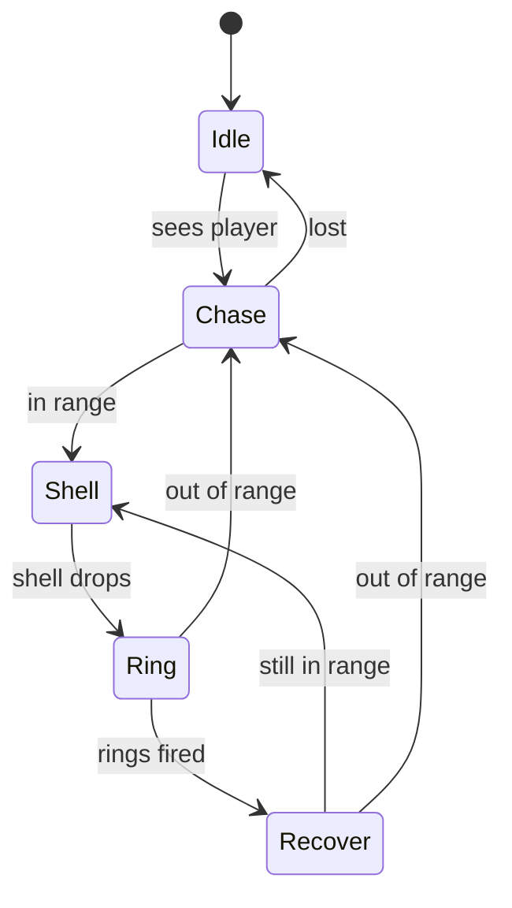
```mermaid
stateDiagram-v2
    [*] --> Idle
    Idle --> Chase : sees player
    Chase --> Shell : in range
    Shell --> Ring : shell drops
    Ring --> Recover : rings fired
    Ring --> Chase : out of range
    Recover --> Shell : still in range
    Recover --> Chase : out of range
    Chase --> Idle : lost
```

### Moth

The deepwood's basic flier and its returning face. It flits in on quick wings, pokes twice
with a dust burst at short range, then bolts for a beat before closing again — it never
stands and trades. Always in twos and threes: fragile chip pressure whose job is to keep
you moving while heavier things line up.

**Art:** a dusty grey-brown moth with big rounded wings and two pale eye pixels; a two-frame flutter.

| Stat |  |
|---|---|
| HP | 55 |
| Speed | 44 px/s |
| Range | detect 13, chase 16, attack 3, retreat 1.25 |
| dust | **23** dmg — 0.9s cd, Single, 2 @ 0.15s, 5 tiles range |
| Drops | **pew t2** (5%) |

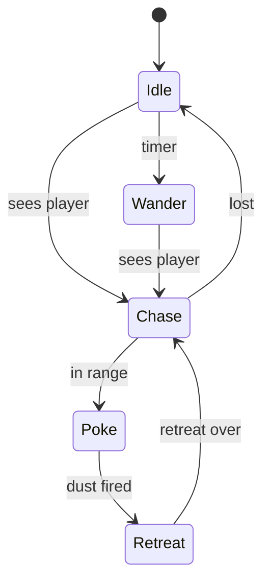
```mermaid
stateDiagram-v2
    [*] --> Idle
    Idle --> Wander : timer
    Idle --> Chase : sees player
    Wander --> Chase : sees player
    Chase --> Poke : in range
    Poke --> Retreat : dust fired
    Retreat --> Chase : retreat over
    Chase --> Idle : lost
```

### Needle Moth

Moth variant, and the one that taxes the dodge. It strikes from five tiles out and leaves
two homing dust-needles behind it, so its retreat is what buys the shot its time: you are
dealing with the moth that just left while the next one comes in. The needles turn hard but
only over a narrow cone — a sidestep won't shake one, breaking the angle will.

**Art:** the moth recoloured rust — tan-orange wings over a dark plum body.

| Stat |  |
|---|---|
| HP | 55 |
| Speed | 46 px/s |
| Range | detect 14, chase 17, attack 3, retreat 1.75 |
| dart | **19** dmg — 1.2s cd, Single, 2 @ 0.2s, 9 tiles range, homing 70° cone |
| Drops | **snipe t2** (5%) |

**Notes:** the longest attack probe of the three (5 tiles) and the longest retreat — it never comes into the range the other two fight at.

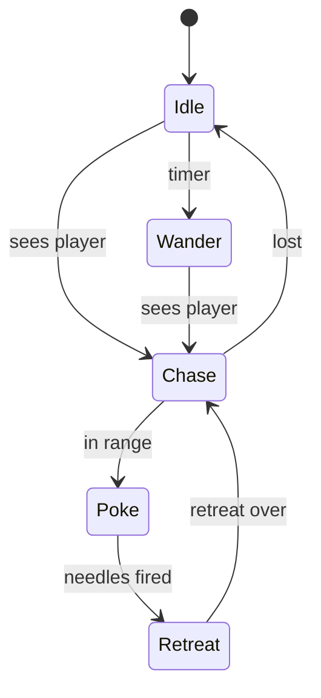
```mermaid
stateDiagram-v2
    [*] --> Idle
    Idle --> Wander : timer
    Idle --> Chase : sees player
    Wander --> Chase : sees player
    Chase --> Poke : in range
    Poke --> Retreat : needles fired
    Retreat --> Chase : retreat over
    Chase --> Idle : lost
```

### Owl

The perch sniper. It sits still and charges a Bwoom shot at anything inside ten tiles, the
wind-up itself being the telegraph. Get too close, or out of its band, and it repositions a
few tiles before charging again; being cornered mid-reposition just makes it fire. It
outranges most of what you carry at this depth, so your move is to close the gap through
its fire.

**Art:** a brown oval with an oversized head and two big amber eyes. The eye rule taken to a whole creature.

| Stat |  |
|---|---|
| HP | 120 |
| Speed | 46 px/s |
| Range | detect 18, snipe 10, close 5, retreat 2 |
| bwoom | **16** dmg — 5s cd |
| Drops | **bwoom t2** (5%), **pew t2** (7%) |

```mermaid
stateDiagram-v2
    [*] --> Idle
    Idle --> Bwoom : sees player
    Bwoom --> Recover : shot fired
    Bwoom --> Reposition : out of band
    Recover --> Reposition : timer / player closed in
    Reposition --> Bwoom : repositioned / cornered
```

### Shard Grimling

Grimling variant, and the pack's back line. It shares the pack, but it stops at nine tiles
and fans a spread of gloom shards instead of closing. On its own the fan is easy to walk out
of; with two of them behind a pack the cones overlap and the gaps you were stepping into
close. The long wind-up is the tell, so the shard grimling is the one you push or break line
of sight on, never the one you trade with at range.

**Art:** the grimling recoloured dark plum, with a duller eye-glow.

| Stat |  |
|---|---|
| HP | 110 |
| Speed | 30 px/s |
| Range | detect 12, chase 16, attack 8 |
| shards | **13** dmg — 2.8s cd, Shotgun x3, 12 tiles range |
| Drops | **blam t2** (5%), **halp t2** (2%) |

**Notes:** the longest attack probe of the three (9 tiles) and the longest wind-up — it never closes to the range the others fight at, and it keeps firing while they do.

```mermaid
stateDiagram-v2
    [*] --> Idle
    Idle --> Wander : timer
    Idle --> Chase : sees player / pack alert
    Wander --> Chase : sees player / pack alert
    Chase --> Fire : in range
    Fire --> Recover : fan fired
    Recover --> Fire : still in range
    Recover --> Chase : out of range
    Chase --> Idle : lost
```

### Snake

A skittish corridor-denier. It wanders until it spots you, then bolts in a random direction;
when its back hits a wall it stands and fires twin parallel shots that ricochet, then bolts
again. Trivial in open rooms; in narrow passages the bouncing pair covers the corridor both
ways.

**Art:** a low serpentine coil in deepwood two-tone green, a forked head with a white eye pixel; weave frames.

| Stat |  |
|---|---|
| HP | 90 |
| Speed | 35 px/s |
| Range | detect 9, retreat 2 |
| zoing | **27** dmg — 1.4s cd, Parallel x2, 2 @ 0.3s, 10 tiles range, BounceBehaviour |
| Drops | **zoing t2** (5%) |

```mermaid
stateDiagram-v2
    [*] --> Idle
    Idle --> Wander : timer
    Idle --> Flee : sees player
    Wander --> Flee : sees player
    Flee --> Volley : cornered
    Volley --> Flee : burst fired
    Flee --> Idle : lost
```

### Stalker

The basic pouncer, and the biome's signature jump-scare. It sits in `Disguise` as a scenery
prop, watching through a probe that only reaches five tiles. Step into that — or hit it —
and it reveals, then weaves in and blasts a point-blank shotgun cone with no recovery
between shots. Lose it and it becomes a prop again. Introduces **prop disguise**.

**Art:** a dark violet-grey cap on a thin stalk with a green leaf flick, indistinguishable from decor until the amber eyes open on reveal.

| Stat |  |
|---|---|
| HP | 150 |
| Speed | 36 px/s |
| Range | detect 5, chase 16, attack 3 |
| blast | **24** dmg — 1.7s cd, Shotgun x4, 4 tiles range |
| Drops | **blam t2** (5%) |

```mermaid
stateDiagram-v2
    [*] --> Disguise
    Disguise --> Reveal : player very close / hit
    Reveal --> Chase : revealed
    Chase --> Blast : in range
    Blast --> Recover : cone fired
    Recover --> Blast : still in range
    Recover --> Chase : out of range
    Chase --> Disguise : lost
```

### Thornback

A charger, introducing the **charge-dash with flank fire**. It runs a long telegraphed
windup, then a straight high-speed dash that sheds bullets off both flanks, then a rooted
recovery that is your punish window. It locks heading at launch and can't corner, so
sidestep the dash and burn it during recovery. Trees are your friend.

**Art:** a wide squat body, dark-brown armour over a tan body, a spike array along the back.

| Stat |  |
|---|---|
| HP | 350 |
| Speed | 14 px/s |
| Range | detect 14 |
| charge | **24** dmg — 3s cd, Flank x2, 9 @ 0.1s, 6 tiles range, dash 120 px/s for 1s |
| Drops | **charge_dash t2** (10%) |

```mermaid
stateDiagram-v2
    [*] --> Idle
    Idle --> Wander : timer
    Idle --> Charge : sees player
    Wander --> Charge : sees player
    Charge --> Recover : dash over
    Recover --> Charge : still sees player
    Recover --> Idle : lost
```

### Wisp Grimling

Grimling variant, and the one that finds you. It sees furthest, runs fastest, and calls from
nearly twice the radius its packmates do, so the first wisp to spot you is what turns a room
into a pack. Its poke is a fast triple flicker at four tiles for almost no damage — the
threat is never the bolt, it's who else is now coming. Kill it first or the fight keeps
recruiting.

**Art:** the grimling recoloured pale — washed lavender body, bright eye-glow; the brightest thing in the gloom.

| Stat |  |
|---|---|
| HP | 60 |
| Speed | 54 px/s |
| Range | detect 18, chase 20, attack 3 |
| flicker | **8** dmg — 1.8s cd, Single, 3 @ 0.18s, 7 tiles range |
| Drops | **pew t2** (5%), **halp t2** (2%) |

**Notes:** pack radius 14 tiles against the grimling's default 8, and the shortest attack probe — it comes all the way in.

```mermaid
stateDiagram-v2
    [*] --> Idle
    Idle --> Wander : timer
    Idle --> Chase : sees player / pack alert
    Wander --> Chase : sees player / pack alert
    Chase --> Fire : in range
    Fire --> Recover : burst fired
    Recover --> Fire : still in range
    Recover --> Chase : out of range
    Chase --> Idle : lost
```

### Great Owl *(rare)*

Owl variant: bigger, and its firing band is most of the map — it charges from twenty-four
tiles, further than anything else in the biome can answer. The wind-up is longer and the
telegraph brighter, so the duel stays honest, but it re-perches further away too and the
whole fight is spent closing.

**Art:** the owl sprite enlarged, pale barn-owl white with amber eyes.

| Stat |  |
|---|---|
| HP | 300 |
| Speed | 42 px/s |
| Range | detect 28, snipe 24, close 7, retreat 2.5 |
| bwoom | **18** dmg — 4s cd |
| Drops | **bwoom t2** (80%) |

**Notes:** guaranteed Bwoom T3 on death.

```mermaid
stateDiagram-v2
    [*] --> Idle
    Idle --> Bwoom : sees player
    Bwoom --> Recover : shot fired
    Bwoom --> Reposition : out of band
    Recover --> Reposition : timer / player closed in
    Reposition --> Bwoom : repositioned / cornered
    Reposition --> Idle : lost
```

### Grimlord *(rare)*

A larger, darker grimling, the pack's alpha, and the one grimling that rolls its beat: a
`PatternPicker` swaps its move at low health rather than adding one. Above a quarter health
it weaves in and sprays five bolts at four tiles. Below it, the spray is gone and it enrages
— seven bolts, faster, from wherever it stands, with no range check at all. On death it
bursts one parting ring. The weave plus the enrage turns the last sliver of its health into
a gauntlet.

**Art:** the grimling silhouette enlarged and near-black, red eye-glow; the enrage frame brightens the eyes.

| Stat |  |
|---|---|
| HP | 380 |
| Speed | 38 px/s |
| Range | detect 11, chase 14, attack 3 |
| burst | **13** dmg — Ring x18, 7 tiles range |
| enrage | **13** dmg — 1.4s cd, Single, 7 @ 0.13s, 10 tiles range |
| spray | **13** dmg — 2.4s cd, Single, 5 @ 0.26s, 10 tiles range |
| Drops | **blam t3** (50%), **ring t3** (30%), **halp t2** (20%) |

**Notes:** enrage replaces the spray below 30% HP; `RingPattern` death burst. Shares the grimling pack group, so it wakes with them.

```mermaid
stateDiagram-v2
    [*] --> Idle
    Idle --> Wander : timer
    Idle --> Chase : sees player / pack alert
    Wander --> Chase : sees player / pack alert
    Chase --> Pick : in range
    Pick --> Fire : above 25% HP
    Pick --> Enrage : below 30% HP
    Fire --> Recover
    Enrage --> Recover
    Recover --> Pick : still in range
    Recover --> Chase : out of range
    Chase --> Idle : lost
```

### Razorback *(rare)*

Thornback variant: the recovery is gone. Each dash ends in a snap re-aim and a fresh launch,
chaining charge after charge for as long as you stay inside its very long sight line; only a
head-on wall hit stuns it into a real punish window. Fight it near trees and make the forest
do the work.

**Art:** the thornback silhouette in near-black armour with red spike tips.

| Stat |  |
|---|---|
| HP | 420 |
| Speed | 18 px/s |
| Range | detect 20 |
| charge | **30** dmg — 0.3s cd, Flank x2, 6 @ 0.1s, 5 tiles range, dash 150 px/s for 0.7s |
| Drops | **charge_dash t2** (50%) |

```mermaid
stateDiagram-v2
    [*] --> Idle
    Idle --> Wander : timer
    Idle --> Charge : sees player
    Wander --> Charge : sees player
    Charge --> Charge : dash over
    Charge --> Stun : head-on wall
    Charge --> Idle : out of range
    Stun --> Charge : recovered
    Stun --> Idle : lost
```

### Gnarlking *(boss)*

The apex of the animal deepwood, and the one boss that doesn't roll: it runs ordered `Gate`
ladders, so what it does next is decided by the arena rather than by dice. The fight
alternates two modes and **the player sets the pace of the swap**.

Everything it owns is a close-quarters weapon, and the whole kit is **range-gated** — it
never swings at air. Out of reach it simply walks you down, and distance is a delay, not an
answer.

- **Call → Hunt** *(armoured)*: it rings in a brood of six grimlings — the plain, shard and
  wisp kinds mixed — then comes for you. While any of them stand it takes about a third
  damage, and it works the ladder by distance: **Ground Slam** inside 6 tiles (radial
  shockwave, damage falling off with distance, big knockback — demonstrates **Thwomp**),
  **Shotgun Volley** inside 8, and outside both it **closes**, at a steady advance you can
  outpace but not shake. Chipping the boss here is a poor trade against clearing the pack,
  but not a wasted one.
- **Charge** *(unarmoured)*: the moment the brood is dead — or its 26s life runs out — the
  charge unlocks and the ranged kit drops entirely. The thornback's charge-dash writ large:
  a locked-heading lunge shedding `FlankPattern` bullets. It can't corner.
- **Stalk → second Charge**: after the lunge it prowls for a beat. Still within reach and it
  immediately charges again; broken away and it goes straight to **Winded**. Your footwork
  sets the length of the burst.
- **Stagger**: sidestep a charge into a tree and the head-on slam staggers it — three and a
  half seconds rooted, taking *extra* damage. The fight's best window, and you have to earn it.
- **Winded**: heaves briefly, then calls the next brood.

The decision the loop poses: clear the adds fast and you reach the burn window sooner but
meet the charge sooner too, with the pack's chip damage still on you; ignore them and you
are ground down while the boss walks into your face anyway.

**Art:** a towering forest-lord of bark, antler, and gloom, pale glowing eyes, oversized frame; a rear-and-slam pose for the slam (boss sheet).

| Stat |  |
|---|---|
| HP | 5000 |
| Speed | 82 px/s |
| Range | detect 22, close 6, slam 2, volley 4 |
| brood | 6 minions, 8 hp, 26s |
| brood_big | 3 minions, 8 hp, 20s |
| charge | **26** dmg — 5s cd, Flank x2, 16 @ 0.045s, 6 tiles range, dash 300 px/s for 0.7s |
| charge_chain | **26** dmg — Flank x2, 13 @ 0.045s, 6 tiles range, dash 300 px/s for 0.6s |
| slam | **48** dmg — 6s cd |
| volley | **24** dmg — 4s cd, Shotgun x4, 4 @ 0.55s, 6 tiles range |
| Drops | **thwomp t3** (100%), **halp t2** (60%), **blam t3** (100%), **charge_dash t2** (60%) |

**Notes:** one Thwomp only — no bigger low-HP variant. Below a quarter health it calls three grimlords instead of six grimlings (on a shorter 20s leash), and Winded shrinks from 5s to 3s. `clear_group` on the charge is what makes the brood, not a timer, the phase gate.

```mermaid
stateDiagram-v2
    [*] --> Idle
    Idle --> Summon : sees player
    Summon --> CallBig : below 25% HP
    Summon --> Call
    Call --> Hunt
    CallBig --> Hunt
    Hunt --> Charge : brood cleared / expired
    Hunt --> Slam : within 6
    Hunt --> Volley : within 8
    Hunt --> Close : out of reach
    Close --> Volley : arrived
    Close --> Brace : volley cooling
    Close --> Hunt : timer
    Slam --> Hunt
    Volley --> Hunt
    Brace --> Hunt
    Charge --> Stagger : slammed a wall
    Charge --> Stalk : dash over
    Stalk --> Charge2 : still in reach
    Stalk --> Breathe : broke away
    Charge2 --> Breathe
    Breathe --> WindedShort : below 25% HP
    Breathe --> Winded
    Stagger --> Summon
    Winded --> Summon
    WindedShort --> Summon
```

### Bramble Stalker

The mimic sub-biome's opener, and the stalker recipe turned inside out: instead of closing
to point-blank and coning you, it sits as a bush, reveals, weaves in, and fires whole rings
of thorns off its own body. The ring means there is no safe side of it — the answer is
distance, not footwork — and the rings drift a little each wave, so a gap you found in the
first one is somewhere else in the second. Hard to lead on the approach, trivial once you
stop letting it arrive.

**Art:** a leafy deepwood bush, built from the biome's own decor bush — same three greens, same sparse silhouette, same ground shadow, and dead still while it waits. The disguise carries no eye and no thorn at all; the amber eyes open in the leaves on reveal, and the bramble-red thorns push out after them, one per flank as it winds up.

| Stat |  |
|---|---|
| HP | 110 |
| Speed | 40 px/s |
| Range | detect 3, chase 12, attack 5 |
| ring | **16** dmg — 2.2s cd, Ring x8, 2 @ 0.4s, 5 tiles range |
| Drops | **ring t2** (6%) |

```mermaid
stateDiagram-v2
    [*] --> Disguise
    Disguise --> Reveal : player close / hit
    Reveal --> Chase : revealed
    Chase --> Ring : in range
    Ring --> Recover : rings fired
    Recover --> Ring : still in range
    Recover --> Chase : out of range
    Chase --> Disguise : lost
```

### Bristlestone

The cinderstone's sibling, and the reason you can't read a minefield at a glance. It is the
same rock sitting in the same litter, and it triggers the same way — step close, or clip it
with a shot, and the fuse runs. What comes out is the difference: instead of one big blast
it bursts into a full ring of piercing darts that carry clean across the room and straight
through anything in the way.

Between the two of them a room of rocks stops being scenery you ignore. The blast one
punishes standing next to it, the dart one punishes standing anywhere in line with it,
and until one goes off you don't know which you're walking past. The tell, if you look
for it, is a pair of dry burr spines in the moss on top.

**Art:** the cinderstone's boulder, moss and all, with two pale burr spines standing out of the green. The fuse lights white instead of amber, and it goes off in a pale green seed-burst rather than a fireball.

| Stat |  |
|---|---|
| HP | 1 |
| Range | trigger 2 |
| ploop | **32** dmg — Ring x6, 3 @ 0.1s, 4 tiles range |
| Drops | **ploop t2** (4%) |

**Notes:** it drops the Ploop it fires, the way the cinderstone drops its Oop. Killing it before the fuse lands does NOT set it off.

```mermaid
stateDiagram-v2
    [*] --> Disguise
    Disguise --> Fuse : player close / hit
    Fuse --> [*] : burst away
```

### Cinderstone

A trap with a health bar. It sits among the real rocks and litter until you step close — or
clip it with a shot — then shivers, glows, and goes up in one big blast, taking itself with
it. Spot the boulder that is slightly too round and spend it from range, or route around it
and leave it armed for whatever chases you. It never moves and never fires twice; the only
question is where you are standing when the fuse ends.

**Art:** a mossy grey boulder, the same stone the deepwood scatters everywhere, with one hairline seam down its face; the seam lights amber through the fuse until the whole rock glows.

| Stat |  |
|---|---|
| HP | 1 |
| Range | trigger 2 |
| oop | **60** dmg — Single, 0 tiles range, blast 5 tiles (splash only) |
| Drops | **oop t2** (4%) |

**Notes:** its blast is the Oop cast — an ordinary blast-payload bullet whose burst kills the caster when it ends, which is exactly what the player's Oop mine does from the other side. Killing the cinderstone before the fuse lands does NOT set it off. The mother tree seeds these as mines.

```mermaid
stateDiagram-v2
    [*] --> Disguise
    Disguise --> Fuse : player close / hit
    Fuse --> [*] : detonated
```

### Shade

A vanishing harasser, and the enemy that teaches the sub-biome's second trick: it fires a
short burst, then blinks somewhere else nearby and bursts again. Nothing about a single
burst is dangerous; what it costs you is aim. Every exchange starts over, so it punishes
standing still and rewards fighting it while moving to something else. It never walks —
the blink is its whole movement.

**Art:** a wispy near-black silhouette with a faint violet edge and two pale eyes; a barely-there body that blinks out.

| Stat |  |
|---|---|
| HP | 70 |
| Range | detect 12 |
| blink | 0.6s cd |
| pew | **20** dmg — 1.1s cd, Single, 3 @ 0.16s, 12 tiles range |
| Drops | **blink t2** (8%), **pew t3** (5%) |

**Notes:** the blink is a teleport cast, not a bullet spell — it moves its caster and refuses a landing spot with a wall in the way. The player's own Blink is the same effect with its landing dial on AIM instead of a random bearing.

```mermaid
stateDiagram-v2
    [*] --> Idle
    Idle --> Volley : sees player
    Volley --> Blink : burst done
    Blink --> Recover : reappeared
    Recover --> Volley : burst ready
    Recover --> Idle : lost
```

### Adder *(rare)*

Snake variant, and a lesson about corridors. It flees like the snake, but when its back hits
a wall the twin shot becomes a wide ricocheting spray that fills the passage behind you as
well as ahead. Cornering it in a hallway is the natural move and precisely the mistake;
take it in the open, where the bounces have nothing to come back off.

**Art:** the snake coil in rare charcoal with amber banding.

| Stat |  |
|---|---|
| HP | 320 |
| Speed | 46 px/s |
| Range | detect 12, retreat 2 |
| zoing | **26** dmg — 1.6s cd, Shotgun x5, 12 tiles range, BounceBehaviour |
| Drops | **zoing t2** (50%) |

```mermaid
stateDiagram-v2
    [*] --> Idle
    Idle --> Wander
    Idle --> Flee : sees player
    Wander --> Flee : sees player
    Flee --> Volley : cornered
    Volley --> Flee : spray fired
```

### Elder Stalker *(rare)*

Stalker variant, and the mimic's long game: an ancient tree that snipes a slow, wide-cone
homing seed from across the room, blinks the moment it has fired, and greets you with a
shotgun cone wherever it lands. The seed forces you to move; the blink means the ground you
moved to is the wrong ground. It never chases — every reposition is a teleport — so the
fight is about closing the gap between its cycle rather than out-running it.

**Art:** a gnarled dead-tree disguise, bark-grey twisted trunk, hollow amber eye-glow on reveal; taller than the stalker.

| Stat |  |
|---|---|
| HP | 260 |
| Range | detect 22, blast 5 |
| blast | **24** dmg — 1.6s cd, Shotgun x5, 5 tiles range |
| blink | 0.4s cd |
| seed | **32** dmg — 3.2s cd, Single, 20 tiles range, homing 150° cone |
| seed_fast | **32** dmg — 2.4s cd, Single, 20 tiles range, homing 150° cone |
| Drops | **blam t3** (30%), **blink t2** (60%) |

**Notes:** below a quarter health the seed's wind-up drops to near-instant — the same beat with a shorter telegraph, swapped in by health window.

```mermaid
stateDiagram-v2
    [*] --> Disguise
    Disguise --> Aim : sees player
    Aim --> SnipeFast : below 25% HP
    Aim --> Snipe
    Snipe --> Blink : seed away
    SnipeFast --> Blink : seed away
    Blink --> Blast : arrived
    Blast --> Recover
    Recover --> Aim : snipe ready
    Recover --> Disguise : lost
```

### Umbra *(rare)*

Shade variant, and the reason you stop treating the blink as a retreat: every hop lands on
the far side of you. The burst itself is the shade's — a plain Pew, one shot longer — so
what changed is entirely where it fires it from. Turning to face it puts your back to
whatever else is in the room, which is exactly the trade the mimic sub-biome keeps asking
you to make. Clear it first, or fight it with a wall behind you.

**Art:** the shade silhouette in deeper black with a thin red edge.

| Stat |  |
|---|---|
| HP | 200 |
| Range | detect 12 |
| blink | 0.6s cd |
| pew | **22** dmg — 1.1s cd, Single, 3 @ 0.16s, 12 tiles range |
| Drops | **blink t2** (50%), **pew t3** (30%) |

**Notes:** the same Blink cast as the shade, with the landing spot taken past the target instead of on a random bearing — the dial the player's tiers leave on AIM.

```mermaid
stateDiagram-v2
    [*] --> Idle
    Idle --> Volley : sees player
    Volley --> Blink : burst done
    Blink --> Recover : behind player
    Recover --> Volley : burst ready
    Recover --> Idle : lost
```

## Mycelium

Fifteen bodies, all built, all fungal: five rooted turrets, three splitters, three movers, a rot heavy and three rares. Half of them print spore clouds and the other half fight harder while standing in them. None of it is placed yet — the floors carve, and every room's table is empty.

### Bloatcap

The first splitter, and the one enemy whose death you get to aim. It waddles at you and
shoves with the cap for very little; the damage you put in swells it visibly rather than
dropping it, and when it finally goes it bursts into a field of spores and a brood of
mycelings that sprint the last few tiles and pop into small patches of their own. So the
question is never whether it goes off, only where — walk it into the corner you had
already written off, or shoot it where you were about to stand and lose the floor.

**Art:** a fat button mushroom in off-white with rot spots and stubby feet, drawn in inflation stages; the burst row squashes it flat and blows the cap out into spores. The mycelings are the same body at half the size, two frames each.

| Stat |  |
|---|---|
| Kinds | fungal |
| HP | 70 |
| Speed | 24 px/s |
| Range | detect 9, chase 12, attack 1.75 |
| burst |  |
| nudge | **6** dmg — 1.4s cd, Single, 2 tiles range |
| myceling_burst | **5** dmg — Ring x6, 4 tiles range |
| myceling_pop |  |
| myceling_wide_burst | **8** dmg — Ring x8, 2 @ 0.12s, 6 tiles range |
| Drops | **oop t2** (2%), **whumf t3** (1%), **poot t3** (1%) |

**Notes:** a pure printer — everything it does is spores, so coated floor buys it nothing and neither the shove nor the burst has an empowered twin. The brood is a `death_spawns` entry on its stat sheet rather than death code, and the mycelings carry no `CreatureResource` at all, so they leave no drops and no kill count. The swell is a health window on a second, faster waddle behind the same `Gate`, and both waddles carry a clock so the Gate is asked again mid-chase rather than once at the start of it. A myceling's contact pop lays its patch and kills it, and dying is what throws the ring — the patch is the printing cast and stays flat, the ring is the consumer one and comes wider off coated floor, so the brood empowers without anything being paid for the floor it laid itself.

```mermaid
stateDiagram-v2
    [*] --> Idle
    Idle --> Waddle : sees player
    Waddle --> Nudge : in reach
    Nudge --> Swell : under half health
    Swell --> Nudge : in reach
    Waddle --> Idle : lost
    Nudge --> Burst : killed
```

### Clustercap

A knot of caps that walks the floor it is painting — it closes on you between lobs,
swelling as you shoot it exactly as its pale cousin does, and comes apart on death into
three small clustercaps that root where they land and go on lobbing. Killing it does not
reduce the room's fire, it multiplies it and nails it down, and the three land spread out,
so one moving problem becomes three fixed ones on the far side of a floor it has already
coated. The correct play is often to leave it walking while you deal with everything
else, which is a thing nothing else in the game asks of you. The brood cannot split
again — one death, one multiplication, and the room ends.

**Art:** the bloatcap sheet recoloured dusky violet, so the family reads at a glance and the darker body says this one is worse; the clusterlings are the myceling sprite under the same recolour.

| Stat |  |
|---|---|
| Kinds | fungal |
| HP | 150 |
| Speed | 20 px/s |
| Range | detect 14, chase 16 |
| lob | **24** dmg — 3s cd, Single, 14 tiles range, SporePayload |
| clusterling_pop | **24** dmg — Ring x8, 2 @ 0.25s, 5 tiles range |
| clusterling_wide_pop | **48** dmg — Ring x10, 3 @ 0.12s, 7 tiles range |
| Drops | **whumf t3** (1%), **poot t3** (1%) |

**Notes:** a pure printer, so the lob stays flat however coated the floor is. The split is three `death_spawns` of the clusterling — a rooted lobber that throws a ring of pods when it dies, wider if it is standing in spores. It carries no `CreatureResource` at all, and no stat sheet means no `death_spawns` to hold, so the one-generation rule is structural rather than a counter someone has to remember to check; the brood also leaves no drops and no kill count. The swell is a health window on a second, slower walk behind the same `Gate`, which is why both walks carry a clock — a rung that never ends is a Gate never asked again.

```mermaid
stateDiagram-v2
    [*] --> Idle
    Idle --> Walk : sees player
    Walk --> Lob : cadence
    Lob --> Walk : shot away
    Walk --> Swell : under half health
    Swell --> Lob : cadence
    Walk --> Idle : lost
    Lob --> Split : killed
```

### Gapcap

The one thing that closes hard, and it only does it once at a time. It sprints the gap,
dumps a shotgun cone at point blank, then roots for a beat and cannot follow — so the
whole enemy is a single committed lunge you either sidestep or eat, and what you get for
sidestepping it is a free window with the thing standing helpless in front of you. It is
the dungeon's answer to a player who solves every room from max range.

Spores turn the free window off. Standing in a field it lunges further, fires the cone
twice, and recovers in about half the time — the same enemy, with the gap between its
commitment and its next one closed. Whether the lunge is a mistake it makes or a mistake
you make is decided by whose floor it is standing on.

**Art:** a squat rust-red cap on two thick stubby legs, its rim split across the front like a mouth over a pale gill band; the lunge row throws the cap out ahead of the legs and the strike row flattens the whole body into the ground before the mouth opens.

| Stat |  |
|---|---|
| Kinds | fungal |
| HP | 100 |
| Speed | 86 px/s |
| Range | detect 12, cone 3 |
| cone | **24** dmg — 2s cd, Shotgun x5, 4 tiles range |
| double_cone | **24** dmg — 2s cd, Shotgun x5, 2 @ 0.25s, 5 tiles range |
| Drops | **blam t3** *(insect)* (3%) |

**Notes:** pure composition, and the roster's clearest case of the empowerment being a shape rather than a number — `approach` to `cast` to a rooted `hold`, with a `needs_cloud` twin of each of the three. The fed lunge is a longer clock on the same chase, the fed cone is a second shot on the same spell, and the shorter root is simply where that cone hands off, so nothing is gated that a `Gate` does not already list.

```mermaid
stateDiagram-v2
    [*] --> Idle
    Idle --> Lunge : sees player
    Lunge --> Cone : arrived
    Cone --> Rooted : fired
    Rooted --> Idle : recovered
```

### Mould Golem

The slow tank, and the one body in the Mycelium that walks at you rather than waiting.
Very high HP, a shield it puts up before it commits, and then a ring pulse that fills the
space around it three times over, each turn drifting off the last so the gaps never sit
still. The shield is the fight: it is a wall of health that arrives on a clock, and
whether you burn it down or walk around it decides whether the room is a fight or a
detour. It never idles — lose it and it simply keeps coming.

**Art:** the moss golem gone to rot — pale fungal white where the stone was, and the moss on its crown sagged from a live green to a dead slate one, with the sprouts at its shoulders the only part still growing.

| Stat |  |
|---|---|
| Kinds | fungal |
| HP | 560 |
| Speed | 14 px/s |
| Range | detect 14, chase 17, attack 3 |
| ring | **36** dmg — 2.6s cd, Ring x8, 3 @ 0.6s, 8 tiles range |
| shell | 5s cd, absorbs 90 |
| wide_ring | **44** dmg — 2.6s cd, Ring x12, 4 @ 0.5s, 10 tiles range |
| Drops | **nope** (10%), **whumf t3** (1%), **poot t3** (1%) |

**Notes:** the moss golem's scene with the idle beat swapped for a `wander`, so "never idles" is a state that walks rather than a dial. The shield is the player's own Nope, channelled — its `cast_time` caps the channel, which is why the golem stands still through the whole wind-up and why the shell pose IS the telegraph.

```mermaid
stateDiagram-v2
    [*] --> Walk
    Walk --> Chase : sees player
    Chase --> Shell : in range
    Shell --> Ring : shield up
    Ring --> Recover : pulsed
    Recover --> Shell : clock lapses
    Chase --> Walk : lost
```

### Normiecap

A mushroom that walks up and spits at you. It notices you, it closes, it fires from about
two tiles out, and if you walk away it gives up and goes back to standing there. There is
no phase, no second idea and nothing to read — it is the body a room uses to make you
commit to a direction while something with an actual plan sets up behind it.

It still drinks. On coated floor the spit comes faster, harder and one shot longer, which
is the whole point of putting the rule on the plainest thing in the dungeon: even the
speed bump is worse on floor you let stand, so there is no body in the Mycelium a player
can safely ignore the clouds around.

**Art:** the plainest mushroom that can be drawn at this size — a tan cap over a pale stem with two dark eyes under the brim, and a base that picks up when it walks. Deliberately the least memorable thing on the sheet.

| Stat |  |
|---|---|
| Kinds | fungal |
| HP | 64 |
| Speed | 40 px/s |
| Range | detect 12, chase 14, shoot 2 |
| hard_pew | **28** dmg — 1.2s cd, Single, 3 @ 0.2s, 4 tiles range |
| pew | **20** dmg — 1.2s cd, Single, 3 @ 0.25s, 4 tiles range |
| Drops | **pew t3** *(insect)* (3%) |

**Notes:** four library beats in a ring and nothing else — `hold` to `approach` to a two-rung `Gate` to `hold` — which makes it the roster's reference for what composition alone buys you, with no script and no bespoke node anywhere. The chase carries the LOS probe and the shot carries none, so giving up is the pursuit's job and re-closing is the recovery's, the split every ranged body in the game uses; the recovery points back at the Gate rather than at a shot, so the floor is re-read between every burst instead of once on the way in.

```mermaid
stateDiagram-v2
    [*] --> Idle
    Idle --> Chase : sees player
    Chase --> Spit : in range
    Spit --> Recover : shot away
    Recover --> Spit : still in range
    Recover --> Chase : player backed off
    Chase --> Idle : lost
```

### Puffcap

The cloud mine, and the first thing the Mycelium teaches. Rooted among the real mushroom
decor with no attack and barely any detection, it inhales when something comes close and
pops into a spore cloud — and **a pop sets off every puffcap beside it**, so one cap is never
one cap. That is the whole encounter: walk into a field and it coats itself for good, or pick
them off from range and keep the floor, because shooting one dead never sets it off. Nothing
you carry cleans the floor afterwards either — the dungeon's spores are inert terrain, and
only your own answer to light.

**Art:** a squat round puffball, pale bone with rot specks and no eyes at all — the same cap the fungal decor scatters, so it reads as scenery until it draws breath; a deep inhale frame swells it past its own width before the pop.

| Stat |  |
|---|---|
| Kinds | fungal |
| HP | 40 |
| Range | trigger 2 |
| pop |  |
| Drops | **oop t2** (2%), **poot t3** (1%) |

**Notes:** it pops through the player's own Whumf effect with `consumes_caster` on — the mine IS its payload, exactly as the cinderstone's Oop is. The chain is pack aggro — entering the inhale calls every packmate a few tiles out into theirs.

```mermaid
stateDiagram-v2
    [*] --> Rooted
    Rooted --> Inhale : player close / neighbour popped
    Inhale --> [*] : spores down
```

### Ringcap

The spiralcap's brother, and the same idea with the twist taken out. It stands rooted and
throws whole rings — no lean, no aim, no drift between shots — three of them a beat apart,
then rests. Where the spiralcap hands you a moving lane to walk, this hands you a wall
that arrives, then a gap, then another wall, so you are not reading a curve any more,
you are counting. Two of them out of phase is a room with no still moments in it.

Coated floor changes nothing about the pattern and everything about eating it: the ring
comes out as a heavier, hotter shot for the same spacing. It is the roster's plainest
empowerment on purpose — the one body where standing in a field costs you health rather
than options.

**Art:** the spiralcap's silhouette in cold slate blue, same stalk and same drooping cap, so the family reads before the behaviour does; the gill band is pale cyan and flares straight out flat on every ring, because nothing here leans.

| Stat |  |
|---|---|
| Kinds | fungal |
| HP | 90 |
| hard_ring | **34** dmg — Ring x8, 5 @ 0.5s, 12 tiles range |
| ring | **22** dmg — Ring x8, 3 @ 1.1s, 12 tiles range |
| Drops | **ring t3** *(insect)* (3%), **blops t3** (1%) |

**Notes:** no probes and no detection, exactly as its brother has none — the rings are a fact about the room rather than an attack on you. The whole cadence is the spell's, three shots on a `shot_interval` with `rotation_per_shot` left at zero and `aim_mode` on INDEPENDENT, so the beat is one `cast()` and the `hold` behind it is the only window it ever gives. Its empowered rung swaps the BulletResource and nothing else, which is the thinnest a `needs_cloud` ladder can honestly get.

```mermaid
stateDiagram-v2
    [*] --> Rings
    Rings --> Rest : three thrown
    Rest --> Rings : clock lapses
```

### Rollcap

A spore ball on a heading, and the only body in the Mycelium that is not fighting you —
it rolls, it reflects off whatever it runs into, and it never once turns to look. There
is nothing to bait, nothing to out-range and nothing to break line of sight with: it is
a hazard with a health bar, wandering a room you are trying to read. Killing it costs
you, because it comes apart into two smaller, faster balls, and those are the end of it
— one death, one split, so a room of them stays a room rather than a screensaver.

Coated floor is what wakes it up: standing in spores it rolls faster **and** starts
pewing at you as it goes. So the only thing that turns the room's own floor into an
attack is the body that was not attacking, and a ball you were happily walking around
becomes the reason to clear the field it is about to cross.

**Art:** a round spore-ball in the family's pale cap flesh, wrapped in rust bands that sweep across it as it turns, with a squashed frame it flattens into off a wall; the split halves are the same ball drawn smaller, so what is left after a kill reads instantly.

| Stat |  |
|---|---|
| Kinds | fungal |
| HP | 60 |
| Speed | 40 px/s |
| pew | **20** dmg — 1.1s cd, Single, 4 @ 0.2s, 8 tiles range |
| Drops | **pew t3** *(insect)* (3%) |

**Notes:** the one body with no beat but its own, which is why its empowerment lives inside the roll rather than behind a `needs_cloud` rung of a `Gate` — the roll never ends, so there is no hand-off for a ladder to make, and a `cast` beat would plant the ball to fire. Coated floor pays it twice over instead — faster, and shooting. Its contact hit is a `DamageZone` rather than a caster, so running you over is an attack with no spell behind it. The roster's one bespoke behaviour lives in its own folder — a heading picked on entry and bounced off the collision normals `move_and_slide` already reports. The split is two `death_spawns` of a smaller ball that carries no `CreatureResource` — no stat sheet is no `death_spawns`, so the two-stage rule is structural rather than a generation counter, exactly as the clusterlings are.

```mermaid
stateDiagram-v2
    [*] --> Roll
    Roll --> Roll : bounce
    Roll --> Pew : standing in spores
    Pew --> Roll : shot away
    Roll --> Split : killed
```

### Shellcap

The sniper, and the clock on every encounter it is in. A rooted armoured cap at the far
end of the floor that lobs a homing volley the length of the room — the one body here
that reaches you wherever you stand. You cannot out-range it and you cannot ignore it,
so the shape of every room it is in is you crossing that room through everything else to
get to it, while the darts curve in behind you the whole way.

On coated floor the volley opens into a three-shot fan, and the far end of the room
stops arriving one bullet at a time. It lays nothing itself, so that is a field somebody
else painted — the turret is the body that most repays letting a printer work.

**Art:** a low hard-shelled cap in cold grey, sunk into the ground behind a thick dark rim with a lime firing slit under it, so it reads as a bunker rather than a mushroom. It has no eyes and never turns; the tell is the charge glowing up through the shell before the slit splits open.

| Stat |  |
|---|---|
| Kinds | fungal |
| HP | 160 |
| Range | room 16 |
| fan | **32** dmg — 3s cd, Shotgun x3, 5 @ 0.35s, 16 tiles range |
| volley | **26** dmg — 3s cd, Single, 3 @ 0.35s, 16 tiles range, homing 70° cone |
| Drops | **snipe t3** *(insect)* (3%), **blops t3** (1%) |

**Notes:** pure composition — a `cast` behind a room-length `range_probe`, so the dispatcher answers "can it even reach you" before it commits rather than rearing into a slam at nothing. The empowered rung is the ordinary `needs_cloud` first rung of its `Gate`, and the only thing that changes is the spell's fire pattern, which is the spell's business and not the beat's.

```mermaid
stateDiagram-v2
    [*] --> Watch
    Watch --> Volley : player in the room
    Volley --> Watch : reload
```

### Spiralcap

The line turret, and the purest bullet-hell object in the game. A tall rooted stalk that
lays one slow lane of spores and winds it around the room like a lighthouse — it never
aims at you, never looks for you, and never reacts to being shot. The lane is a fact
about the room rather than an attack on you: you read where it is going and walk the gap,
and because the shots are slow and the bearing drifts every one of them, the arm behind
it curls into a spiral you have to cross rather than a wall you wait out. Two of them
turning opposite ways is a floor all by itself.

**Art:** a tall thin stalk in pale bone under a drooping magenta cap with a lime gill band, the rim curling past the gills; no eyes at all, because it is an object rather than an animal. The attack row tips the cap hard to each side and bends the stalk with it, so the lean says which way the lane is pointing.

| Stat |  |
|---|---|
| Kinds | fungal |
| HP | 90 |
| sweep | **32** dmg — Single, 40 @ 0.25s, 10 tiles range |
| twin_sweep | **40** dmg — Ring x2, 40 @ 0.25s, 12 tiles range |
| Drops | **ring t3** *(insect)* (3%), **blops t3** (1%) |

**Notes:** no probes and no detection — the sweep is one `cast()` whose spell owns everything, with `aim_mode` on INDEPENDENT so the burst commits to its own random bearing and `rotation_per_shot` walking that bearing a full turn over the burst. The rest between revolutions is an ordinary `hold`, and is the only window it ever gives you.

```mermaid
stateDiagram-v2
    [*] --> Sweep
    Sweep --> Rest : revolution done
    Rest --> Sweep : clock lapses
```

### Sporefly

The moth, exactly: flits in, pokes twice at short range, bolts for a beat, closes again,
and never stands and trades. The twist is that the poke **leaves a small patch of spores
where it struck you**, so the thing chipping you is also the thing seeding the floor you
are standing on — back off from one and you back into what the last one left. The patches
are short-lived on their own, which is what keeps twos and threes of these a moving
problem rather than a room that fills up and stays filled.

**Art:** the deepwood moth sheet gone pale and dusty — bone wings over a grey body, and the moth's amber eyes swapped for the Mycelium's lime, which is the whole difference between an animal that lives in the woods and one that lives in the spores.

| Stat |  |
|---|---|
| Kinds | fungal |
| HP | 80 |
| Speed | 44 px/s |
| Range | detect 12, chase 16, attack 3, retreat 1.25 |
| dust | **28** dmg — 0.9s cd, Single, 2 @ 0.4s, 5 tiles range, SporePayload |
| Drops | **pew t3** *(insect)* (3%), **whumf t3** (1%), **poot t3** (1%) |

**Notes:** the moth's scene wholesale — same weaving `approach`, same `flee` on a clock — with a `SporePayload` added to the poke's bullet, so the patch is planted by the shot expiring exactly as the sporespitter's lob plants its own. Its spores are the dungeon's, so they are inert terrain and nothing can light them.

```mermaid
stateDiagram-v2
    [*] --> Idle
    Idle --> Chase : sees player
    Chase --> Poke : in range
    Poke --> Retreat : struck
    Retreat --> Chase : beat over
    Chase --> Idle : lost
```

### Sporespitter

The fuse factory, and the first thing the Mycelium shows you. Rooted, long-sighted, and
it answers **by where you stand**: from across the room it arcs a spore blob on a slow
cadence that leaves a lasting patch where the blob lands rather than where it stands, and
the moment you close on it the cap coughs a shotgun cone into your face instead. So it has
no comfortable range — walk in and you eat the barrel, hang back and it paints the floor
you were going to cross. One is a zoning puzzle. Three, spread around a room, and the
floor is gone by the time you have crossed it, none of it yours to spend, since only your
own spores answer to light.

**Art:** a bent mushroom with a spout-shaped cap in rust, sickly lime gills and a pale stalk; the attack row swells the stalk and puffs the cheek on the spit.

| Stat |  |
|---|---|
| Kinds | fungal |
| HP | 55 |
| Range | detect 11, close 3 |
| blam | **24** dmg — 2.5s cd, Shotgun x3, 2 @ 0.4s, 4 tiles range |
| lob | **4** dmg — 2s cd, Single, 9 tiles range, SporePayload |
| wide_blam | **30** dmg — 2.5s cd, Shotgun x5, 3 @ 0.35s, 5 tiles range |
| Drops | **blam t3** *(insect)* (3%), **whumf t3** (1%), **poot t3** (1%), **blops t3** (1%) |

**Notes:** the lob is an ordinary bullet carrying a `SporePayload` — the patch is planted by the shot expiring, so a body, a wall or the end of its range all plant it the same way. Its two beats hang off a `Gate` whose first rung is the cone behind a short range probe, so the choice is the player's position rather than a roll or a rotation, and the lob is simply what is left when you are not close enough to be shot.

```mermaid
stateDiagram-v2
    [*] --> Idle
    Idle --> Blam : player close
    Idle --> Lob : player far
    Blam --> Lob : player backs off
    Lob --> Blam : player closes
    Lob --> Idle : lost sight
```

### Burrower *(rare)*

The mole's trick, fungal, and the one body in the Mycelium that decides where the room
is. It dives, crosses the floor unseen and untouchable, comes up somewhere you are not,
sprays whatever is in front of it, puffs a patch of spores and goes straight back down.
It is never fighting you — it is redrawing the floor, and it redraws it against you.

The order of those two casts is the whole enemy. It shoots first and prints second, so
the cloud it just laid never pays for the spray that came before it: on clean floor the
spray is a short cone you can be out of, and the only thing that opens it into a full
ring is surfacing into a field it left standing on an earlier lap. The rare is the body
that punishes you for letting its own leftovers sit.

**Art:** the graveyard's `burrower` sprite, revived — a mound of turned earth with two yellow eyes under it, four rows for the dive, the travelling hump, the surfacing spray of dirt and the surfaced idle.

| Stat |  |
|---|---|
| Kinds | fungal |
| HP | 220 |
| Speed | 56 px/s |
| Range | detect 14, spray 6 |
| ring | **20** dmg — 1s cd, Ring x10, 2 @ 0.35s, 6 tiles range |
| spores |  |
| spray | **18** dmg — 1s cd, Shotgun x4, 4 tiles range |
| Drops | **zaap t2** (2%), **whumf t3** (1%), **poot t3** (1%) |

**Notes:** pure composition. The crossing is a `wander` at `damage_scale = 0` — a random heading on a clock is exactly "surfaces somewhere you are not", and the armour dial is what makes it unseen without a second mechanism. The spray is the plain rung of a two-rung `Gate` and the ring the `needs_cloud` one; the cloud is a `cast` after both, which is where the printer rule ends up being an ordering rather than a flag.

```mermaid
stateDiagram-v2
    [*] --> Idle
    Idle --> Dive : sees player
    Dive --> Burrow : under
    Burrow --> Surface : crossed
    Surface --> Spray : clean floor
    Surface --> Ring : standing in its own field
    Spray --> Spores : shot away
    Ring --> Spores : shot away
    Spores --> Dive : cloud down
    Spores --> Idle : lost
```

### Deathcap *(rare)*

A shellcap that got old. Same bunker, same slit, same refusal to ever turn — but it
reloads in about half the time, its darts curve harder, and the fan it opens into on
coated floor is five wide instead of three. Nothing about it is new, which is the point:
it is the room telling you that the sniper you already know how to walk through is not
the sniper in this room.

It is the rare a turret line wants, because it does not change the shape of the encounter
at all — it only shortens the window you were crossing in.

**Art:** the shellcap recoloured — pale violet shell over a plum rim, with the firing slit lit magenta instead of lime, so a room reads which of the two it is before the first shot.

| Stat |  |
|---|---|
| Kinds | fungal |
| HP | 340 |
| Range | room 18 |
| fan | **28** dmg — 2.6s cd, Shotgun x5, 6 @ 0.3s, 16 tiles range |
| volley | **20** dmg — 2.6s cd, Single, 4 @ 0.3s, 16 tiles range, homing 80° cone |
| Drops | **snipe t3** *(insect)* (40%) |

**Notes:** a straight copy of the shellcap's wiring with its own numbers, down to the `range_probe` on both rungs; the only structural difference is a shorter reload.

```mermaid
stateDiagram-v2
    [*] --> Watch
    Watch --> Volley : player in the room
    Volley --> Watch : reload
```

### Maulcap *(rare)*

A gapcap with more of everything the gapcap already had. It sprints further, its cone is
six pellets wide instead of five, and the fed lunge dumps three of them rather than two
before it roots. The sidestep still works — it is one committed charge and it still
cannot follow — but the window it leaves you afterwards is shorter and the price of
misreading it is most of a health bar.

**Art:** the gapcap recoloured — a charcoal-blue cap over an ember-orange stalk, so the one thing in the room that is going to run at you is the one thing that glows.

| Stat |  |
|---|---|
| Kinds | fungal |
| HP | 260 |
| Speed | 104 px/s |
| Range | detect 15, cone 3.5 |
| cone | **34** dmg — 1.8s cd, Shotgun x6, 5 tiles range |
| double_cone | **34** dmg — 1.8s cd, Shotgun x6, 3 @ 0.3s, 6 tiles range |
| Drops | **blam t3** *(insect)* (40%) |

**Notes:** the gapcap's exact node graph with harder dials on both lunges and both cones. Its empowerment is still the pair of behaviour dials rather than a spell — further and briefer — so `needs_cloud` sits on the lunge as well as the cast.

```mermaid
stateDiagram-v2
    [*] --> Idle
    Idle --> Lunge : sees player
    Lunge --> Cone : in range
    Cone --> Root : shot away
    Root --> Idle : recovered
```

<!-- END GENERATED CATALOGUE -->

---

# ideas

## Deepwood

The forest biome, T3: everything has more health and hits harder, tuned to pressure
long-range squishy builds and push the player into close quarters. It comes in three
flavours, in encounter order: the **animal deepwood** (beasts, boss **gnarlking**), the
**mimic deepwood** (props that come alive, boss **mother tree**), and the **insect
deepwood** (swarms and crawlers, boss **hive queen**).

**The shared pool and the animal and mimic sub-biomes are built** — they moved up into the
catalogue above. What remains below is the one unbuilt sub-biome, insect. Its sprites
exist; nothing else does.

The fungal roster **left the deepwood** and became the [Mycelium](#the-mycelium-dungeon), an
eight-floor dungeon behind the mimic biome's mushroom door. It was always the odd one out —
a sub-biome whose whole mechanic was the floor turning against you, which a wandering
overworld biome cannot commit to and a descent can.

Each sub-biome adds three commons, three rares (almost all cheap variants of another enemy —
the mandraker recipe; only the drone is bespoke), and its boss: 16 per sub-biome. Every enemy
carries a generic cast plus a signature and drops both. Commons drop T2, rares guarantee T3,
bosses drop their T3 signatures — the glade's structure one tier up.

The mechanics are budgeted: each sub-biome introduces at most three, and later sub-biomes
reuse and combine earlier ones instead of adding more.

| #   | Mechanic          | Introduced by          | Reused / combined                            |
| --- | ----------------- | ---------------------- | -------------------------------------------- |
| 1   | prop disguise     | stalker *(shared)*     | the mimic sub-biome doubles down on it       |
| 2   | charge-dash       | thornback              | gnarlking; mother tree's thorn rush          |
| 3   | burrow            | mole                   | the Mycelium's rotmaw dives between patterns |
| 4   | blink teleport    | shade                  | elder stalker; umbra                         |
| 5   | self-detonation   | cinderstone *(static)* | ticktick *(mobile)*; the Mycelium's puffcap  |
| 6   | wall crawl *(unbuilt)* | longleg           | weaver                                       |
| 7   | bullet escort *(unbuilt)* | drone          | hive queen's swarm phase                     |

The first five ship; the enemies that introduce them are in the catalogue above.

The Mycelium's own mechanics (spore clouds, electric detonation, splitting) are budgeted in
its own ledger — a dungeon you descend on purpose can teach from scratch, where a fourth
overworld sub-biome could only have recombined.

Spells introduced here: Bwoom, ChargeDash, Thwomp, Halp and Zoing all ship (the animal roster
drops them), and so do Blink and Oop (the shade and umbra carry the two Blink tiers, the
cinderstone its own Oop), and Ploop, off the bristlestone, though the mother tree it was written
for was cut. Halo waits on the insect sub-biome below; Whumf, Poot and Blops left with the fungal
roster and are now the Mycelium's set. Slurp and Vroop are earmarked for the hive. Reserved
for future T3 biomes: Kaboom, Krak, Brrr, Clang, Chomp, Piercing Lights, Beep Boop, Nyoom,
Shing, Splay, Fwoosh.

**Mimic deepwood** — the sub-biome is built except for its boss, which was cut from the
game and is a proposal again.

### mother tree *(boss, mimic)*

The oldest stalker: a massive gnarled tree that uproots and thunders across the room, on
a two-phase cycle.

- **Thorn Rush**: the charge-dash reused at boss scale — a lunge at high speed that fires
  wide high-damage `ShotgunPattern` bursts the whole time and scatters **Ploop**
  seed-mines behind it. The mines arm after a delay and erupt into darts if you step
  near. The room becomes a minefield.
- **Root**: slams down and stops dead. Your burn window. Earlier mines stay live.

**Art:** a massive gnarled bark-brown trunk with a mossy canopy and root legs, amber
eyes; uproots into a charging pose (boss sheet).

| Stat | |
|---|---|
| HP | very high (boss) |
| Speed | very fast during Thorn Rush; stationary in Root |
| Detection | long |
| Attack | shotgun bursts + Ploop mines / none in Root |
| Casts | Blam, Ploop |
| Drops | **Ploop** (t3), **Blam** (t3) |

**Notes:** at critical HP Thorn Rush lasts twice as long, the spread tightens, mines
double, and Root drops out.

```mermaid
stateDiagram-v2
    [*] --> Idle
    Idle --> ThornRush : sees player
    ThornRush --> Root : lunge done
    Root --> ThornRush : burn window over
    ThornRush --> ThornRush : low HP (no Root)
```

**Insect deepwood** — swarms, crawlers, and geometry: the walls stop being safe.
Introduces the wall crawl and the bullet escort; the cinderstone's detonation goes mobile
here.

### longleg *(insect)*

A wall-crawling spider with two weapons, introducing the **wall crawl**.
`Wander`→`SniperCharge` a slow wide-cone homing web at medium range; when you close, a
`RingPattern` then a scuttle away. Wall Crawl keeps it on wall/blocker tiles. The web is
slow enough to sidestep but forces you to keep moving while it repositions.

**Art:** a small round body on long spidery legs, deepwood browns, clustered eye pixels;
a wall-crawl pose.

| Stat | |
|---|---|
| HP | low |
| Speed | slow (wall-crawling) |
| Detection | med |
| Attack | `Homing` web (med dmg) / close `RingPattern`, low dmg |
| Casts | Ring, Snipe |
| Drops | **Snipe** (t2), **Ring** (t2) |

```mermaid
stateDiagram-v2
    [*] --> Wander
    Wander --> Snipe : sees player
    Snipe --> Ring : player close
    Ring --> Snipe : reposition
    Snipe --> Wander : lost
```

### beetle *(insect)*

A bouncing brawler. `Chase` (medium speed)→`Volley` burst at short range, then an Impulse
Hop in a random cardinal direction that fires a `RingPattern` mid-hop. It is hard to pin:
the hop resets your aim, and the mid-hop ring makes it dangerous to stand near. Charge in
after the hop lands.

**Art:** a rounded armoured shell, dark carapace over a lighter belly, small eyes; a
squash/stretch hop frame.

| Stat | |
|---|---|
| HP | low |
| Speed | med (chase), hops |
| Detection | med |
| Attack | `Volley` (low dmg, fast) + hop `RingPattern` |
| Casts | Pew, Ring |
| Drops | **Ring** (t2), **Pew** (t2) |

```mermaid
stateDiagram-v2
    [*] --> Idle
    Idle --> Chase : sees player
    Chase --> Volley : in range
    Volley --> Hop : burst done
    Hop --> Chase : landed
    Chase --> Idle : lost
```

### ticktick *(insect)*

The cinderstone gone mobile. A tiny sprinter that locks on from far off and closes in a dead
straight line, clicking faster the nearer it gets; on contact it detonates, and that
blast is its whole life. Kill it at range or sidestep the final lunge — there is no third
option.

**Art:** a round dark tick on scrabbling legs, with a red pulse-glow that quickens as it
closes.

| Stat | |
|---|---|
| HP | very low |
| Speed | very fast (straight chase) |
| Detection | long |
| Attack | contact blast, high dmg |
| Casts | Oop (on itself) |
| Drops | **Oop** (t2) |

```mermaid
stateDiagram-v2
    [*] --> Idle
    Idle --> Chase : sees player
    Chase --> Detonate : contact
    Chase --> Idle : lost
```

### weaver *(insect, rare)*

Longleg variant: a large wall-crawling spider. `SniperCharge` a medium-turn high-damage
homing web that bounces off walls several times, so it is dangerous in corridors and can
hit you around a corner. If you close, a `ShotgunPattern` then a scuttle to the nearest
wall. Open rooms are your safe zone.

**Art:** a large spider, bulbous abdomen and long legs, deep purple-brown two-tone, an
eye cluster; a wall-cling pose.

| Stat | |
|---|---|
| HP | med |
| Speed | slow (wall-crawling) |
| Detection | long |
| Attack | bouncing `Homing` web (high dmg) / close `ShotgunPattern` |
| Casts | Zoing, Blam |
| Drops | **Zoing** (t3), **Blam** (t3) |

**Notes:** at critical HP the windup drops to near-instant.

```mermaid
stateDiagram-v2
    [*] --> Crawl
    Crawl --> Snipe : sees player
    Snipe --> Shotgun : player close
    Shotgun --> Crawl : scuttle to wall
    Snipe --> Crawl : lost
```

### goliath *(insect, rare)*

Beetle variant: bigger, armoured, and patient. It opens with a Guard windup — an
armoured shell that eats your burst, the rosebud lesson at scale — then answers with a
hop whose mid-air ring covers most of the room. Wait out the shell, burn it on the
landing.

**Art:** the beetle scaled up in gunmetal carapace with a nose horn.

| Stat | |
|---|---|
| HP | high |
| Speed | slow (chase), hops |
| Detection | med |
| Attack | guard → room-wide hop `RingPattern`, med dmg |
| Casts | Ring |
| Drops | **Ring** (t3), **Nope** (t3) |

```mermaid
stateDiagram-v2
    [*] --> Idle
    Idle --> Chase : sees player
    Chase --> Guard : in range
    Guard --> Hop : shell drops
    Hop --> Chase : landed
    Chase --> Idle : lost
```

### drone *(insect, rare)*

A flying orbiter introducing the **bullet escort**. It tethers at a fixed radius
(`Tether`) with bullets circling it as a deterrent. Every so often the bullets launch
outward in a shotgun spread and the drone flees to recharge, then re-enters the tether at
a wider orbit. The fight is a cycle: dodge the burst, chase it while it is vulnerable,
then repeat. The one bespoke rare in the biome.

**Art:** a small flying orb ringed by orbiting bullet pixels, metallic two-tone, a single
glowing eye.

| Stat | |
|---|---|
| HP | low |
| Speed | med (orbiting) |
| Detection | med |
| Attack | Circling Bullets → launched `ShotgunPattern`, med dmg |
| Casts | Halo, Blam |
| Drops | **Halo** (t3) |

```mermaid
stateDiagram-v2
    [*] --> Tether
    Tether --> Burst : charged
    Burst --> Flee : bullets launched
    Flee --> Tether : recharged (wider orbit)
```

### hive queen *(boss, insect)*

A massive flying hornet queen on a `PatternPicker`.

- **Acid Spray**: `ShotgunPattern` bursts while she `TimedChase`s toward you. The
  sweeping coverage forces you to rotate around her.
- **Spawn Swarm**: summons her own larvae — fragile fast-shooting brood — plus drones,
  and turns invulnerable until they clear; the drones' orbiting escorts fill the room.
  Demonstrates the **Bzzz** spell.
- **Web Trap**: fires slow bouncing homing webs that explode into AoE on expiry, so you
  can't stand still anywhere.
- **Rest**: hovers chittering. Your burn window.

**Art:** a massive hornet queen, striped ochre/black thorax, big flat translucent wings,
a compound-eye band (boss sheet).

| Stat | |
|---|---|
| HP | very high (boss) |
| Speed | fast during Acid Spray; hovers otherwise |
| Detection | long |
| Attack | acid shotgun / swarm / bouncing web traps |
| Casts | Blam, Bzzz (brood), Snipe (web traps) |
| Drops | **Bzzz** (t3) |

**Notes:** at critical HP Rest drops out and she adds a room-wide exploding `RingPattern`
(Desperation Swarm) behind a long wing-vibration telegraph.

```mermaid
stateDiagram-v2
    [*] --> Idle
    Idle --> Pattern : sees player
    Pattern --> Acid : roll
    Pattern --> Swarm : roll
    Pattern --> WebTrap : roll
    Pattern --> Rest : roll
    Acid --> Pattern
    Swarm --> Pattern : cleared
    WebTrap --> Pattern
    Rest --> Pattern
    Pattern --> Idle : lost
```

### Deepwood drops

Commons drop T2 — generic and signature both — rares guarantee T3, bosses drop their T3
signatures. Between them the three sub-biomes **cover** a full tier-2 kit and seed the tier-3
one; the built rosters' drops are in the catalogue above, the insect one is what's left.

| Enemy | Drops |
|---|---|
| longleg | **Snipe** (t2), **Ring** (t2) |
| beetle | **Ring** (t2), **Pew** (t2) |
| ticktick | **Oop** (t2) |
| weaver *(rare)* | **Zoing** (t3), **Blam** (t3) |
| goliath *(rare)* | **Ring** (t3), **Nope** (t3) |
| drone *(rare)* | **Halo** (t3) |
| hive queen *(boss)* | **Bzzz** (t3) |

The Mycelium's drops are in its own section — a dungeon pays out differently, and mixing the
two tables is how a guaranteed set reward gets mistaken for a drop chance.

## The Mycelium *(dungeon)*

Behind the mushroom door at the bottom of the mimic deepwood — the one that already ships and
already leads nowhere. Eight floors down, a boss at the bottom, a secret boss for much later,
and a set of three spells. It is the game's first **dungeon** rather than a biome: you go in
on purpose, you go one way, and the floors are rolled, so you go in more than once.

**The dungeon fills the room with fuses and sells you the match.**

That is the whole design. Half the roster prints spore clouds and the other half fights
harder while standing in them; **electricity detonates a cloud, and the blast chains through
every cloud touching it**. Zaap is the match, a new Zaap tier drops down here, and your own
Whumf is how you lay fuses of your own. The clouds are not a hazard you route around — they
are the floor both sides are fighting over, and the fight is about when to spend it.

The fungal roster used to be the fourth deepwood sub-biome, and moved because none of this
fits a wandering overworld biome. A biome has to stay playable from any door in any order, so
the strongest thing spore clouds could do there was tick for chip damage and time out. A
dungeon can commit.

### The clouds

One primitive, both sides. A **spore cloud** is a patch of floor that lingers, ticks for very
little, and can be set off. It has no health and nothing shoots it.

| | |
|---|---|
| **Anything standing in it** | casts a **stronger version of its spells** — a different beat with its own numbers, not a damage multiplier bolted on |
| **The cast that lays the cloud** | is never the empowered one. A body gets nothing for the floor it made itself; every *other* cast it carries still empowers |
| **The player standing in it** | takes a small tick. That is all: no slow, no root, no blindness |
| **Hit by electricity** | detonates for far more than it ever ticks, and the blast chains into every adjacent cloud |
| **Some clouds drift** | the ones that came off a driftcap wander on their own, so a cleared lane does not stay cleared |

Three rulings hold the mechanic together:

- **The detonation cannot hurt the player.** Whumf lays spores *around* you, so a
  self-damaging blast would make the player's own combo suicide. Spending the field is cost
  enough — a detonated room is a room where nothing is ramping any more.
- **Electricity only.** Fire does not trigger clouds. Fireball is the starting spell, and a
  universal detonator every player already owns deletes the puzzle before it is posed.
- **Printing is not free.** A body that fills the room with spores does not also get paid for
  standing in them. That is what stops the dungeon spiralling: the more floor the room lays
  down, the more it is arming the bodies that *don't* lay any — and you.

The rule being about **casts** rather than creatures is what keeps it readable. You never have
to remember which mushroom cares; you read what a body is doing. The thing puffing spores at
you is exactly as dangerous as it was, and the thing shooting at you through them is not.

Mechanically it is one flag: a beat that is only eligible while its caster stands in spores,
and a `Gate` per body whose first rung is the empowered version and whose fallback is the
plain one. No creature carries a "powered" mode; it simply has one more beat than it can
always reach.

### The feel

Slow or static, long range, short leash. Almost nothing here chases you for more than a
moment — turrets are rooted, heavies are slow, and the fliers dart in and leave. The player's
problem is **space**, not pursuit: you thread a room rather than kite it, and the clouds are
what shrink the room while you do.

**On clean floor the roster is deepwood-hard, and no harder.** Commons sit in the same band as
a grimling or a snake, heavies in the thornback's; a room you have not let coat itself plays
like the forest above it. The dungeon's whole threat budget is in the clouds, which
means the player sets it: every patch you leave standing is a room that fights a tier above
its stat block.

This is why the set is three stationary things. The Mycelium is the first place in the game
that asks you to hold a position instead of an aim.

### Structure

A floor is **small**: three to five rooms, one path, one descent. **Eight floors**, and the
last is the boss. Short enough to want again — the dungeon is built to be re-run, so it
should end before it becomes an evening.

Floors **roll from a depth-tiered encounter pool** rather than running a script: a couple are
pinned, the rest are drawn. That is the existing `weight` / `min_per_biome` / `max_per_biome`
quota machinery doing what it already does, one level up.

| Depth | Draws from |
|---|---|
| 1–2 | one mechanic at a time: a spitter room, a puffcap minefield, a first splitter |
| 3–5 | mixed — a turret line plus movers, splitters under covering fire, the first mould golem |
| 6–7 | the rare, and the roster at full density |
| 8 | rotmaw |

A floor wants **at least one printer and one consumer** in every room it rolls. A room of pure
printers coats itself and threatens nothing; a room of pure consumers never gets its floor and
plays like a thin deepwood encounter. The pool is drawn, but that pairing is the one constraint
on the draw.

You are not meant to see all thirteen in one descent. Two runs of the same dungeon should
disagree about what the dungeon is.

### Drops

Every drop is derived from what the body **casts**, so the roster teaches its own loot table.

1. **The basic spells it casts, at T3, strong against insect.** A gapcap casts Blam and pays
   Blam; a shellcap casts Snipe and pays Snipe. See [side tiers](spells.md#side-tiers).
2. **Whumf, unchanged**, off anything that lays clouds — the weak version of the set's first
   piece, findable on the way down, so the dungeon tells you what it pays out before you have
   beaten it.
3. **Blops** off the **turrets**, **Poot** off anything that **casts Whumf**. The set's two
   stationary pieces come off the roster's stationary halves, so what drops teaches what the
   piece does. rotmaw then guarantees whichever piece you are still missing.
4. **A new Zaap tier**, off the rare — the enabling item, since the dungeon's whole mechanic
   is gated on owning the detonator.

The side tier is the common roll and the set piece is the rare one, so a body carrying both is
not a jackpot, it is one likely drop and one lottery.

This supersedes the earlier no-power-creep rule, which paid T2 sidegrades throughout. The
Mycelium pays a tier up because it is the hardest content in the game and because its payout
has to arm you for the **hive**, which drops fungal side tiers and arms you to come back. Two
dungeons pointing at each other, each easier after the other — the multiple-runs loop without a
grind, and the deepwood signs already tell the player: *"for some reason mushrooms and insects
hate each other."*

### Kinds

Every enemy in the game gets a **kind** — the enemy half of [tags](spells.md#tags). One
bitfield, one `and` in the hurtbox, double damage on a match. **Two of the kinds ship**:
`insect`, on the wasp, and `fungal`, on the whole Mycelium roster. The catalogue above shows
each enemy's kinds; anything without a Kinds row carries none yet.

The rest are proposals, and only the assignment is — the mechanism is already in the game:

| Kind | Roster |
|---|---|
| plant | sproutling, seedling, mandrake, mandraker, thornthrower, rosebud, thornmess, thornback |
| beast | hopper, viper, snake, coral snake, ash snake, moth, moon moth, needle moth, owl, great owl, mole, razorback |
| insect | the insect deepwood roster, on top of the wasp |
| spirit | fae, grimling, shard grimling, wisp grimling, grimlord, shade, umbra |
| stone | dirt golem, cinderstone, bristlestone |
| plant + stone | moss golem |
| plant + beast | gnarlking |

**Mushrooms are not plants.** Fungal is its own kind, and nothing in the base game is strong
against it — so a player arriving from the plant-heavy glade with a plant-killing kit finds it
does exactly nothing here. The first descent is the one fight where your tag advantages are all
switched off, and the way to switch one back on is to go clear the hive.

Mimics (stalker, elder stalker, the logs) are **plant**: they are furniture made of wood, and a
plant-killing spell working on them is the joke landing correctly.

---

### The roster

Seventeen. Fifteen are built and in the catalogue above; what follows is the two that are
not, plus the two bosses.

Every body is a **printer** or a **consumer**, and most carry both kinds of cast. What sorts
them is which cast is theirs: the one that lays spores never empowers, so a pure printer is
flat wherever it stands and a body with a second cast fights above its weight on coated floor.
The built roster is five **turrets** (rooted, long-range, and the reason the rooms read as
patterns rather than fights), three **splitters** (three flavours of one verb — killing
something here rarely makes the room simpler), three **movers** (short-leashed, and the only
things here that come to you), a **heavy**, and three **rares**. The two unbuilt bodies are
both movers.

The rares are cheap on purpose: only the **burrower** is a new idea, the heavy that redraws
the room and drops the detonator. The **deathcap** and the **maulcap** are the shellcap and
the gapcap with harder numbers and a recoloured sheet, so a room with one in it plays the
shape you already know at a speed you don't. A dungeon that rolls its floors wants rares often
enough to matter, and a rare whose whole content is a second stat block costs nothing to roll
and still changes what a familiar encounter is worth.

### cindergnat *(fungal)*

The moth pattern with an errand: before it commits it **darts to the nearest cloud to
empower**, then comes at you with an exploding blob. It loses the empowerment the moment it
leaves the cloud, so what you are watching is a shuttle — cloud, you, cloud, you — and the
counter is to fight it where there is nothing to drink, or to detonate the cloud it is
standing in while it is standing in it.

It is the rule made literal: the one body that goes looking for the floor the rest of the
roster laid.

**Art:** the needle moth recoloured — rust wings over a dark cap-body, a glow while empowered.

| Stat | |
|---|---|
| Kinds | fungal |
| HP | low |
| Speed | fast (dart and retreat) |
| Detection | long, short leash |
| Attack | an exploding blob, med dmg |
| In a cloud | the blast doubles — and it will go and stand in one to get it |
| Casts | Fireball |
| Drops | **Fireball** (t3, *insect*) |

```mermaid
stateDiagram-v2
    [*] --> Wander
    Wander --> Feed : sees player
    Feed --> Strike : empowered
    Strike --> Feed : back to a cloud
    Strike --> Wander : lost
```

### driftcap *(fungal)*

Barely an enemy — a floating cap that drifts across the room ignoring walls and terrain,
shedding clouds behind it that then **wander off on their own**. It is how the dungeon stops
a cleared lane from staying cleared, and it is the one thing the ground game cannot answer:
you can pop every rooted mushroom on the floor and the air will still be filling it in.

The purest printer in the game, and correspondingly the one body that gains nothing anywhere.

**Art:** the graveyard's `spore_drone` — a small ballooning cap trailing spore flecks,
translucent gills lit from inside.

| Stat | |
|---|---|
| Kinds | fungal |
| HP | low |
| Speed | slow, drifting, ignores terrain |
| Detection | none — it drifts regardless |
| Attack | none of its own; a trail of drifting clouds |
| In a cloud | — (printer) |
| Casts | Whumf |
| Drops | **Whumf**, **Poot** |

```mermaid
stateDiagram-v2
    [*] --> Drift
    Drift --> Shed : timer
    Shed --> Drift : cloud released
```

**Bosses**

### rotmaw *(boss, fungal)*

A bullet-hell capstone on a **`Gate`** rather than a roll — a rotation you can learn, because
you will fight it more than once. It is rooted for most of the fight and the arena is the
opponent.

1. **Spiral** — a ring-with-drift of spore shots that winds outward, the classic curtain. Each
   shot that lands leaves a cloud, so the pattern builds its own floor. This is its printing
   cast, so it is the one beat that never empowers.
2. **Lanes** — two sweeping spiralcap-style lines from opposite walls, closing.
3. **Brood** *(below half)* — a wave of mycelings that sprint and burst, replacing clean floor.
4. **Burrow** *(only while you are far)* — dives and resurfaces underneath you. Range is not a
   place you get to stand.
5. **Rest** — the floor of the ladder, always eligible. Your burn window.

The fight's lever is the one the dungeon spent seven floors teaching, and the printer rule is
what sharpens it: the arena fills with clouds the maw itself laid, and **everything that
crosses them fights harder except the maw**. Lanes, burrow and the brood all come out
empowered on coated floor; the spiral does not. So leaving the field standing does not feed
the boss, it feeds four of its five beats and its adds — and detonating it costs you the
ammunition you were saving. At quarter health it **splits into two half-HP maws**, each
running Spiral and Rest only — desperation replaces the puzzle with two bodies and a clock
rather than stacking a third thing on top.

**Art:** a huge split-capped fungus with a toothy maw between the halves, pale flesh and
rot-green gills (boss sheet); `rotmaw_half` for the split.

| Stat | |
|---|---|
| Kinds | fungal |
| HP | very high (boss) |
| Speed | rooted mid-beat; submerged dashes between |
| Detection | the arena |
| Attack | spiral curtain / closing lanes / myceling waves / burrow |
| In a cloud | every beat but the spiral, and the whole brood |
| Casts | Whumf, brood |
| Drops | **the set piece you are missing** (Whumf, Poot, Blops), then insect side tiers once the set is done |

```mermaid
stateDiagram-v2
    [*] --> Idle
    Idle --> Gate : sees player
    Gate --> Burrow : player far
    Gate --> Brood : below half
    Gate --> Spiral : roll of the ladder
    Gate --> Lanes : roll of the ladder
    Gate --> Rest : nothing else eligible
    Spiral --> Gate
    Lanes --> Gate
    Brood --> Gate : cleared
    Burrow --> Gate
    Rest --> Gate
    Gate --> Split : quarter health
    Split --> Gate : as two maws (spiral + rest)
```

### the Mother *(secret boss, fungal)*

A colossal rooted cap behind a hidden door on one of the floors — the thing the dungeon grew
out of, and much stronger than anything else in the game when you first find it.

**It is gated by your kit, not by a key.** It is always reachable and it simply kills you
until your kit can handle it, which means no unlock flag, no quest item, no new system: the
fight *is* the lock. The honest gate is the loop — she is a fungal boss, so what kills
her is the **fungal side tiers from the hive**, and the hive is the dungeon you needed the
Mycelium's insect side tiers to clear. Beating her is the point where the two dungeons close
on each other.

Where rotmaw moves and divides, the Mother never moves at all and never splits. She is rooted
dead centre, she coats the arena faster than you can detonate it, and every beat is a curtain
you read. She is a printer to the last: none of it makes her stronger, all of it makes the
room worse. The fight is the Zaap economy from upstairs, run at a speed that punishes hoarding
and punishes spending.

**Art:** the graveyard's `mother_cap` — an enormous pallid cap sagging over a ring of tiny
fruiting bodies, gills breathing. Reviving it as the secret boss is why it is not a rare.

| Stat | |
|---|---|
| Kinds | fungal |
| HP | enormous |
| Speed | rooted, permanently |
| Detection | the arena |
| Attack | overlapping curtains; the whole floor coated on a clock |
| In a cloud | — (printer, and the room is all hers) |
| Casts | Whumf, brood, *(bespoke curtain spells)* |
| Drops | the **t3** set pieces — Whumf, Poot and Blops one tier up |

**Notes:** the last thing you do, and the only fight the dungeon does not let you make easier
by managing the floor.

### Mycelium drops

Derived from casts, per the rules above: the side tier is the common roll, the set piece the
rare one. The built bodies drop what their `.tres` ship, in the catalogue above. What is left
is what the unbuilt ones are aimed at.

| Enemy | Group | Prints? | Target drops |
|---|---|---|---|
| cindergnat | mover | consumer | **Fireball** (t3, *insect*) |
| driftcap | mover | prints | **Whumf**, **Poot** |
| rotmaw *(boss)* | boss | prints | the set piece you are missing, then insect side tiers |
| the Mother *(secret boss)* | secret | prints | **Whumf**, **Poot**, **Blops** (t3) |

Whumf is the one drop that is not a tier up: the weak version of the set's first piece, off
anything that lays clouds, so the dungeon shows its payout before you have earned it.

**Art:** fifteen of the seventeen ship. Live and ready: rotmaw + rotmaw_half. Graveyard, back
with `git mv`: spore_drone (driftcap), mother_cap (the Mother). Recolour off an existing
sheet: cindergnat (the needle moth).

`creeper_mold`, `leech` and `elder_leech` are **in the graveyard**: the wall crawler duplicated
the insect biome's mechanic, and the two leeches went with the life-drain theme, which is the
hive's now. The **spell** moved to the hive; the mushrooms that used to carry it did not, and
nothing in this design reaches them. Revive with a `git mv` if the hive wants a fungal leech
after all.

## other ideas

enemies that scan for the same type in the room and shoot at each other not at the player
bids that make wind
