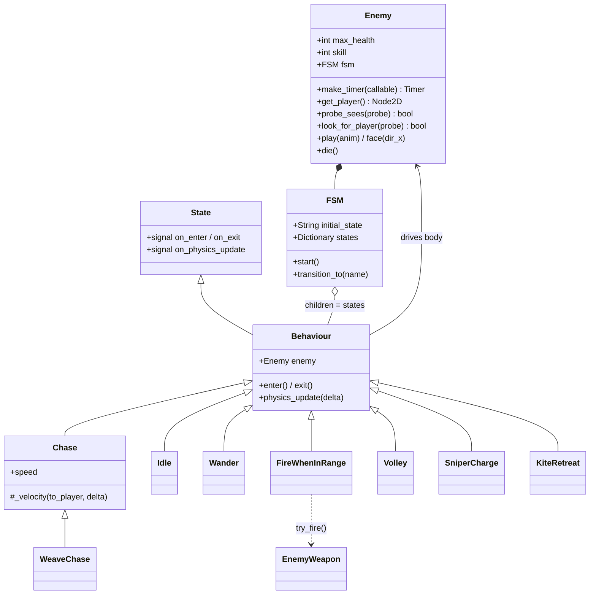
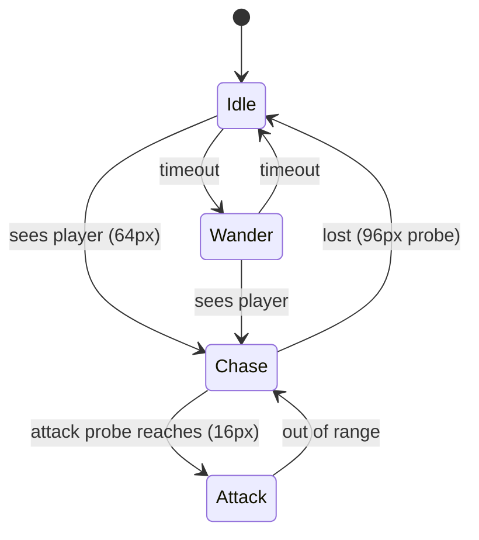
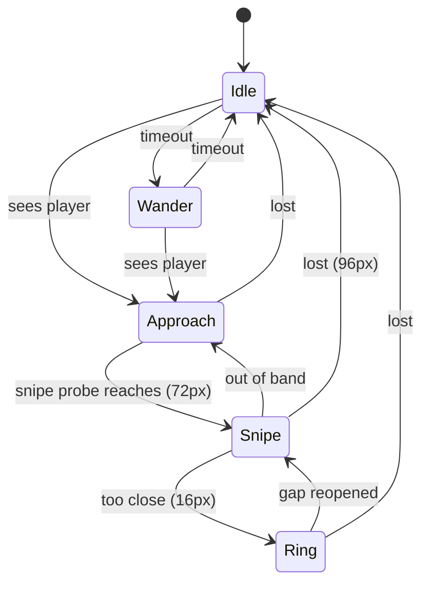

# Enemy Behaviour System — Architecture Design Document

This document describes the full architecture of enemy AI: the shared body, the FSM and the
`Behaviour` adapter, probes as the range/line-of-sight mechanism, the reusable behaviour
library and its hand-off wiring, weapon binding, and the current enemy roster as case
studies. Code paths are relative to the Godot project root (`game/`, i.e. `res://`). For the
short overview, see `docs/enemy_behaviour_composition.md`; the `add-enemy` skill has the
step-by-step checklist.

## 1. Overview and design goals

Enemies are **assembled in the editor from reusable behaviour nodes**, not written as a
script per enemy. The design goals:

1. **One shared body.** Every enemy runs the same `enemy.gd`: health, hurtbox wiring, sprite
   helpers, probe helpers. No enemy subclasses it.
2. **Behaviours are library nodes.** Each "state of mind" (watch, stroll, chase, snipe…) is
   one small script reused across enemies. What makes an enemy *that* enemy is which
   behaviours sit in its FSM and how they hand off — all configured via exported fields in
   the inspector, so most new enemies are **just a scene file**.
3. **Ranges are probes, not numbers.** Every range check is a `RayCast2D` aimed at the
   player; "in range" means the ray reaches them. Since rays are blocked by terrain, range
   and line-of-sight are the same check, tuned by dragging the ray's length in the editor.
4. **Attacks are data.** Enemies fire through the same data-driven weapon system as the
   player (`docs/weapon_system.md`); a behaviour binds a `WeaponResource` `.tres` to an
   `EnemyWeapon` node.

## 2. Component map

| Component | File | Responsibility |
|---|---|---|
| `Enemy` (body) | `characters/enemies/enemy.gd` | Health, hurtbox, helpers; zero AI |
| `FSM` / `State` | `components/fsm.gd`, `components/state.gd` | Generic signal-based state machine (shared with the player) |
| `Behaviour` | `characters/enemies/behaviours/behaviour.gd` | Adapter: `State` signals → overridable methods, exposes `enemy` |
| Behaviour library | `characters/enemies/behaviours/*.gd` | Idle, Wander, Chase, WeaveChase, FireWhenInRange, Volley, SniperCharge (+ per-enemy ones like `longleg/kite_retreat.gd`) |
| Probes | `RayCast2D` nodes per enemy scene | Detection / attack ranges + line of sight |
| `EnemyWeapon` | `characters/enemies/enemy_weapon.gd` (+ `.tscn`) | `try_fire()` wrapper over the generic `WeaponNode` |
| `Hurtbox` | `components/hurtbox.gd` | Damage intake from player bullets/zones |

## 3. The body: `enemy.gd`

`Enemy` is a `CharacterBody2D` in the `"enemies"` group. Per-enemy variation is two exports
(`max_health`, `skill` — the latter feeds bullet damage scaling) plus whatever the scene
overrides. It owns no AI; it provides the vocabulary behaviours speak:

- `get_player()` — first member of the `"player"` group (null when the player is dead).
- `probe_sees(probe)` / `look_for_player(probe)` — aim a ray at the player and test whether
  the first collider is them (terrain blocks the ray ⇒ no sight).
- `play(anim)` — forwards to the `AnimatedSprite2D`.
- `face(dir_x)` — sprite flip with a deadzone so near-vertical headings don't flip-flicker.
- `make_timer(callable)` — one-shot `Timer` factory for behaviours (see the ordering contract
  below).
- `_on_hurt` → `die()` (`queue_free`) at 0 HP; damage arrives via the `Hurtbox` child.

### The deferred-start ordering contract

`enemy.gd` calls `fsm.start.call_deferred()` and `make_timer` uses
`add_child.call_deferred(timer)`. Rationale: while a freshly instantiated enemy scene is
being added, the tree is busy — behaviours can't parent their timers during their `_ready`.
Deferred calls flush FIFO, and behaviours' `_ready` (where they call `make_timer`) run before
the body's, so **every behaviour timer is inside the tree before the FSM enters its first
state**. New behaviours must create timers via `enemy.make_timer()` in `_ready()` to stay
inside this contract.

### Body physics

Enemy bodies sit on layer 32 (*Enemies*) with mask 33 (*Terrain | Enemies*): they collide
with walls and each other but **not with the player** — there is no body blocking and no
contact damage; all damage an enemy deals goes through its weapon's bullets. The `Hurtbox`
child masks layer 256 (*Player Bullets*), which covers both weapon bullets and spell damage
sources.

## 4. FSM mechanics and the `Behaviour` adapter

The FSM (`components/fsm.gd`) is the same generic machine the player uses: child `State`
nodes keyed by **node name**, `transition_to(name)` by string, and per-state signals
(`on_enter`, `on_exit`, `on_update`, `on_physics_update`, `on_input`) that the FSM pumps for
whichever state is current. Unknown state names print an error and do nothing — wiring
mistakes surface at runtime, not load time.

`Behaviour` extends `State` so **the FSM needs no changes**: its `_ready` connects the State
signals to overridable methods (`enter()`, `exit()`, `physics_update(delta)`) and resolves
`enemy` by walking up the parents until it finds an `Enemy`. A behaviour node's **name is its
state name**, and behaviours transition by calling `enemy.fsm.transition_to(<exported
string>)` — every hand-off target is an exported `String` field, so the state graph is
recomposed per enemy in the inspector without touching code.

## 5. Probes: ranges and line of sight

Each enemy scene carries a few `RayCast2D` children (e.g. `DetectProbe`, `ChaseProbe`,
`AttackProbe`), all with `collision_mask = 17` (*Terrain | Player*). The convention:

- **Range = ray length** (`target_position`, set in the editor — e.g. demon: detect 64 px,
  chase 96 px, attack 16 px).
- Each physics frame the active behaviour does `probe.look_at(player)` then
  `enemy.probe_sees(probe)` — true only if the first thing the ray hits is the player, so
  terrain occlusion is free.
- Behaviours **enable their probes in `enter()` and disable them in `exit()`** — only the
  active state pays for raycasts, and a disabled probe can't leak stale state.
- Nested probes encode bands: the longleg's snipe logic reads three concentric probes
  (close 16 < snipe 72 < detect 96) to classify "too close / in the band / drifting away /
  lost".

## 6. The behaviour library

All under `characters/enemies/behaviours/` unless noted. Every hand-off target below is an
exported string with the listed default.

| Behaviour | Role | Key exports | Exits |
|---|---|---|---|
| `Idle` | Stand watch, random duration | probe, `min/max_time` (1.5–4 s) | sight → `alert_state` ("Chase"); timeout → `next_state` ("Wander") |
| `Wander` | Stroll a random direction, random duration | probe, `speed`, `min/max_time` (0.4–1.2 s) | sight → `alert_state`; timeout → `next_state` ("Idle") |
| `Chase` | Close on the player | chase + attack probes, `speed` | attack probe reaches → `attack_state` ("Attack"); chase probe lost → `lost_state` ("Idle") |
| `WeaveChase` | Chase with erratic sideways sway | + `weave_frequency`, `weave_amplitude` | same as Chase |
| `FireWhenInRange` | Hold position, fire while the probe reaches | weapon path + `weapon_data`, attack probe, `attack_anim` | probe lost → `out_of_range_state` ("Chase") |
| `Volley` | Plant feet, fire a fixed burst, then leave | weapon path + `weapon_data`, `shot_count` | burst done (or no player) → `done_state` ("Idle") |
| `SniperCharge` | Hold and snipe with a wind-up per shot | 3 probes (detect/sniper/close), weapon, `charge_time` | lost → `lost_state`; too close → `too_close_state`; out of band → `too_far_state` |
| `KiteRetreat` (`longleg/`) | Back away while firing | detect + close probes, weapon, `retreat_speed` | lost → `lost_state`; player no longer close → `regain_state` |

Design details worth knowing:

- **`Chase._velocity()` is a movement seam**: subclasses override only how the gap is closed.
  `WeaveChase` adds a perpendicular sine sway and re-rolls its phase at random 0.3–0.9 s
  intervals so the weave reads as unpredictable rather than a clean sine.
- **`Volley` has no range gate by design** — it's a parting reaction that keeps lobbing shots
  in the player's direction even after they leave detection. Its cadence is the weapon's own
  `fire_cooldown`: each frame it calls `try_fire` and only counts a shot when one actually
  leaves.
- **`SniperCharge` commits to its wind-up**: once the charge timer runs, range checks are
  skipped until the shot fires (the enemy keeps *facing* the player meanwhile), and `exit()`
  defensively stops any pending charge. The shot itself re-resolves the player at fire time.
- **Loops are wired, not hardcoded**: the default Idle⇄Wander pair forms the patrol loop;
  the golem instead sets Idle's `next_state = "Idle"` to stand still forever.

### Weapon binding

A firing behaviour exports `weapon_path` (NodePath to an `EnemyWeapon` node) and
`weapon_data` (a `WeaponResource` `.tres`), and calls `weapon.setup_for_enemy(weapon_data)`
in `_ready()`. Attacks-as-data falls out of this: the golem's ring burst is a `RingPattern`
weapon `.tres`, its ranged volley another `.tres`, each bound to its own weapon node. **One
weapon node per resource** — two behaviours pointing different `weapon_data` at the same node
would race in `_ready` and the last one wins.

## 7. Case studies (current roster)

**Small demon** (`small_demon/`) — the canonical loop. `Idle ⇄ Wander`, sight → `Chase`
(plain, 24 px/s), attack probe (16 px) → `Attack` (`FireWhenInRange`) with a short-range
single-shot weapon (3 tiles, no homing) — effectively a melee poke. Lost → back to `Idle`.

**Snake** (`snake/`) — same graph as the demon but `Chase` is a `WeaveChase` and its weapon
is a `ParallelPattern` twin shot. One node script swap + one `.tres` = a different-feeling
enemy; nothing else changed.

**Golem** (`golem/`) — stationary heavy (120 HP). `Idle` loops on itself (no Wander); sight →
`Chase` (slow, 12 px/s); ring probe (40 px) → `Ring` (`FireWhenInRange` with a `RingPattern`
weapon — a radial burst as "melee"); and the twist: Chase's `lost_state` is **`Volley`**, so
a fleeing player eats a 3-shot parting burst (rapid 0.2 s-cadence weapon) before the golem
returns to Idle.

**Longleg** (`longleg/`) — band-keeping sniper (30 HP). `Idle/Wander` → `Approach` (a reused
`Chase` whose `attack_state` is "Snipe" and whose probes are detect 96/snipe 72) → `Snipe`
(`SniperCharge`, 2 s wind-up, repeating while the player sits in the 16–72 px band). Player
too close → `Ring` (`KiteRetreat`: backs away at 34 px/s while firing a ring weapon) until
the gap reopens → back to `Snipe`. Lost anywhere → `Idle`.

## 8. Known limitations and sharp edges

- **String-typed wiring fails late.** State names, NodePaths, and animation names are checked
  only when used; a typo'd `alert_state` prints "State not found" at runtime. The implicit
  animation contract ("idle", "run", "attack", …) must exist on each enemy's `SpriteFrames`.
- **No pathfinding.** Movement is straight-line (± weave); probes blocked by a wall mean
  "lost", so enemies don't pursue around corners — currently a feature (terrain breaks
  aggro), but it is the whole navigation story.
- **Single-player assumptions**: `get_player()` returns the first group member.
- **No contact damage or body blocking** of the player (mask excludes them) — every threat
  must be expressed as a weapon.
- **Death is bare `queue_free`**: no death animation, loot, or event; nothing else is
  notified an enemy died.
- **The deferred-start contract is subtle** (§3): a behaviour creating a raw `Timer` and
  `add_child`-ing it directly in `_ready` will crash or race; always go through
  `enemy.make_timer()`.
- **`skill` is flat per enemy** and only feeds bullet damage scaling; there is no per-enemy
  stat system beyond `max_health` + the weapon `.tres`.

## 9. Adding an enemy

Mostly editor work — the `add-enemy` skill has the full checklist:

1. Copy the closest-shaped existing enemy scene (you inherit body, probes, weapon nodes, and
   a wired FSM).
2. Swap art (`SpriteFrames` with the expected animation names), `max_health`, `skill`,
   collision shape, and the weapon `.tres`.
3. Re-tune the graph in the inspector: probe lengths for ranges, speeds and timings, add or
   remove behaviour nodes and re-point the exported hand-off state names.
4. Only if no library behaviour fits, write one: extend `Behaviour`, override
   `enter`/`exit`/`physics_update`, export probes/weapon/hand-off strings, use
   `enemy.make_timer()` for timers, and toggle your probes in `enter`/`exit`. Park it in
   `behaviours/` if reusable, next to the enemy if bespoke (like `kite_retreat.gd`).
5. Place it in the world and record balance in `docs/data/enemies.toml`.

The body, FSM, and weapon system need no changes.
