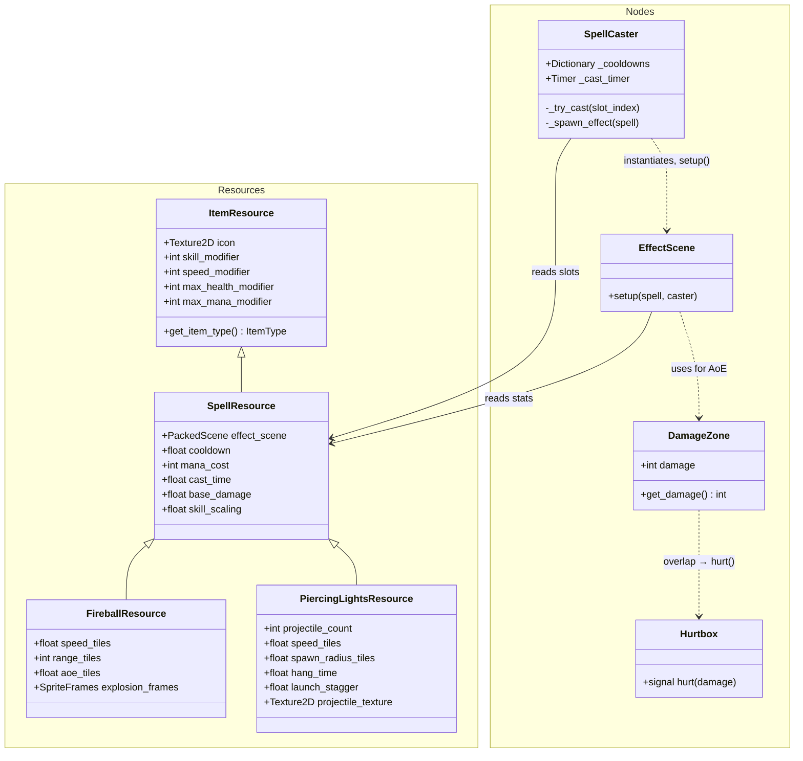

# Spell System — Architecture Design Document

This document describes the full architecture of the spell system: the data model, the cast
pipeline, how spells integrate with the inventory/item pipeline and the player FSM, how damage
is delivered, how cooldowns work (gameplay and UI), and the contracts a new spell must honor.
Code paths are relative to the Godot project root (`game/`, i.e. `res://`). For the short
overview, see `docs/spell_composition.md`.

## 1. Overview and design goals

A spell is **data plus one scene**: a `SpellResource` `.tres` describing what it costs and how
it casts, and an **effect scene** containing everything the spell actually does. The system is
built around three goals:

1. **Adding a spell never touches the machinery.** The caster, inventory, UI, and cooldown
   indicator are generic; a new spell is a resource subclass (only if it needs new stats), one
   effect scene, and one `.tres` per tier.
2. **Spells are ordinary items.** `SpellResource` extends `ItemResource`, so spells ride the
   exact same pickup → bag → slot pipeline as hats, robes, and weapons — no parallel
   inventory code.
3. **Damage reuses the bullet contract.** Effects hurt enemies through the same `Hurtbox` /
   `get_damage()` mechanism bullets use, on the same physics layers, so friendly fire and hit
   detection need no spell-specific rules.

The whole coupling between machinery and spell behaviour is a single call:
`effect.setup(spell, caster)`.

## 2. Component map

| Component | File | Responsibility |
|---|---|---|
| `SpellResource` | `characters/player/spells/spell_resource.gd` | Shared spell data; the equippable item |
| Per-spell resource subclass | e.g. `fireball/fireball_resource.gd` | Spell-specific stats |
| `SpellCaster` | `characters/player/spells/spell_caster.gd` | Input, gating, mana, cooldowns, cast time, effect spawning |
| Effect scene | e.g. `fireball/fireball.tscn` + `fireball.gd` | All spell behaviour |
| `DamageZone` | `components/damage_zone.gd` | Area-based damage source for AoEs |
| `Hurtbox` | `components/hurtbox.gd` | Receives damage from bodies/areas with `get_damage()` |
| Player FSM `Cast` state | `characters/player/player.gd` | Roots the player during cast time |
| `UISlot` | `gui/ui_slot.gd` | Slot rendering + cooldown curtain overlay |
| `GlobalInventory.spell_slots` | `autoload/global_inventory.gd` | The four equipped-spell slots |
| `GlobalEvent.spell_cooldown_started` | `autoload/global_event.gd` | Caster → UI cooldown broadcast |
| `GameConstants` | `globals/game_constants.gd` | `PX_PER_TILE`, bullet-layer bitmasks |



## 3. Data model

### 3.1 `SpellResource` — the shared contract

`SpellResource` extends `ItemResource`, inheriting `icon` and the four stat modifiers
(equipped spells *could* modify player stats, though stat recomputation currently only reads
weapon/hat/robe — see §10). It returns `ItemType.SPELL` from `get_item_type()`, which is what
routes it into spell slots. It adds what every spell shares:

| Field | Meaning |
|---|---|
| `effect_scene` | `PackedScene` spawned when the cast resolves |
| `cooldown` | Seconds before this spell can be cast again (default 1.0) |
| `mana_cost` | Deducted at cast start (default 5) |
| `cast_time` | Seconds the player is rooted before the effect spawns; 0 = instant |
| `base_damage` / `skill_scaling` | Damage = `roundi(base_damage + skill * skill_scaling)` |

The base resource deliberately knows nothing about projectiles, AoEs, or healing — anything
not universal lives in a subclass next to the effect scene (one folder per spell under
`characters/player/spells/`).

### 3.2 Tiers

A tier is **not** a level on a spell — it is a separate `.tres` file with bigger numbers,
sharing the same effect scene and resource script. Fireball I–III are three resources pointing
at one `fireball.tscn`; Fireball III differs from I only in `range_tiles`, `aoe_tiles`,
`mana_cost`, damage numbers, its icon region, and its explosion spritesheet. Because cooldowns
are keyed by resource identity (§7), tiers cool down independently by construction.

Visual assets are embedded in the tier `.tres` as sub-resources: the icon is an `AtlasTexture`
region of the shared `spells.png`, and per-tier animations (e.g. explosion `SpriteFrames`) are
built inline from the tier's spritesheet. The effect scene stays art-free and reads everything
from the resource.

### 3.3 Units

All distances/speeds are authored in **tiles** (`speed_tiles`, `range_tiles`, `aoe_tiles`,
`spawn_radius_tiles`). Effects convert at runtime through `GameConstants.PX_PER_TILE` (= 8);
the factor is never hardcoded.

### 3.4 Registry

Tier resources are registered in `registries/player_items.tres` (the *yard* addon registry,
name ↔ uid maps), which is how the game enumerates obtainable items. New tiers must be added
there to be discoverable/spawnable.

## 4. Inventory integration

Spells flow through the standard item pipeline with zero special cases:

- **Pickup**: `PickupItem.area_entered` → `GlobalInventory.add_to_bag` → `item_picked_up` /
  `slot_updated` signals → UI refresh. Bag slots accept `SPELL` in their compatibility list.
- **Equipping**: `GlobalInventory.spell_slots` is an `ArraySlot` of 4 slots accepting only
  `ItemType.SPELL`. Drag-and-drop between UI slots calls `swap_items`/`set_item`;
  double-clicking a bag spell auto-equips into the first empty spell slot
  (`get_equipment_slot_for_item`).
- **No `equipment_changed`**: that signal fires only for weapon/hat/robe. Equipping a spell
  does not touch the player node at all — `SpellCaster` reads
  `GlobalInventory.spell_slots.at(i)` lazily at cast time, so slots can change at any moment
  with no synchronization.

## 5. The cast pipeline

`SpellCaster` is a plain `Node` child of the player (`player.tscn`). It owns the entire
generic flow; the gates below run in order and any failure silently aborts the cast.

```mermaid
sequenceDiagram
    participant In as _unhandled_input
    participant SC as SpellCaster
    participant Inv as GlobalInventory
    participant P as Player (FSM)
    participant E as Effect scene
    participant GE as GlobalEvent

    In->>SC: spell1..spell4 pressed → _try_cast(i)
    SC->>Inv: spell_slots.at(i)
    Note over SC: gates: slot has a SpellResource with an effect_scene,<br/>spell not on cooldown, player.can_use_weapon,<br/>player.mana >= mana_cost
    SC->>P: mana -= mana_cost
    SC->>GE: player_mana_changed
    SC->>SC: cooldown Timer.start(spell.cooldown)
    SC->>GE: spell_cooldown_started(spell, duration)
    alt cast_time > 0
        SC->>P: fsm.transition_to("Cast")
        Note over P: can_use_weapon = false,<br/>velocity = 0, "channel" anim
        SC->>SC: _cast_timer.start(cast_time)
        SC-->>SC: timeout → _on_cast_time_finished
        SC->>P: fsm.transition_to("Idle")
    end
    SC->>E: instantiate(); setup(spell, player)
    SC->>E: get_tree().root.add_child(effect)
    Note over E: _ready() runs now — fields from setup()<br/>are already populated
```

Key decisions encoded in this flow:

- **Input mapping is positional**: actions `spell1`–`spell4` (project input map) index
  directly into `spell_slots`. There is no keybind-per-spell; rebinding a spell means moving
  it to another slot.
- **`can_use_weapon` doubles as "free to act"**: the player sets it false while in the Focus
  state (channeling mana regen) and the Cast state, so spells can't be cast while focusing or
  mid-cast, and a cast also blocks the weapon. There is no separate "busy" flag.
- **Mana and cooldown commit at cast start, not resolution.** A cast time is a commitment: the
  resources are spent the moment the wind-up begins. (Nothing currently interrupts a cast, so
  today this is unobservable; if interrupts are ever added, this is the rule to revisit —
  see §10.)
- **Effects are parented to `get_tree().root`**, not to the player — they must survive
  independent of the caster's movement (and, today, even the caster's death).

### 5.1 The `setup(spell, caster)` contract

This call is the **entire** interface between machinery and spell. Rules:

- The effect scene's root script must implement `setup(spell: SpellResource, caster: Node2D)`.
- `setup()` is called **before** `add_child`, so it runs before the effect's `_ready()`.
  Effects rely on this ordering: `setup()` stores raw inputs (resource, caster snapshot),
  `_ready()` derives everything else (velocity, damage, shapes, timers).
- The effect positions **itself** from the caster (`caster.global_position`); the caster does
  not place it.
- Aim is sampled inside `setup()` via `caster.get_global_mouse_position()` — i.e. at **cast
  resolution**, after the cast time, not at button press. The player aims during the wind-up.
- The effect snapshots `caster.skill` at setup; stat changes after the spawn don't affect
  in-flight effects.

The caster never holds a reference to the effect after spawning it. Effects are entirely
self-managing: they free themselves on impact, range, lifetime, or animation end.

## 6. Damage delivery

All spell damage lands through the same contract bullets use: the target's `Hurtbox`
(`components/hurtbox.gd`), an `Area2D` that emits `hurt(damage)` when an entering **body or
area** exposes `get_damage()`. An enemy's hurtbox monitors the *Player Bullets* physics layer
(layer 9, bitmask `GameConstants.LAYER_PLAYER_BULLETS` = 256), so anything a spell wants to
hurt enemies with simply needs `get_damage()` and `collision_layer = 256`. Two shapes exist:

- **Damaging body** — a `CharacterBody2D` projectile with `get_damage()` (the piercing light).
  Same shape as a weapon bullet. Hurtboxes despawn entering bullets only if they are in the
  `"bullets"` group (`reached_hurtbox()`); a projectile that *stays out of that group pierces*
  — the hurtbox damages it and lets it fly on. This group-membership trick is currently the
  only piercing mechanism.
- **`DamageZone`** (`components/damage_zone.gd`) — the area counterpart of a bullet body: an
  `Area2D` carrying a plain `damage` int and `get_damage()`. Used for AoEs (explosions,
  bursts, beams). A hurtbox overlapping the zone takes the damage **once, on entry** —
  there is no ticking/DoT support; a persistent zone would re-damage only enemies that leave
  and re-enter.

Hurtbox damage application is per-hurtbox, so one explosion hits every enemy inside it once.

### Physics layer summary (project settings)

| Layer | # | Bit | Spell-relevant use |
|---|---|---|---|
| Terrain | 1 | 1 | Stops projectiles (fireball, piercing light masks include it) |
| Player | 5 | 16 | Player hurtbox lives here |
| Enemies | 6 | 32 | Fireball body collides with enemies to detonate |
| Player Bullets | 9 | 256 | All spell damage sources sit on this layer |
| Enemy Bullets | 10 | 512 | Player hurtbox mask |

## 7. Cooldowns

Two cooperating pieces, deliberately decoupled:

**Gameplay truth — `SpellCaster._cooldowns`.** A `Dictionary` mapping `SpellResource → Timer`
(one-shot timers created lazily, children of the caster). Keying by the **resource**, not the
slot, means moving a spell to another slot mid-cooldown can't dodge it, and two tiers of the
same spell cool down independently (they're distinct resources). Unequipping doesn't stop the
timer, so re-equipping mid-cooldown stays blocked. Timers are reused per spell, never freed.

**UI display — `UISlot._spell_cooldowns`.** The caster emits
`GlobalEvent.spell_cooldown_started(spell, duration)` once per cast. UI slots keep a
**static** table `SpellResource → Vector2i(start_ms, end_ms)` shared by all slot instances;
each slot draws an overlay for whatever spell it *currently holds*, so the indicator follows
the spell around the inventory (slot swaps trigger `slot_updated`, which refreshes the
overlay). Expired entries are pruned lazily on read.

The overlay itself is a palette-safe dithered curtain: a 2×2 50% checkerboard of the palette
dark, tiled, covering the 8×8 icon and receding top-to-bottom in whole pixel rows; when the
cooldown expires while displayed, the icon flashes white for 0.1 s via a flatten shader. No
alpha blending or modulation — every pixel stays either the icon's color or the palette dark
(a hard art constraint for the Zughy-32 palette).

The two tables can in principle disagree (they're synchronized only by the signal), but the
caster's timers are the only authority — the UI is purely cosmetic.

## 8. Case study: Fireball (projectile + AoE)

`characters/player/spells/fireball/` — resource subclass, effect scene, three tiers.

**Behaviour**: 0.5 s rooted wind-up, then a projectile flies toward the cursor and explodes on
the first thing it hits — terrain *or* enemy — or at max range. All damage comes from the
explosion's `DamageZone`; the projectile body carries none, so a direct hit and a splash hit
are worth the same.

```
Fireball                 (CharacterBody2D — fireball.gd; layer 0, mask 33 = Terrain|Enemies,
│                         floating motion mode)
├─ Sprite2D              (projectile visual — the tier's item icon)
├─ CollisionShape2D      (small circle, r=2 px)
└─ Explosion             (DamageZone Area2D — layer 256 = Player Bullets, mask 0)
   ├─ CollisionShape2D   (disabled until impact; circle built at runtime from aoe_tiles)
   └─ AnimatedSprite2D   (hidden until impact; explosion_frames from the tier's resource)
```

Implementation notes:

- `_ready()` computes `explosion.damage = roundi(base_damage + skill * skill_scaling)`,
  sizes the AoE circle to `aoe_tiles * PX_PER_TILE / 2` (diameter in tiles), and starts a
  one-shot **range timer** of `range_tiles / speed_tiles` seconds — distance expressed as
  time, so there's no per-frame distance bookkeeping.
- The body's `collision_layer` is 0: nothing reacts to the projectile itself; it only *probes*
  via `move_and_collide`. On collision (or range timeout) `_explode()` runs once (guarded by
  `_exploded`): hide projectile sprite, disable body shape, **enable the explosion shape**
  (deferred — we're inside physics), play the animation, `queue_free` on animation end. The
  explosion damages by overlap during the animation's lifetime.
- The explosion sprites are drawn at exactly `aoe_tiles × PX_PER_TILE` pixels, so **the visual
  is the hitbox** — an authoring convention, not enforced by code.

## 9. Case study: Piercing Lights (spawner + sub-projectiles)

`characters/player/spells/piercing_lights/` — demonstrates the **spawner pattern**: the effect
scene is a transient orchestrator that spawns independent sub-projectiles and immediately
frees itself.

**Behaviour**: a volley of lights materializes scattered around the caster, hangs briefly,
then launches one-by-one (staccato) toward the cursor, each flying straight and piercing
through every enemy in its path until it hits a wall, leaves the screen, or times out.

Two scenes:

- **`piercing_lights.tscn`** (root `Node2D`, the spawner): `setup()` captures position, aim
  direction, and skill. `_ready()` computes damage once, then for each of `projectile_count`
  lights: scatters it uniformly over a disc of `spawn_radius_tiles` (radius `sqrt(randf())`
  for uniform area density), gives it shared velocity/rotation, and a `launch_delay` of
  `hang_time + i * launch_stagger`. Lights are added to root with **`call_deferred`** — the
  spawner's own `_ready()` runs while the tree is busy adding the spawner, so a direct
  `add_child` to root would fail. Then `queue_free()` — the spawner outlives the cast by one
  frame.
- **`piercing_light.tscn`** (root `CharacterBody2D`, one light): layer 256 (Player Bullets,
  so enemy hurtboxes see it), mask 1 (Terrain **only** — enemies don't block it). It is
  deliberately **not** in the `"bullets"` group, so hurtboxes don't despawn it: that is the
  piercing (§6). Damage is a plain `damage` int + `get_damage()` pushed in by the spawner —
  the light never sees the resource. It waits `launch_delay` (hanging in place), then flies;
  it dies on walls, on `VisibleOnScreenNotifier2D.screen_exited`, or after a 3 s lifetime
  whose clock starts **at launch**, so a long stagger can't eat into flight range.

Contrast with fireball: per-projectile damage vs. single AoE; pushed plain values vs. shared
resource reference; spawner frees instantly vs. effect living its full flight. Both are valid
shapes — the `setup()` contract doesn't care.

## 10. Known limitations and sharp edges

- **Casts are uninterruptible.** Nothing cancels the Cast state — taking damage, dying, or
  knockback won't stop `_cast_timer`. If the player dies mid-cast (`queue_free`), the timer
  dies with them and `_pending_spell` silently never resolves (mana/cooldown already spent).
  If interrupts are added, decide whether to refund the at-cast-start commit (§5).
- **One pending cast.** `_pending_spell` is a single slot; this is safe today only because
  `can_use_weapon` blocks a second cast during the first, not by design of the field itself.
- **Cast always exits to Idle**, even if movement keys are held — movement resumes on the next
  physics frame via the Idle→Move transition, costing one frame.
- **Spell stat modifiers are dead weight.** `SpellResource` inherits the `ItemResource`
  modifiers, but `Player._recompute_stats()` only reads weapon/hat/robe — modifiers on
  equipped spells do nothing.
- **No DoT/tick damage.** `Hurtbox` damages once per entry; a lingering zone needs a new
  mechanism, not just a long-lived `DamageZone`.
- **Effect scripts trust the resource type.** `fireball.gd` declares `var data:
  FireballResource` but `setup()` accepts any `SpellResource`; wiring the wrong effect scene
  into a `.tres` fails at runtime, not at load.
- **Cooldown timers are never freed**, one per distinct spell ever cast — bounded by the item
  pool, fine in practice, worth knowing.

## 11. Recipe: adding a new spell

1. **Folder**: `characters/player/spells/<spell_name>/`.
2. **Resource subclass** *only if* the spell has stats the base lacks
   (`extends SpellResource`, `class_name <Name>Resource`, `@export_group("<Name>")`,
   distances in tiles).
3. **Effect scene**: root script implements `setup(spell, caster)` (store inputs; derive in
   `_ready()`), positions itself from the caster, and frees itself when done. Damage sources
   go on layer 256 with `get_damage()` — a `DamageZone` for areas, a body for projectiles
   (join the `"bullets"` group to despawn on hit, stay out of it to pierce). Convert tiles
   through `GameConstants.PX_PER_TILE`.
4. **One `.tres` per tier**: icon as an atlas region of `spells.png`, the shared effect
   scene, per-tier numbers (balance source of truth: `docs/spells.md`). Embed per-tier art
   (e.g. `SpriteFrames`) as sub-resources.
5. **Register** the tiers in `registries/player_items.tres` and drop pickups in the world.

`SpellCaster`, `GlobalInventory`, the UI, and the cooldown indicator need no changes.
