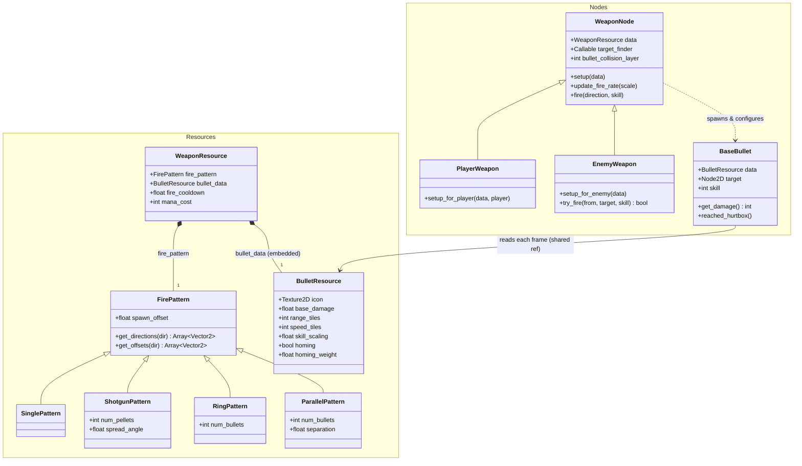

# Weapon System — Architecture Design Document

This document describes the full architecture of the weapon system: the data model, the fire
pattern abstraction, the runtime nodes shared by player and enemies, bullet behaviour, how
weapons integrate with the inventory and stat pipeline, and the contracts a new weapon must
honor. Code paths are relative to the Godot project root (`game/`, i.e. `res://`). The spell
system (`docs/spell_system.md`) deliberately mirrors several of these contracts.

## 1. Overview and design goals

A weapon is **one `.tres` file**: a `WeaponResource` that composes a `FirePattern` (the shape
of a volley) and a `BulletResource` (the stats of each bullet). The system is built around
three goals:

1. **Adding a weapon is authoring data, not writing code.** A new weapon is one `.tres`
   picking a pattern and filling in bullet stats. New *patterns* are tiny resource scripts;
   new *bullet behaviours* are flags on `BulletResource`.
2. **One machinery for player and enemies.** `WeaponNode` holds all firing logic;
   `PlayerWeapon` and `EnemyWeapon` are thin subclasses that differ only in trigger, bullet
   collision layer, and homing-target policy. An enemy weapon `.tres` and a player weapon
   `.tres` are the same resource type.
3. **Single source of truth for bullet stats.** Every live bullet holds its `BulletResource`
   *by reference* and reads it each frame — stats are never copied onto the bullet.

## 2. Component map

| Component | File | Responsibility |
|---|---|---|
| `WeaponResource` | `items/weapons/weapon_resource.gd` | The equippable item: pattern + bullet data + cooldown + mana cost |
| `FirePattern` + subclasses | `items/weapons/*_pattern.gd` | Volley shape: directions and lateral offsets per shot |
| `BulletResource` | `items/bullets/bullet_resource.gd` | All bullet stats (damage, range, speed, homing) |
| `WeaponNode` | `items/weapons/weapon_node.gd` | Generic firing: cooldown gate, target resolution, bullet spawning |
| `PlayerWeapon` | `characters/player/weapons/player_weapon.gd` | LMB auto-fire, mana deduction, mouse aim/targeting |
| `EnemyWeapon` | `characters/enemies/enemy_weapon.gd` | `try_fire()` API for AI behaviours, player targeting |
| `BaseBullet` | `items/bullets/base_bullet.gd` (+ `base_bullet.tscn`) | The one bullet scene: flight, homing, lifetime, damage |
| `Hurtbox` | `components/hurtbox.gd` | Receives damage; despawns bullets via the `"bullets"` group |
| `GameConstants` | `globals/game_constants.gd` | `PX_PER_TILE`, `LAYER_PLAYER_BULLETS`/`LAYER_ENEMY_BULLETS` |



## 3. Data model

### 3.1 `WeaponResource`

Extends `ItemResource` (inheriting `icon` and the four stat modifiers — these *do* apply to
the player, unlike spell modifiers) and returns `ItemType.WEAPON`, routing it into the single
weapon equipment slot. It owns four things: `fire_pattern`, `bullet_data`, `fire_cooldown`
(seconds between volleys), and `mana_cost` (per trigger pull).

The `BulletResource` is **embedded** in the weapon `.tres` as a sub-resource, not a separate
file — a weapon and its bullet are one authoring unit. The `FirePattern` is likewise embedded
(a `SubResource` with the pattern script and its exports).

### 3.2 `BulletResource` — single source of truth

All bullet stats in one resource: `icon`, `base_damage`, `range_tiles`, `speed_tiles`,
`skill_scaling`, `homing`, `homing_weight`. `BaseBullet` never redeclares or copies these —
it holds `data` by reference and reads it live. Two consequences worth knowing:

- All bullets fired by one weapon share the same resource instance; mutating it at runtime
  retunes bullets already in flight.
- Damage is computed **at hit time** (`get_damage()` is called by the hurtbox), from the live
  resource plus the `skill` value snapshotted at spawn.

### 3.3 Fire patterns

`FirePattern` is a `Resource` with two override points, paired by index:

- `get_directions(direction) -> Array[Vector2]` — one entry per bullet, the travel direction.
- `get_offsets(direction) -> Array[Vector2]` — optional per-bullet **lateral spawn offsets**
  (world space), letting a pattern spread bullets sideways without changing their heading.
  Empty (the default) means no offset; missing indices fall back to `Vector2.ZERO`.

Plus one shared export: `spawn_offset`, a per-bullet random forward displacement
(`randf() * spawn_offset` along the bullet's direction) that loosens up volleys.

| Pattern | Exports | Shape |
|---|---|---|
| `SinglePattern` | — | One bullet along the aim |
| `ShotgunPattern` | `num_pellets`, `spread_angle` | Pellets at **random** angles within the cone (not evenly spaced — volleys clump differently each shot) |
| `RingPattern` | `num_bullets` | Evenly spaced full circle (`TAU / n`), first bullet on the aim direction |
| `ParallelPattern` | `num_bullets`, `separation` | Same direction, spread perpendicular to the aim, centered on the firing axis (the snake's twin shot) |

### 3.4 Families, tiers, registries

Player weapons come in three families under `characters/player/weapons/` — `staff/` (single),
`wand/` (single), `rune/` (shotgun) — five tiers each, one `.tres` per tier. Enemy weapons
live next to their enemy (e.g. `characters/enemies/golem/golem_ring.tres`). Player-obtainable
weapons are registered in `registries/player_weapons.tres` (yard addon registry, name ↔ uid).
Balance source of truth is `docs/data/weapons.toml` (which generates `docs/items/weapons.md`).

### 3.5 Units

`range_tiles` and `speed_tiles` are authored in tiles; everything converts through
`GameConstants.PX_PER_TILE` (= 8) at runtime — never a hardcoded factor.

## 4. Runtime: `WeaponNode` and the fire flow

`WeaponNode` is a `Node2D` configured by `setup(weapon_data)`, which creates a one-shot
`fire_timer` from `data.fire_cooldown`. Firing is gated by a simple `can_fire` flag: `fire()`
flips it false and the timer flips it back. `update_fire_rate(speed_scale)` rescales the
cooldown (clamped to a 0.01 minimum scale to avoid an infinite wait).

```mermaid
sequenceDiagram
    participant O as Owner (player input / enemy AI)
    participant W as WeaponNode
    participant FP as FirePattern
    participant B as BaseBullet (xN)

    O->>W: fire(direction, skill)
    Note over W: gate: can_fire, data, bullet_data, fire_pattern
    alt bullet_data.homing
        W->>W: target = target_finder.call()
    end
    W->>FP: get_directions(direction) / get_offsets(direction)
    loop one per direction
        W->>B: instantiate; set data (shared ref), collision_layer,<br/>position (+ random forward offset + lateral), base_direction, skill, target
        W->>B: root.add_child(bullet) → _ready()
    end
    W->>W: can_fire = false; fire_timer.start()
```

Key decisions:

- **Homing target is resolved once per trigger pull**, only when `bullet_data.homing` is
  true, via the owner-injected `target_finder: Callable` — the mechanism by which the node
  stays generic (player targets the enemy nearest the mouse; enemy targets the player). All
  bullets in a volley share the one target.
- **Bullets are configured before entering the tree** (fields set, then `add_child`), the
  same setup-before-`_ready` ordering contract the spell system uses.
- **Bullets are parented to `get_tree().root`** so they outlive the weapon (e.g. swapping
  weapons mid-flight).

## 5. `BaseBullet` — the one bullet scene

There is exactly one bullet scene (`items/bullets/base_bullet.tscn`); variety comes entirely
from the resource. The scene root is a `CharacterBody2D` in the **`"bullets"` group** with
`collision_layer = 0` (overwritten at spawn) and the default `collision_mask = 1` (Terrain).

Lifecycle and behaviour (`base_bullet.gd`):

- **Range as lifetime**: `_ready()` computes `range_tiles / speed_tiles` seconds and starts a
  one-shot timer → `queue_free`. A degenerate bullet (zero speed or range) is discarded
  immediately rather than producing an invalid timer. Note the consequence: range is
  *time*-based, so a homing bullet flying a curve covers less straight-line distance.
- **Orientation**: `rotation = velocity.angle() + PI/2` — bullet sprites are authored
  pointing up.
- **Homing** is not a subclass but an inline branch in `_physics_process`: when `data.homing`
  and the target is still valid, velocity lerps toward the target direction with weight
  `homing_weight * delta`, then is re-normalized to full speed — constant speed, finite turn
  rate; `homing_weight` *is* the turn rate. If the target dies mid-flight the bullet simply
  flies straight (an `is_instance_valid` check, no retargeting).
- **Collision**: `move_and_collide` against terrain (mask 1) frees the bullet. Hits on
  characters work the other way around — the target's `Hurtbox` watches the bullet's layer,
  calls `get_damage()` (= `round(base_damage + skill * skill_scaling)`), and then calls
  `reached_hurtbox()` because the bullet is in the `"bullets"` group, despawning it. This
  group membership is what makes weapon bullets non-piercing; piercing projectiles exist
  only in the spell system (by staying out of the group).

### Physics layer summary

| Element | Layer | Mask |
|---|---|---|
| Bullet body (player-fired) | 256 (Player Bullets, set at spawn) | 1 (Terrain) |
| Bullet body (enemy-fired) | 512 (Enemy Bullets, set at spawn) | 1 (Terrain) |
| Enemy hurtbox | — | 256 |
| Player hurtbox | — | 512 |

Friendly fire is impossible by construction: a bullet's only physical collision is terrain,
and only the opposing side's hurtboxes monitor its layer.

## 6. Player side: `PlayerWeapon`

Created **at equip time**, not present in the scene by default: `Player._on_equipment_changed`
(reacting to `GlobalEvent.equipment_changed` for the weapon slot) frees the old `PlayerWeapon`
node, creates a new one as a child of the player, and calls `setup_for_player(resource,
player)` — which sets the bullet layer to 256 and installs `_find_closest_enemy_to_mouse` as
the `target_finder`.

Firing is **held-button auto-fire**: `_unhandled_input` tracks the `weapon` action (LMB) into
`weapon_input_held`; `_physics_process` fires every frame the gates pass — input held,
`can_fire` (weapon cooldown), `owner_ref.can_use_weapon` (false while focusing or casting a
spell), and `mana >= mana_cost`. Mana is deducted **per trigger pull**, not per pellet — a
five-pellet shotgun volley costs one `mana_cost`. Aim is the normalized vector from player to
mouse, sampled per shot.

Two stat couplings, both flowing through `Player._recompute_stats()`:

- The weapon's inherited `ItemResource` stat modifiers apply to the player while equipped.
- **Fire rate scales with the speed stat**: the player calls
  `weapon.update_fire_rate(speed / base_speed)` on every stat recompute, so speed-boosting
  gear shoots faster.

Targeting (`_find_closest_enemy_to_mouse`): scans the `"enemies"` group, keeps only enemies
within the bullet's range **of the shooter** (range in tiles → px), and returns the one
closest to the *cursor* — so homing weapons hit what you point at, not just whatever is
nearby. Returns null (bullet flies straight) when nothing qualifies.

## 7. Enemy side: `EnemyWeapon`

A persistent `Node2D` child of the enemy scene (`characters/enemies/enemy_weapon.tscn`),
configured by an AI behaviour calling `setup_for_enemy(weapon_data)` — bullet layer 512,
`target_finder` returns the player iff within the bullet's range. The API for behaviours is
`try_fire(from, target_position, skill) -> bool`: it aims, fires if the cooldown allows, and
reports whether a shot actually left — behaviours use the return value as their shot counter,
so attack cadence is the weapon's own `fire_cooldown` (see `docs/enemy_system.md` §6).
Enemies have no mana; `mana_cost` is ignored on the enemy path (their `.tres` files set 0).

One enemy can carry **several weapon nodes** with different resources for different attacks
(the golem has `RingWeapon` + `VolleyWeapon`; the longleg `SnipeWeapon` + `RingWeapon`).

## 8. Known limitations and sharp edges

- **Mana is per volley, pattern-blind.** Multi-bullet patterns cost the same `mana_cost` as a
  single shot; balance lives entirely in the numbers.
- **One homing target per volley**, resolved at fire time. No per-pellet targeting, no
  retarget after the target dies (bullets go straight).
- **Range is a lifetime**, so curving (homing) bullets travel less far than `range_tiles`
  suggests; also the bullet's spawn offset doesn't reduce it.
- **Shared `BulletResource` instance**: runtime mutation retunes in-flight bullets — powerful
  for live tweaking, surprising if treated as per-bullet state.
- **Shotgun spread is random**, not even — occasional all-pellets-clumped volleys are
  expected behaviour, not a bug.
- **No piercing, bouncing, or modifier plugins.** New bullet behaviour means a flag on
  `BulletResource` handled inline in `BaseBullet` (the homing precedent); there is no
  modifier-plugin system yet.
- **`update_fire_rate` is player-only in practice** — enemies never call it, so enemy cadence
  is fixed at authoring time.
- **`fire()` fails silently** when gated, except `EnemyWeapon.try_fire` which reports back.

## 9. Recipes

**New weapon** — one `.tres`: `WeaponResource` with an icon region from the family
spritesheet, an embedded `FirePattern` sub-resource, an embedded `BulletResource` with stats
in tiles, `fire_cooldown` and `mana_cost`. Register it in `registries/player_weapons.tres`
(player weapons) and record balance in `docs/data/weapons.toml`. No code.

**New fire pattern** — one `.gd` extending `FirePattern` under `items/weapons/`, overriding
`get_directions()` (and `get_offsets()` only if bullets should spread laterally — keep the
index pairing). Export its knobs; it becomes pickable in any weapon `.tres`.

**New bullet behaviour** — an exported flag/parameter on `BulletResource`, handled inline in
`BaseBullet` (`_ready`/`_physics_process`), defaulting to off so every existing `.tres` is
unaffected.
