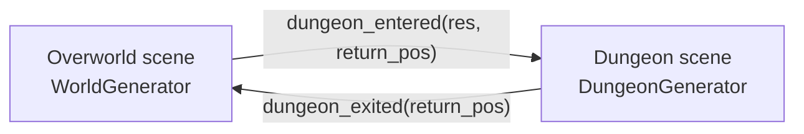

# World Generation — Design (on hold)

> **Status: proposed, not yet implemented.** This is a design document for a future feature.
> No generator code exists yet; the overworld is currently the hand-authored `world.tscn`.

Two separate, independent systems:

- **The overworld** — an open, seamless, biome-based world. You spawn into it and roam freely.
  It has no entry or exit of its own; it is the root you play in.
- **Dungeons** — self-contained, multi-floor areas with explicit entry and exit. You enter one
  from an entrance found in the overworld and leave it back to where you came from.

The only thing connecting them is a pair of signals. Neither generator knows about the other.

---

## Overworld

An open world with biomes, generated at runtime from a single seed. No transition logic — it
is simply the scene the player lives in.

### Generation pipeline

A `WorldGenerator` (owned by the world scene) runs in passes from one `seed`:

1. **Seed.** One `RandomNumberGenerator` seeded once. Every pass draws from it (or a derived
   sub-seed), so a world is fully reproducible and seeds are shareable for debugging.
2. **Biome map.** Two low-frequency `FastNoiseLite` fields — **temperature** and **moisture** —
   sampled per tile. The `(temp, moisture)` pair maps to a biome (Whittaker-diagram style),
   giving natural contiguous blobs with sensible adjacency. An optional **elevation** field
   carves water/mountains as impassable region borders.
3. **Paint terrain.** Per tile, look up its biome → its terrain id → batch-paint with
   `TileMapLayer.set_cells_terrain_connect()` so the existing autotiling handles edges and
   transitions. Paint per-biome in groups for clean borders.
4. **Decorate.** Trees, rocks, clearings via blue-noise / rejection sampling against each
   biome's density, so props don't overlap.
5. **Place dungeon entrances** (see below).
6. **Spawn enemies & pickups** from each biome's roster into the existing container nodes.

The map is **finite and bounded** (e.g. 256² or 512² tiles), not infinite/streamed. A bounded
map lets us *guarantee* things — "N dungeon entrances exist, spread out, all reachable" — which
is exactly the property an action RPG with discoverable dungeons wants. One `TileMapLayer`
holds a map this size comfortably. Chunk streaming can be added later if needed; the same
passes apply per-chunk.

### Biomes as data

Mirrors the data-driven weapon system: a new biome is one `.tres`, no generator changes.

```gdscript
class_name BiomeResource extends Resource

@export var id: StringName
@export var terrain_set: int                  # which terrain in the tileset
@export var terrain_id: int
@export var temp_range: Vector2               # where it sits on the noise map
@export var moisture_range: Vector2
@export var decorations: Array[PackedScene]
@export var decoration_density: float
@export var enemy_roster: Array[PackedScene]  # reuses existing enemy scenes
@export var enemy_density: float
@export var allows_dungeon: bool              # can an entrance spawn here
```

The generator iterates an `Array[BiomeResource]` registry (lives under `registries/`). Spawned
enemies are exactly the current enemy scenes — no changes to the enemy/FSM/weapon systems.

---

## Dungeons

Self-contained, multi-floor, with explicit entry and exit. A dungeon is **its own scene**, not
part of the overworld tree.

- **Entrances** in the overworld are placement-constrained props: biome has `allows_dungeon`,
  the tile is walkable, and a min-distance from spawn and from other entrances (Poisson-disk /
  rejection sampling). This guarantees a fixed count, well spread, never in water.
- Each entrance carries a `DungeonResource` — theme, floor count, tileset, enemy roster,
  hazards — plus its own `seed`.
- A dungeon is a **stack of floors**. Each floor is built by a `DungeonGenerator` using a
  rooms-and-corridors / BSP / cellular-cave algorithm (a different problem from the overworld
  biome map, so `DungeonGenerator` stays distinct from `WorldGenerator`).
- Each floor has explicit markers:
  - `entry_point` — where the player appears on arrival.
  - `exit_point` (one or more):
    - a **down** exit generates the next floor and places the player at its `entry_point`;
    - an **up** exit (or a dedicated exit on floor 0) returns the player to the overworld at
      the saved entrance position.
- Floor *N* derives its seed from `dungeon_seed + N`, so floors are stable if the player walks
  back up.

`DungeonResource`:

```gdscript
class_name DungeonResource extends Resource

@export var theme: StringName          # e.g. "hell_caves"
@export var tileset: TileSet
@export var floor_count: int
@export var enemy_roster: Array[PackedScene]
@export var hazards: Array[PackedScene]
```

---

## The contract between the two

The entire interface is two signals on `GlobalEvent` (signal-first, per project convention).
A small scene/transition manager owns the swap — instance the dungeon scene and hide/free the
overworld on enter, reverse on exit. Neither generator references the other.

```gdscript
# overworld -> dungeon
signal dungeon_entered(dungeon_res: DungeonResource, return_position: Vector2)

# dungeon -> overworld
signal dungeon_exited(return_position: Vector2)
```



---

## How it slots into the existing project

- `world.tscn` keeps `Player`, `UI`, the `TileMapLayer` (now filled at runtime), and empty
  `Enemies` / `pickups` containers. The hand-placed instances are stripped.
- `world.gd` (or a child `WorldGenerator` node) runs the passes in `_ready`, painting the
  tilemap and `add_child`-ing enemies/pickups/entrances into the existing containers.
- The overworld is the persistent root: no enter/exit logic for it. Keep its seed for the
  session so the same world regenerates when the player returns from a dungeon.

### Suggested build order

1. `WorldGenerator` painting a single biome over a fixed region from a seed (proves the
   tilemap-paint + autotiling path).
2. `FastNoiseLite` temp/moisture → multi-biome painting with `BiomeResource`.
3. Move enemy/pickup spawning into the generator, roster-driven.
4. Dungeon-entrance placement + the transition signals (entrances can be no-ops at first).
5. Decoration pass for polish.
6. `DungeonGenerator` for floor interiors.

---

## Open decisions

- **Floor traversal** — linear descent only (classic roguelike), or can the player climb back
  up to previous floors? Affects whether floors must persist their state.
- **Overworld stability** — identical every time you exit a dungeon (store the seed), or
  allowed to regenerate fresh.
- **Entrance count & distribution** — fixed N per world, or scaled to map size / biome area.
- **Dungeon state persistence** — does a cleared dungeon stay cleared, or regenerate on
  re-entry?
